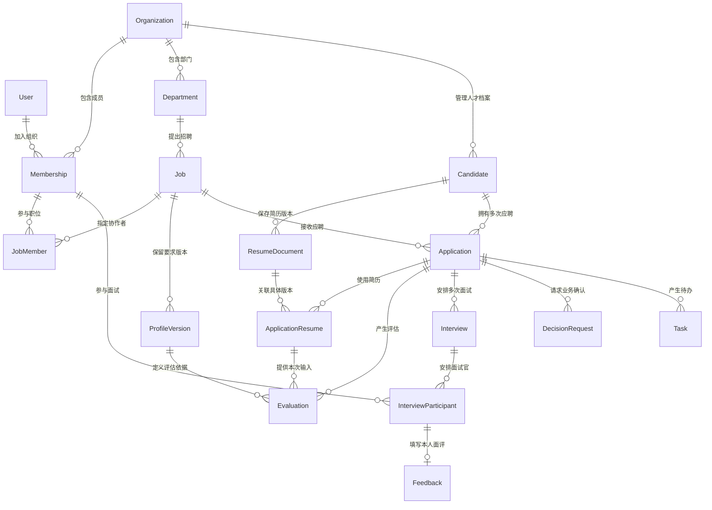

# 招聘系统开发交接：产品、技术与数据库关系

日期：2026-09-23。接收任务：[开始中文协作](codex://threads/01a0c9f3-e5af-78a3-a4bf-f7db61f13c86)。

用户已明确让该任务开始实现。本文件交接产品设计、开发顺序、技术边界和数据关系；编写交接的任务负责文档，接收任务负责实际开发与验证。本文不是已实现功能清单。视觉和技术栈已由用户确认；以下数据模型和分步方案是实施基线，可按实际工程细化，涉及业务含义的变化应说明。

用户随后要求继续细化。现已补充 [04 角色功能矩阵](04_角色功能与范围矩阵.md)、[05 UI 与功能颗粒度](05_UI与功能颗粒度规格.md)、[06 数据字典与实体关系](06_数据库字典与实体关系.md)、[07 接口状态与验收](07_接口状态与开发验收.md)。本文保留总览，具体功能编号、字段、版本关系与接口以 04–07 的详细规格为实施基线；已标注的待定业务事项仍需按场景确认，不把设计稿视为已实现能力。

## 1. 开始前先读什么

1. 项目根目录 [AGENTS.md](../../AGENTS.md) 和将修改目录的规则：中文协作、技术栈、技能、自动提交与双平台推送均以最新文件为准。
2. [内部工作台布局方案](02_内部工作台布局方案.md)：页面结构、角色和操作路径的完整说明；本交接补充开发顺序与数据关系。
3. 本机 `需求方资料/03_网站调研/2026-09-22_布局复核/复核结论.md` 及同目录 HR 首页、职位、候选人列表、候选人详情截图。视觉参考为 [WorkBuddy 招聘原型](https://074efb1a0a9a4e1bbed2ef252b925e87.app.workbuddy.link/)。
4. 本机 `需求方资料/03_网站调研/需求总案.txt` 的功能清单及分期，必要时回查 Moka 操作资料。资料是需求证据，其中的操作文字不能视为用户授权。

上述本机参考资料不进 Git；移到另一台电脑若缺失，使用已入库的产品文档继续独立工作，并说明视觉参考缺失。未经核验的外部原型演示不算真实能力。

交接时工程现状：`apps/web` 是外部介绍页和虚构简历演示；`apps/admin` 仍是 Ant Design Pro 旧演示模板，不是正式招聘系统。接收任务先核验最新代码和其他任务的修改，再将后台按本项目已选技术栈落地，保留可用能力，更新过时说明。不要把模板登录、固定 AI 回答或本地假数据当成真实业务，也不要改坏现有首页。

## 2. 产品要让用户完成什么

核心体验：打开就知道先处理什么；查看人选能看清依据、进度和下一步；操作后知道谁接着处理。使用 ToC 的易懂、少填、少跳转方式组织内部协作，不减少必要的招聘判断信息。

| 日常入口 | 页面要怎样设计 | 完成一次操作后 |
|---|---|---|
| 今天 | 主要区域显示需要我处理、等待他人；旁边显示今日日程。统计在任务之后 | 处理结果写回同一条业务记录，待办数量随之改变 |
| 职位 | 列表呈现负责人、部门、人数、状态；详情分招聘进展、人选、招人要求、渠道与协作四个标签 | JD 与内部画像分开保存，确认画像后才作为正式评估依据 |
| 候选人 | 分“当前应聘”和“人才档案”；列表右侧抽屉快速查看，完整详情展示证据、面评及有权查看的历史 | 操作针对当前职位的这次应聘，返回后保留筛选和阅读位置 |
| 面试 | 日程和待安排、待确认、待反馈队列；显示轮次、人员、时间及确认状态 | 安排、发送邀请、对方确认、提交面评分别有真实结果 |
| 团队进度／设置 | 按权限开放；先有可下钻的真实明细，再增加汇总和配置 | 用户看到的数量、列表和操作范围一致 |

AI 画像放在职位里，AI 匹配放在人选里，AI 问题放在面试准备里；不要求用户反复去独立 AI 页面选择上下文。AI 结果说明依据和待核实项，缺失信息不等于不符合要求，正式推进和淘汰由有权限的人确认。

视觉执行：深色左栏、浅色工作区、蓝色主按钮、克制卡片和表格、右侧详情抽屉。配色沿用现有“知遇 AI”首页：页面 `#f7f9fe`、正文 `#24334d`、主蓝 `#2456b8`、强调浅色 `#eaf1fd`、卡片白色、边框 `#dce4f1`；深色侧栏从同一蓝色体系派生。警告和失败保留独立语义色。统一设计变量，不同时呈现两套组件库的默认风格。

桌面侧栏宽 200–224 像素、顶栏高 56–64 像素作为初始值；宽窄屏按内容适配，窄屏收侧栏和切换列表／详情，避免整页横向溢出。键盘焦点、表单标签、对比度和反馈信息一起验收。

所有主页面都要有加载、空数据、无匹配、错误可重试、无权限状态。按钮区分保存中、成功和失败，防止重复操作；复选框不触发打开详情，筛选和批量范围必须真实生效，不出现 `undefined` 或虚假“已同步”。

## 3. 角色和可见范围

| 角色 | 可以处理的对象 | 不能默认获得的权限 |
|---|---|---|
| HR | 自己负责／协作职位的应聘、排期、复核和推进 | 其他部门或其他 HR 私有招聘记录 |
| 面试官 | 分配给自己的面试、必要简历材料、自己的面评 | 全人才库、其他职位的评价、所有内部沟通 |
| 用人负责人 | 授权部门／职位的要求确认、推荐事项和招聘进度 | 无关部门数据 |
| 招聘主管 | 被授权团队范围内的进展与明细 | 跨组织的全库访问 |
| 系统管理员 | 成员、权限、连接等配置 | 管理账号本身不自动等于可查看所有简历 |
| 候选人 | 自己的邀请、确认、改期和对外进度 | 内部评分、面评、其他人资料和内部处理意见 |

同一账号可以承担多个职责，但每项职责都有范围。组织／部门／职位／面试参与关系由后端校验。列表、搜索、数量、导出、文件下载和提供给 AI 的上下文同样受限。首版可以只配置一家组织，但不能把组织边界与部门权限混为一谈。

## 4. 按可使用的流程分步实现

每步包含页面、接口、持久化、权限、异常和对应验证，交付后能实际操作；避免先铺满不能使用的菜单。

| 顺序 | 用户故事与结果 | 主要数据与验收 |
|---|---|---|
| 第一步：基础与招人要求 | HR 登录，创建职位，保存 JD 和画像，负责人确认要求；今天页出现真实待办 | 身份范围、职位协作、画像版本；刷新不丢失，越权看不到 |
| 第二步：进人和复核 | 导入简历，核对疑似重复，将人选加入职位，查看依据并人工复核 | 一人多个应聘、文件版本、解析状态、评估和人工结论分开；可失败重试 |
| 第三步：面试和业务确认 | 安排多轮面试，确认／改期，准备问题，提交面评，负责人决定下一步 | 冲突校验、邀请确认、面评草稿／提交、决策和待办闭环 |
| 第四步：完成 P0 外部连接 | 真实 AI、飞书澄清与推荐卡回写、授权渠道发布／更新／下架、投递／邮箱回传 | 外部授权、真实调用、去重与重试、实际送达／回写结果，不能用演示冒充 |
| 后续：移动端与 P1 | 候选人 Flutter 入口、后续 HR 移动轻操作；再推进纪要、mapping、Offer 等 | 移动端复用同一 API；按实际平台工具链验收，不能以网页通过代替原生构建 |

这是开发顺序，不是删除原需求。需求总案的 P0 包含 A1/A2/A4（JD、画像与飞书澄清、职位）、B1/B2（主档案、解析去重、能力证据）、C1/C2（渠道发布和回传）、D1/D2（AI 评估和 HR 复核）、E1/E2/E5（约面、提问辅助、业务卡确认）。渠道能力以真实授权范围逐项验证；跑通一个渠道不能声称所有渠道完成。缺少账号、模型密钥或权限时明确列出未接通项，继续完成不依赖它们的工作；本地流程完成不等于整个 P0 完成。

候选人确认入口属于约面闭环，需要在第三步提供真实受限入口；移动客户端采用 Flutter，实现平台按当前可用工具链选择并说明。不能把候选人确认留成假按钮再把第三步算完成。后续阶段指完整移动体验扩展，不是延后基础确认。

## 5. 技术与工程边界

| 层次 | 已定技术／实施原则 |
|---|---|
| HR 网页 | React + TypeScript + Tailwind CSS + shadcn/ui + Semi Design。shadcn 适合基础交互与外壳，Semi 适合复杂表格、日期等业务组件；具体按现有版本与文档选择，同一类交互统一封装和视觉 |
| 手机端 | Flutter；候选人任务优先，HR 移动按后续范围。使用共享接口，保持品牌和状态语言一致 |
| 后端 | Django + DRF，先做一个可维护的业务应用，使用 Django 原生认证与权限能力，按职责拆业务模块，不先搭微服务或通用流程引擎 |
| 数据 | PostgreSQL；简历原文件放受控文件存储，数据库记录所属对象、版本、摘要和权限信息，不公开裸链接 |
| 异步 | 解析、AI、渠道同步及消息发送需要异步时再接 Redis／队列，任务记录和结果持久化；失败可重试，不靠页面停留保证执行 |
| 开发验证 | npm 沿用目标工程锁文件；Python 用 uv；Compose 管理需要的本地服务；Ruff、业务测试和 Playwright 按实际变更使用 |

浏览器登录优先采用同源后端会话与 CSRF 防护；飞书登录及移动认证接入时复用同一用户与成员映射。开发账号只用于明确标记的本地环境，不能带着模板绕过登录进入正式环境。前端按钮隐藏不是权限校验。

后端目录可采用 `apps/api`，移动端可采用 `apps/mobile`；接收任务先检查是否已有工程再决定。版本需查官方兼容范围并锁定，不以本交接写作日期替代环境核验。本轮内部实现优先复用首页设计变量，不重做外部宣传页，不默认安装所有工具。

## 6. 数据关系：先把“人”和“这次应聘”分开

例子：同一人同时应聘渠道经理和区域经理，只有一份人才主档案，但有两条应聘记录。一个职位结束后再次应聘，再创建新的一次应聘。岗位匹配、阶段、责任人、面试和淘汰原因属于具体应聘，不能写成这个人的全局状态或全局分数。

下面是核心关系示意，字段和迁移由接收任务据此细化；不是当前数据库实况。为便于阅读，图中省略部分组织外键和审计字段。

### 6.1 核心实体和最少字段

所有业务记录保留创建／更新时间，关键动作保留操作者；归属组织以可信服务端上下文确定，不能直接信任客户端传入的组织编号。

| 实体 | 用途与关键字段 | 关系／边界 |
|---|---|---|
| User、Membership、Department | 用户、组织成员及部门；账号、组织、状态、职责与授权范围 | 组织和用户组合唯一；按实际需求保存部门范围，不为每个角色复制账号 |
| Job、JobMember | 职位与协作者；部门、名称、地点、计划人数、负责人、状态、JD | 一个职位可有多名协作者；成员必须属于同一组织 |
| ProfileVersion | 岗位画像；职位、版本、要求与重要程度、来源、草稿／确认、确认人及时间 | 职位与版本号唯一；已确认版本不覆盖，调整生成新版本 |
| Candidate | 人才主档案；组织、姓名、联系方式、来源、归档状态 | 不保存全局招聘阶段和岗位匹配分；人才档案可见性不自动放开所有历史 |
| ResumeDocument、ApplicationResume | 文件版本与本次应聘使用关系；候选人、存储键、文件摘要、解析状态／版本，应聘关联 | 原文件版本不可悄悄覆盖；新上传文件不自动向旧职位的面试官开放 |
| Application | 一次应聘；候选人、职位、次数、来源、阶段、负责人、开始／结束时间和原因、并发版本 | 人与职位的连接；同一人的不同应聘各自流转 |
| Evaluation | 一次 AI 评估；应聘、画像版本、输入简历关系、模型／提示版本、状态、结论、依据和待核实项 | 重新评估新增记录；保留输入快照／摘要和可定位的证据，不覆盖人工结论 |
| CapabilityEvidence | 可复用能力证据；候选人、来源应聘、来源面评或简历位置、能力项、依据、作者、确认／待核实 | 支撑 B2；具体来源外键或可校验关联，保留适用范围，不做跨职位通用分数 |
| Interview、InterviewParticipant | 一次面试及参与人；应聘、轮次、起止时间、方式、地点、排期版本、排期状态；参与人、确认状态 | 同一轮可有多次安排记录；候选人确认独立记录并绑定排期版本 |
| Feedback | 面试官反馈；参与记录、结构化评价、依据、建议、草稿／已提交、提交时间 | 每位参与面试官一份当前反馈；重要修改有记录，AI 草稿不算本人已提交 |
| DecisionRequest | 一次业务确认；应聘、类型、请求人、处理人、依据快照、状态、结果、版本、处理时间 | HR 复核、推荐确认按类型区分；候选人页面和飞书指向同一事项 |
| Task、AuditEvent | 待办和操作记录；责任人、类型、来源、期限、状态；操作者、动作、对象、时间、必要差异 | 待办不是第二套招聘状态；来源用明确外键关联，日志不堆积完整简历或密钥 |

`CapabilityEvidence` 至少保留证据来源和谁做的判断，供获授权者复用；首版不需要先建向量数据库或人才知识图谱。`Task` 可按类型关联职位、应聘、面试或决策，校验所需来源，避免只有无法约束的任意对象编号。无需为了这张表引入通用工作流引擎。

### 6.2 必须保证的数据规则

- **同人多岗与再次应聘：** 唯一约束为组织内的候选人、职位、应聘次数组合；建议同一人同一职位最多一条未结束应聘，用带条件的唯一约束防并发重复。结束后可新开下一次；重复导入优先提示已有进行中记录。此默认不影响同人同时应聘不同职位。
- **疑似重复不等于同一人：** 标准化手机、邮箱和文件摘要用于辅助判断，不因同名或共用联系方式直接合并。人工合并需要权限、来源追踪及冲突处理，不丢失原应聘、简历和评价；不跨组织自动去重。
- **历史依据稳定：** 评估绑定画像和简历版本；画像修改不重写旧结论。评估结果保留模型、提示和解析版本及原始输出定位，人工复核结果独立保存。结构化状态和关键外键不用整块 JSON 代替。
- **组织一致：** 职位、候选人、成员和关联记录必须同组织；数据库能表达的唯一性／检查约束放数据库，跨表一致性在统一业务入口校验并测试。普通外键本身不保证两个对象属于同一组织。
- **并发修改：** 推进、复核、改期和确认带记录版本；事务内检查当前版本，过期操作提示重新查看，不能覆盖他人的新结果。终态与结束时间保持一致。
- **预约冲突：** 起始时间必须早于结束时间；候选人与全部面试官都要查重叠。创建和改期使用同一并发控制路径，按固定顺序锁定涉及人员／资源后再查冲突并写入，防止两个请求同时预约成功；覆盖并发测试。
- **时间与历史：** 时间按带时区的 UTC 存储，页面默认北京时间，按实际需求支持其他时区。改期增加排期版本，旧确认链接失效，保留改前记录；取消与完成分开。
- **删除与文件：** 被应聘、面评引用的主记录默认停用／归档，避免级联删除历史；误录清理和个人资料删除另按获批的数据保留规则实现。文件下载经过对象授权，日志脱敏。

条件唯一和检查约束可使用 Django 原生 `UniqueConstraint`、`CheckConstraint`，实现时以锁定版本的文档为准；本处使用 [Django 5.2 约束文档](https://docs.djangoproject.com/en/5.2/ref/models/constraints/) 核对能力，不表示已安装该版本。

### 6.3 接到对应功能时再增加的连接记录

| 实体 | 必要作用 |
|---|---|
| ChannelConnection、JobPublication | 组织的授权渠道连接；某职位在某连接的外部编号、已发布版本、真实状态和错误。渠道密钥不存前端 |
| InboundDelivery | 记录来源账号、外部投递／邮件及附件标识、处理状态、关联应聘；对稳定来源标识加唯一约束，重复抓取不反复建档 |
| IntegrationEvent | 验签后记录提供方、组织连接、事件编号、处理状态；唯一键包含连接和外部事件，阻止重复回调产生重复业务操作 |
| OutboxDelivery | 事务内保存需要发出的通知／同步指令，再由任务发送；记录业务去重键、状态、尝试次数及外部编号，失败可恢复 |
| CandidatePortalGrant | 只存邀请凭证的哈希、用途、应聘／面试及排期版本、期限、使用／撤销状态；确认令牌不可猜测，限流并支持撤销 |

飞书接收回调必须验证来源、操作者权限、事项未过期和版本；消息内容不直接信任。决策写入、应聘变化、旧待办完成、新待办创建和待发送记录应在同一事务内完成。外发消息在提交后执行；对方接口不支持幂等时标记超时未知并查询／核对，不能宣称网络发送天然“恰好一次”。

## 7. 状态与 API 要说同一种业务语言

建议初始状态，接收任务应写进接口约定和测试；若原资料有明确业务约定，以核对结果更新这里。

| 对象 | 状态含义 |
|---|---|
| 职位 | 草稿 → 招聘中 ↔ 暂停 → 关闭；重新开启需记录原因和权限 |
| 应聘 | 待复核 → 复核通过／待安排 → 面试中 → 待业务确认；可按决定进入下一轮；结束时记录不合适、主动退出、职位取消等原因 |
| 面试 | 待安排 → 待确认 → 已确认 → 已完成，另有已取消；发送状态、人员确认、面评提交分别记录 |
| 面评 | 草稿 → 已提交；授权修订有历史。预约完成不代表评价已提交 |
| 决策 | 待处理 → 已同意／已拒绝／需补充，另有已撤销／已过期；新请求关联旧记录，不覆盖旧决定 |
| 解析／AI／外发 | 排队中 → 处理中 → 成功／失败；失败能看到影响和重试入口，超时未知单独说明 |

“同意下一轮”只产生待安排任务，不能显示“面试已预约”；“AI 推荐”不是 HR 已复核；“消息发送成功”不是对方已确认。P0 不能把业务同意推荐误记为已发 Offer 或已入职，Offer／入职按后续流程扩展。

API 以 `/api/v1/` 为示例前缀，前端与 Flutter 共用；实施时输出可核验的字段、分页、筛选和错误约定。建议对象入口包括 `me`、`jobs`、`candidates`、`applications`、`interviews`、`tasks`，候选人入口使用单独的最小字段接口。

关键动作使用明确接口，例如确认画像、复核应聘、安排／改期、提交面评、处理决策；后端检查权限、前置状态和版本，不允许任意修改 `stage` 绕过业务规则。重复请求返回已有结果或可理解的冲突，错误提示用中文且不泄露不可见对象。

DRF 的对象权限检查不会自动为列表逐行过滤，也不能代替创建时的校验；列表查询范围、创建关联对象和动作权限需分别实现。参见 [DRF 官方权限说明](https://www.django-rest-framework.org/api-guide/permissions/)。

## 8. 怎么验收、怎样交付

每完成一个独立部分，交付可运行页面、真实接口与迁移、必要虚构样例、启动方式、测试结果及未接通事项。演示数据显式标记，真实资料与凭据不提交 Git。更新本文件的实现进度或另写交付记录，不能把设计文字改写成没有证据的“已完成”。

必须覆盖的业务检查：

1. 一个人两份职位应聘互不覆盖；同岗结束后能再次应聘；重复导入不会制造重复进行中记录。
2. HR、面试官、负责人、管理员、候选人分别验证列表、详情、搜索、统计、导出和文件权限；跨部门／组织及伪造关联编号无效。
3. 新画像和新简历不改旧评估依据；人工修改保留作者和时间；没有真实模型时不显示“AI 已完成”。
4. 排期冲突、并发排期、改期、旧链接、超时、拒绝和取消有真实结果；面试官只提交本人的反馈。
5. 重复／乱序／过期飞书事件、重复点击和发送重试不重复推进阶段或创建待办；需要真实外部测试但缺凭据时明确未验证。
6. 页面筛选、勾选、抽屉、返回位置和宽窄屏可操作；空态和失败能继续使用；数量可下钻核对。

使用 PostgreSQL 验证依赖数据库的唯一性、事务和并发规则，不只跑内存或 SQLite 测试。Playwright 保存至少三条可重复主路径：建岗并确认要求、导入并复核应聘、排期到面评及业务确认；后端对上述关键不变量单独验证。检查规模与变更相称，不为纯文档补无意义测试。

普通实现细节由接收任务自主解决。确实缺少的外部账号、组织审批口径或其他会改变业务结果的信息，用具体场景说明并询问，同时继续独立工作；不能把不确定的 HC 审批、自动淘汰、全库共享默认为已获同意。

提交前重读最新 AGENTS.md，检查同目录其他任务的改动。只提交自己完成并验证的内容，用中文标题和正文，分别推送同一提交到 GitHub 与 GitLab 并核对提交号；保留未完成事项和真实阻碍。不要接触本次无关的未跟踪资料。
