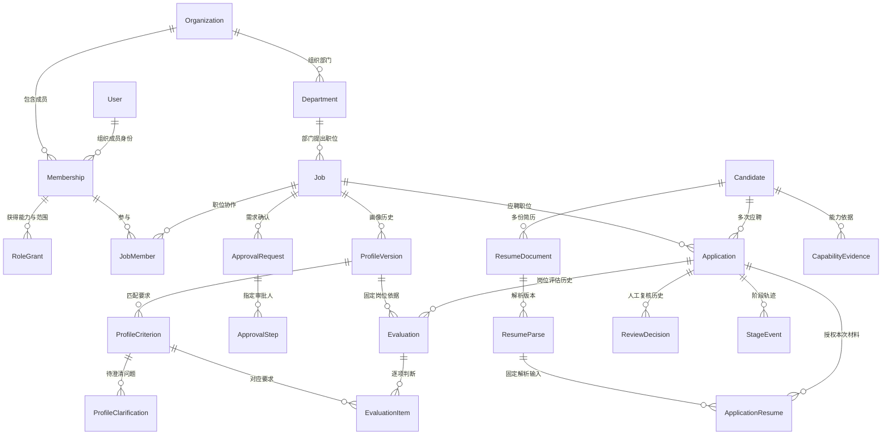
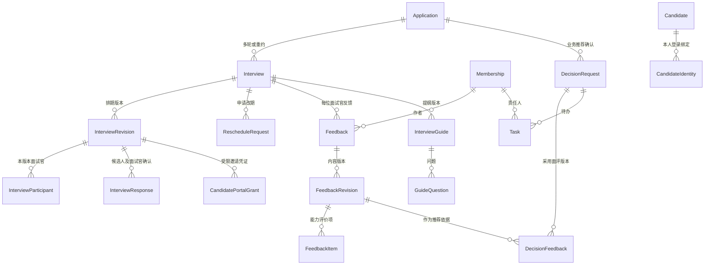
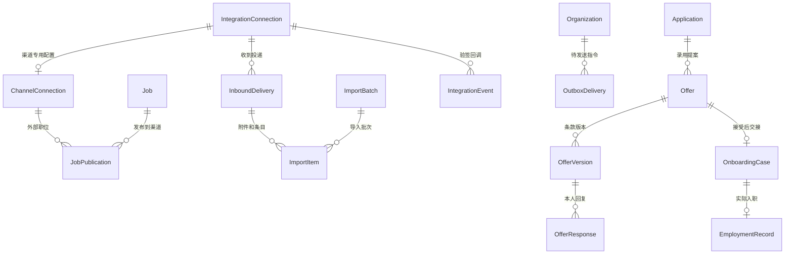

# 详细开发规格（三）：数据库字典与实体关系

更新：2026-09-23。对应 [04 功能与权限](04_角色功能与范围矩阵.md)、[05 UI 和功能](05_UI与功能颗粒度规格.md)、[07 接口与状态](07_接口状态与开发验收.md)。以下是 PostgreSQL＋Django 的逻辑建模基线，不是已执行 DDL，不宣称库表存在。

当前第一步实际迁移及等价命名见 [08 实施交付记录](08_第一步实施交付记录.md)：DepartmentRole 对应部门 RoleGrant，ProfileRequirement 对应本阶段 ProfileCriterion；单人画像确认由 ProfileVersion、Task 与 AuditEvent 保存。其余实体仍按后续切片建设，不因列在本字典中视为已落地。

## 1. 建模约定

按开发切片创建必要模型和迁移：第一步只需身份、职位、画像、确认、待办和审计；后续用到解析、面试、集成时再迁移；P1/P2/P3 表不预先堆入 P0。逻辑实体允许按已有代码合并为明确的子结构或复用同类表，但必须保留外键、权限、历史及唯一性语义，更新此处映射。禁止用一个任意 JSON 对象替代整个招聘领域。

**字段记法：** `id` 默认 UUID 主键（已有模型主键可沿用）；`→Table` 为外键，`?` 可空，未标 `?` 为必填；`str(n)` 为最大长度，`text` 长文本，`int` 整数，`decimal(p,s)` 定点数，`bool` 布尔，`ts` 带时区时间，`date` 日期，`json` 有版本和结构校验的文档。默认值除明确列出的外一律不编造；缺信息用 NULL／未知状态，不用空字符串伪造完整数据。

**共用字段：** 实体表除特殊说明均有 `id, created_at, updated_at`。业务归属表有 `organization_id→Organization`；只能由可信后端确定。人工写入对象有 `created_by_id→Membership?`（系统创建允许 NULL）和可追溯服务身份。可编辑业务根对象有 `row_version:int=1`；追加型事件不原地覆盖。时间保存 UTC，返回 ISO 8601，显示按用户时区；不把“北京时间字符串”当数据库时间。

**外键删除：** 未标例外的业务引用使用 PROTECT／RESTRICT；停用／归档代替删除被引用对象。纯从属、尚未提交草稿的行可在受控清理时级联；作者离职保留 Membership 停用记录。确认版本、审批、面評、操作事件不随父对象误删。经过 F42 批准的数据清理可以脱敏或删除，但须遍历引用并记录实际结果，不用保护外键永久阻止合法清理。

**组织一致：** 每条关联校验父对象、成员和目标对象同组织；普通外键不能保证这一点。服务统一入口／序列化器负责跨表校验，数据库能表达的唯一／检查约束负责兜底；如采用复合外键或触发器需维护迁移与测试。所有读取先限定组织与对象范围，再筛选／统计／排序。

**版本与 JSON：** 金额、状态、时间、常用筛选字段、核心关系单列。JSON 只承载有结构的快照、外部输出或非关系型扩展，不存无法约束的角色 ID 数组、主候选人 ID 或任意对象指针。大文件不塞数据库，不存公开文件 URL 或原始访问令牌。

## 2. 核心实体关系图

图示：`||--o{` 表示一对零到多，`||--o|` 表示一对零到一；所有子记录仍受组织范围约束。

## 3. 身份、组织与授权（P0；F01/F22/F24）

| 实体／建议表 | 必填及可选业务字段 | 约束／索引／说明 |
|---|---|---|
| Organization `organization` | name:str(120), status:active/suspended, timezone:str(64)='Asia/Shanghai' | 首版一家也保留边界；停用阻断新操作 |
| User `user` | Django 认证身份，display_name:str(100), is_active:bool | 使用 Django 认证字段与密码哈希；业务角色不直接等同 is_staff／superuser |
| Department `department` | organization, parent_id→Department?, name:str(120), code:str(64), status | UQ(org,code)；父部门同组织、不得成环；IDX(org,parent) |
| Membership `membership` | organization, user_id→User, primary_department_id→Department?, status:invited/active/disabled | UQ(org,user)；离职停用保留引用；主部门不代表自动拥有部门内全部招聘权限 |
| RoleGrant `role_grant` | membership_id→Membership, role_code:str(32), scope_kind:organization/department/job/talent_pool/self, department_id?, job_id?, talent_pool_id?, expires_at:ts?, capabilities:json | 范围类型与唯一目标匹配；capabilities 只能来自服务端白名单；NULL 范围分别用条件唯一防重；IDX(member,role,expires) |
| ExternalIdentity `external_identity` | user_id→User, connection_id→IntegrationConnection, external_subject:str(200) | UQ(connection,external_subject)；用于飞书映射，不能信客户端提供的用户 ID |
| CandidateIdentity `candidate_identity` | organization, candidate_id→Candidate, user_id→User, verified_at:ts, method:str(32), revoked_at:ts? | UQ(org,user,candidate)；跨候选人登录需重新验证，独立于内部 Membership |
| UserPreference `user_preference` | user_id→User, timezone?, language='zh-CN', notification_preferences:json | UQ(user)；偏好不授予权限 |
| OrganizationSetting `organization_setting` | organization, key:str(64), schema_version:int, value:json, changed_by_id→Membership | UQ(org,key)；允许的 key 与结构写白名单；变更留审计 |
| ConsentRecord `consent_record` | organization, candidate_id→Candidate, purpose:str(64), text_version:str(64), state:granted/declined/withdrawn, recorded_at:ts, evidence_file_key?:text | 按用途记录，撤回追加事件或版本，不能把一次同意复用于所有用途；IDX(candidate,purpose,time) |

RoleGrant 同时限定角色和范围，不能先把能力合并再把范围全量合并造成越权。JobMember 是职位协作关系，动作能力仍由角色／职位职责判定。RoleGrant 的 talent_pool_id 可在实现人才分库时再加，不要求基础登录一次建完所有表。

## 4. 职位、画像与确认（P0；F04–F08）

| 实体／建议表 | 字段 | 约束／索引／说明 |
|---|---|---|
| Job `job` | organization, department_id, title:str(120), city:str(120), employment_type:str(32), headcount:int, owner_id→Membership, status:draft/recruiting/paused/closed, jd_text:text='', jd_version:int=1, salary_min/max:decimal(14,2)?, currency:str(3)?, salary_period:str(16)?, active_profile_id→ProfileVersion?, closed_at:ts? | headcount>0；薪资双空或上下限完整且合法；active_profile 同职位且 confirmed；IDX(org,status,owner)、(org,department)；范围名不接受任意 SQL |
| JobMember `job_member` | organization, job_id, membership_id, duty:recruiter/hiring_owner/interviewer/coordinator, active:bool | UQ(job,member,duty)；同组织；interviewer 职责本身不放开全部应聘材料 |
| ProfileVersion `profile_version` | organization, job_id, version:int, status:draft/in_review/confirmed/rejected/superseded, based_on_id→ProfileVersion?, created_by, confirmed_by_id→Membership?, confirmed_at:ts?, scoring_schema_version:str(32) | UQ(job,version)；确认人时间与状态一致；confirmed 内容冻结，旧版被新版本替代仍可引用；IDX(job,status) |
| ProfileCriterion `profile_criterion` | profile_version_id, key:str(64), label:str(120), description:text, kind:required/preferred/exclusion_signal, weight:decimal(6,3), evidence_instruction:text, clarification_status:pending/confirmed, display_order:int | UQ(profile,key)；weight≥0；确认画像不能包含未明确的必要规则；引用 key 表示跨版本同类项，ID 表示确切版本项 |
| ProfileClarification `profile_clarification` | organization, profile_version_id, criterion_id, question:text, requester_id, assignee_id, status:pending/answered/withdrawn, answer:text?, answered_at:ts?, request_key:str(100) | UQ(org,request_key)；条件属于同版本；被指定人可答复，答复不代表审批通过；绑定的旧草稿被替代后拒绝写入 |
| ApprovalRequest `approval_request` | organization, kind:profile/headcount/offer, job_id, profile_version_id?, offer_version_id?, request_version:int, requester_id, status:draft/pending/approved/rejected/returned/withdrawn/superseded, submitted_at?, resolved_at?, subject_snapshot:json | kind 对应目标 FK 必须存在且属于 job；不可把任意 target_id 当实际外键；同目标只允许一条有效 pending；IDX(org,status,job) |
| ApprovalStep `approval_step` | request_id, step_no:int, approver_id→Membership, status:waiting/pending/approved/rejected/returned/cancelled, answer:json?, comment:text?, acted_at:ts? | UQ(request,step_no)；只处理当前 pending 步；身份、当前版本与自审规则验证；IDX(approver,status) |

编制审批快照至少含部门、人数、薪资范围、成本主体等实际需要审的字段，snapshot 带 schema_version；具体成本主体与层级规则 Q01 未定，不能默认为已审批。第一步只做画像 kind；Offer 外键在 P1 增量迁移加入。

## 5. 人才主档案、文件与投递（P0；F09–F11）

| 实体／建议表 | 字段 | 约束／索引／说明 |
|---|---|---|
| Candidate `candidate` | organization, display_name:str(100), phone_normalized:str(32)?, email_normalized:str(254)?, current_city:str(120)?, status:active/archived/merged, redirected_to_id→Candidate?, owner_id→Membership? | 手机／邮箱只索引，不无条件唯一；不能存全局职位、招聘阶段或匹配分；redirected_to 同组织且不成环；IDX(org,name)、(org,phone)、(org,email) |
| CandidateExperience `candidate_experience` | candidate_id, company_name:str(200), title:str(120), started_on:date?, ended_on:date?, is_current:bool, description:text?, source_resume_id→ResumeDocument?, confirmed_by_id?, confirmed_at? | 起止合法；不只存“总年限”一个易过时数字；来源可定位 |
| CandidateEducation `candidate_education` | candidate_id, institution:str(200), degree:str(64)?, major:str(120)?, started_on?, ended_on?, source_resume_id? | 未知学历 NULL；原解析值和人工纠正用审计区分 |
| ResumeDocument `resume_document` | organization, candidate_id?, file_key:text, original_name:str(255), mime_type:str(100), size_bytes:bigint, sha256:str(64), uploaded_by_id?, source_kind:str(32), access_state:active/quarantined/deleted | 文件先接收再认人允许 candidate 空，未认人仅接收者可读；上传后不覆盖文件；IDX(org,sha256)，相同文件不等于同一人 |
| ResumeParse `resume_parse` | organization, resume_document_id, version:int, parser_version:str(64), status:queued/running/succeeded/failed, parsed_fields:json?, extracted_text_key:text?, error_code:str(64)?, completed_at? | UQ(document,version)；JSON 有字段和来源页码结构；不把原文全文重复复制到多个表 |
| Application `application` | organization, candidate_id, job_id, attempt_no:int, owner_id→Membership, source_kind:str(32), source_connection_id?, source_external_id:str(200)?, stage:str(32), opened_at:ts, closed_at:ts?, close_reason:str(64)?, public_stage:str(32), latest_evaluation_id→Evaluation? | UQ(org,candidate,job,attempt_no)；条件 UQ(org,candidate,job WHERE closed_at IS NULL)；终态与 closed_at 一致；IDX(job,stage,owner)、(candidate,opened_at) |
| ApplicationResume `application_resume` | organization, application_id, resume_document_id, resume_parse_id, assigned_at:ts, assigned_by_id?, use_kind:submitted/supplement, revoked_at:ts? | UQ(application,document,parse)；parse 必须属于 document，document 的 candidate 必须匹配 application；查询文件仍复核本次授权 |
| TalentPool `talent_pool` | organization, name:str(100), category:general/employee/former_employee/restricted_contact, active:bool | UQ(org,name)；人才分库可见性单独授权 |
| TalentPoolEntry `talent_pool_entry` | pool_id, candidate_id, reason:text?, source_application_id?, review_due_at:ts?, added_by_id, removed_at:ts? | 条件 UQ(pool,candidate WHERE removed_at IS NULL)；限制联系必须有原因和复核期限；加入库不自动扩大材料共享 |
| CandidateMerge `candidate_merge` | organization, source_candidate_id, target_candidate_id, status:planned/applied/reverted/needs_repair, approved_by_id?, applied_at?, field_choices:json, movement_manifest:json, reason:text | source≠target；清单保存确切迁移对象 ID／原归属，是审计快照不是在线权限来源；反向操作先检查后续依赖 |

### 为什么 ApplicationResume 同时记录文件与解析版本

同一个文件可以用不同解析器重新解析；旧评估必须指向当时那次解析。关联中同时固定文件和解析并检查一致性，可用 FK 通过 parse 反查文件的等价实现。Evaluation 只能使用本次应聘已授权的输入，不能默认拿 Candidate 最新简历替换历史。一份评估若使用多个材料，增加下表 EvaluationInput 连接，不把材料 ID 数组藏 JSON。

## 6. 评估、人工决定与证据（P0；F12–F14）

| 实体／建议表 | 字段 | 约束／索引／说明 |
|---|---|---|
| AIExecution `ai_execution` | organization, task_kind:str(32), status:queued/running/succeeded/failed/cancelled, provider:str(64), model_version:str(100), prompt_version:str(64), input_digest:str(64), input_snapshot_key?:text, output_key?:text, started_at?, finished_at?, error_code?, cost_usage:json? | 执行记录不等于业务结果；敏感输入受控保存／脱敏；运行租约与重试次数按队列实现补充 |
| Evaluation `evaluation` | organization, application_id, profile_version_id, execution_id→AIExecution, version:int, status:queued/running/succeeded/failed/needs_review, recommendation:recommend/consider/not_recommended/insufficient, total_score:decimal(5,2)?, evidence_coverage:decimal(5,2)?, summary:text?, scoring_snapshot:json | UQ(application,version)；分数和 coverage 在 0–100；输入画像 confirmed；执行成功但引用校验失败用 needs_review；IDX(application,created_at) |
| EvaluationInput `evaluation_input` | evaluation_id, application_resume_id | UQ(evaluation,application_resume)；两端同应聘，用于多份输入及摘要追溯 |
| EvaluationItem `evaluation_item` | evaluation_id, criterion_id→ProfileCriterion, finding:supported/not_met/unknown, score:decimal(5,2)?, reason:text, evidence_locations:json | UQ(evaluation,criterion)；criterion 属于该评估画像；引用结构限定已关联材料 ID、页／段／字符定位，服务端逐项核验 |
| ReviewDecision `review_decision` | organization, application_id, evaluation_id?, reviewer_id, action:advance/need_info/reject, reason_code:str(64)?, reason:text?, followup_owner_id?, decided_at:ts, previous_stage:str(32), resulting_stage:str(32), request_key:str(100) | UQ(org,request_key)；reject 必须原因；人工结果与 AI 原输出分开；追加不可直接修改 |
| StageEvent `stage_event` | organization, application_id, from_stage:str(32), to_stage:str(32), actor_id?, source_action:str(64), source_request_key:str(100), reason:text?, happened_at:ts | 与当前 stage 同事务；UQ(application,source_request_key)；IDX(application,happened_at)；用于统计实际流转 |
| CapabilityEvidence `capability_evidence` | organization, candidate_id, source_application_id?, criterion_key:str(64)?, capability_label:str(120), statement:text, source_kind:resume/feedback/manual, resume_parse_id?, feedback_revision_id?, locator:json?, status:draft/confirmed/retracted, authored_by_id?, confirmed_by_id?, observed_at:ts?, supersedes_id? | 来源类型要求对应 FK，manual 明示人工记录；同组织与同候选人；共享范围继承来源，另有批准共享时单独授权；IDX(candidate,label,status) |

`latest_evaluation_id` 只作快捷指针，不能删除旧 Evaluation；指针必须指向该应聘记录。06 的 EvaluationInput 扩展了 03 简化图中的单份输入关系，03 图不要求一份评估只能读一个文件。

## 7. 排期、确认、提纲与面评（P0；F15–F18）

| 实体／建议表 | 字段 | 约束／索引／说明 |
|---|---|---|
| AvailabilityWindow `availability_window` | organization, membership_id?, candidate_id?, starts_at:ts, ends_at:ts, timezone:str(64), source:str(32), expires_at:ts? | member 与 candidate 恰一非空；start<end；可用窗口不代表已预订；IDX(owner,start,end) |
| Interview `interview` | organization, application_id, round_no:int, purpose:str(200), current_revision_id→InterviewRevision?, status:unscheduled/pending_confirmation/confirmed/completed/cancelled, organizer_id, completed_at?, cancelled_at?, cancellation_reason? | round_no>0；同轮允许重新约，不做 UQ(app,round)；本场身份稳定，排期变化另表 |
| InterviewRevision `interview_revision` | organization, interview_id, version:int, starts_at:ts, ends_at:ts, timezone:str(64), mode:onsite/video/phone, location:text?, meeting_url:text?, status:current/superseded/cancelled, change_reason:text? | UQ(interview,version)；每场仅一个 current；start<end；模式对应必填；IDX(org,start,end) |
| InterviewParticipant `interview_participant` | revision_id, membership_id, required:bool=true, duty:str(32) | UQ(revision,member)；改期后新版本重新复制参与关系，不复用旧 RSVP |
| InterviewResponse `interview_response` | revision_id, membership_id?, candidate_id?, response:pending/accepted/declined/change_requested, responded_at?, source:web/feishu/candidate, comment:text? | member/candidate 恰一；按响应者类型条件唯一；面试官须在此版本参与表中、候选人须为该应聘人 |
| RescheduleRequest `reschedule_request` | organization, interview_id, requested_revision_id, requested_by_member_id?, requested_by_candidate_id?, proposed_windows:json, reason:text, status:pending/accepted/rejected/withdrawn, resolved_by_id?, resolved_at? | 来源双方恰一；建议时段逐项合法；accepted 必须对应新的排期版本或明确处理结果 |
| QuestionTemplate `question_template` | organization, name:str(120), capability_label:str(120), question:text, followups:json, active:bool, version:int | 仅获授权维护者修改；旧提纲保存内容快照 |
| InterviewGuide `interview_guide` | organization, interview_id, version:int, profile_version_id, execution_id?, status:draft/ready, saved_by_id? | UQ(interview,version)；关联画像须来自当前应聘职位 |
| GuideQuestion `guide_question` | guide_id, display_order:int, question:text, purpose:text, followups:json, template_id?, criterion_id?, evidence_location:json? | UQ(guide,display_order)；引用按原材料权限显示 |
| Feedback `feedback` | organization, interview_id, author_id→Membership, current_revision_id→FeedbackRevision?, status:draft/submitted | UQ(interview,author)；作者必须参与实际面试的有效版本；与改期参与行分开避免改期导致反馈重复 |
| FeedbackRevision `feedback_revision` | feedback_id, version:int, status:draft/submitted, summary:text?, remaining_questions:text?, next_step:str(32)?, correction_reason:text?, submitted_at:ts? | UQ(feedback,version)；submitted 内容冻结；新修订不抹掉旧推荐引用 |
| FeedbackItem `feedback_item` | revision_id, criterion_id?, capability_label:str(120), finding:verified/not_met/unverified, evidence:text, rating:decimal(5,2)? | criterion 与当前岗位对应；未验证 rating 空；不要求编造面试未涉及的能力 |

**预约并发规则：** 以同组织 Candidate 和相关 Membership 作为稳定锁定对象，事务内按固定顺序加锁，再查询各自非取消有效排期是否重叠。新增、改期、更换面试官和取消都走同一锁路径；跨职位也查候选人冲突。范围使用 `[start,end)`，相邻不算重叠。锁与查询不能只按 application_id，否则同人多岗仍会双约。预约能力仅覆盖系统内已知日程，外部日历是否接通必须单独显示。

反馈作者绑定 Interview＋Membership 是对 03 简图的具体化：图中的“参与人写本人面评”依然成立，但排期版本变动不应替换反馈的身份键。

## 8. 业务确认、待办与候选人入口（P0；F02/F16/F19/F20）

| 实体／建议表 | 字段 | 约束／索引／说明 |
|---|---|---|
| DecisionRequest `decision_request` | organization, application_id, requester_id, reviewer_id, version:int, kind:recommendation/followup, status:draft/pending/decided/deferred/withdrawn/expired, evidence_snapshot:json, evaluation_id?, result:str(32)?, reason:text?, revisit_at?, expires_at?, decided_at?, public_summary:text? | 快照保存明确的引用版本和摘要，面评通过 DecisionFeedback 连接；一个 pending 请求不接受第二个最终决定；IDX(reviewer,status) |
| DecisionFeedback `decision_feedback` | decision_request_id, feedback_revision_id | UQ(request,feedback_revision)；仅引用该应聘已提交且发起人有权分享的面评版本；共享不越过接收人权限 |
| Task `task` | organization, kind:str(32), assignee_id→Membership, job_id?, application_id?, interview_id?, clarification_id→ProfileClarification?, approval_step_id?, decision_request_id?, status:open/completed/cancelled, due_at?, completed_at?, source_key:str(160) | 按 kind 检查对应来源外键；UQ(org,source_key,assignee) 防重复；IDX(assignee,status,due_at)；关联父对象一致，不用 source_key 绕开 FK |
| Notification `notification` | organization, recipient_id→Membership, task_id?, interview_id?, title:str(160), safe_summary:text, read_at:ts?, created_at | 至少一个明确业务来源或运行事件；消息不是待办；IDX(recipient,read_at,created_at) |
| ReminderRule `reminder_rule` | organization, kind:str(32), offset_minutes:int, max_attempts:int, min_interval_minutes:int, enabled:bool=false, timezone:str(64), quiet_hours:json | 经确认再启用；明确相对面试起点或截止时间，禁止模糊正负方向 |
| ReminderOccurrence `reminder_occurrence` | rule_id, interview_revision_id?, task_id?, recipient_member_id?, recipient_candidate_id?, scheduled_at:ts, status:scheduled/queued/sent/skipped/failed, dedupe_key:str(160) | 来源和收件人均明确；UQ(org,dedupe_key)；发送前重查对象和版本 |
| CandidatePortalGrant `candidate_portal_grant` | organization, candidate_id, application_id, interview_revision_id?, offer_version_id?, purpose:str(32), token_hash:str(128), expires_at:ts, used_at?, revoked_at?, max_uses:int | UQ(token_hash)；仅保存摘要；按 purpose 限制对象和动作，身份验证强度按材料敏感度配置；不是全功能登录凭证 |

Task 面向内部成员；候选人的当前事项由 Interview／AssessmentOrder／Offer 等本人关联生成，必要时复用受限投影，不复制另一套独立招聘状态。PortalGrant 允许限定次数的查看与单次决定；读取和消费分开，不能邮件预览爬虫打开即“自动确认”。

## 9. 接入、导入、外发与审计（按 P0 对应功能增量创建）

| 实体／建议表 | 字段 | 约束／索引／说明 |
|---|---|---|
| IntegrationConnection `integration_connection` | organization, provider:str(64), purpose:str(32), name:str(120), external_account_id:str(200), credential_ref:text?, scopes:json, status:disconnected/active/expired/error, last_success_at?, safe_error:text? | UQ(org,provider,purpose,external_account_id)；只存受保护凭据引用，展示不回显密钥 |
| ChannelConnection `channel_connection` | connection_id→IntegrationConnection, publication_capabilities:json, external_field_mapping:json | UQ(connection)，仅渠道特有配置；若直接合入 Connection 也须保留渠道类型约束 |
| JobPublication `job_publication` | organization, job_id, channel_connection_id, external_job_id:str(200)?, requested_jd_version:int, published_jd_version:int?, desired_state:published/paused/removed, actual_state:unknown/published/paused/removed, operation_status:queued/running/succeeded/failed/unknown, checked_at?, safe_error? | UQ(job,channel)；外部 ID 非空时 UQ(channel,external_job_id)；desired≠actual 时不能显示全成功 |
| ImportBatch `import_batch` | organization, initiated_by_id?, target_job_id?, source_kind:str(32), status:queued/processing/completed/partial/failed, total_items:int, finished_at? | 数量由 Item 计算可校验；系统收件可用按抓取批次分组 |
| ImportItem `import_item` | batch_id, inbound_delivery_id?, source_item_key:str(200), resume_document_id?, candidate_id?, application_id?, status:received/parsing/needs_assignment/needs_review/completed/failed, error_code?, safe_error? | UQ(batch,source_item_key)；已完成项不能在重试时重建业务；IDX(batch,status) |
| InboundDelivery `inbound_delivery` | organization, connection_id, external_message_id:str(300), external_candidate_id:str(200)?, attachment_key:str(200), payload_digest:str(64), external_job_id:str(200)?, matched_job_id?, status:received/processing/completed/unmatched/failed, received_at:ts, processed_at? | UQ(connection,external_message_id,attachment_key)；邮件标识范围需包含 mailbox／UIDVALIDITY 等真实稳定上下文；不能仅文件名去重 |
| IntegrationEvent `integration_event` | organization, connection_id, external_event_id:str(300), event_type:str(64), payload_digest:str(64), received_at:ts, verified_at:ts, status:received/processing/completed/ignored/failed, processed_at?, safe_error? | UQ(connection,external_event_id)；同 ID 不同摘要记录异常；先验证来源再业务处理；原始敏感负载受控保存不进日志 |
| OutboxDelivery `outbox_delivery` | organization, connection_id?, kind:str(64), job_publication_id?, decision_request_id?, interview_revision_id?, reminder_occurrence_id?, recipient_member_id?, recipient_candidate_id?, payload_version:int, safe_payload:json, dedupe_key:str(200), status:queued/sending/sent/failed/unknown/cancelled, attempt_count:int=0, next_attempt_at?, locked_until?, external_message_id?, sent_at?, safe_error? | UQ(org,dedupe_key)；按 kind 要求实际来源 FK 和接收对象；IDX(status,next_attempt_at)；操作和消息投递都可用，但不能无来源任意执行 |
| AuditEvent `audit_event` | organization, actor_member_id?, actor_connection_id?, action:str(64), job_id?, candidate_id?, application_id?, object_label:str(160), object_ref:str(100), happened_at:ts, request_id:str(100), safe_diff:json | 追加只读；对象引用用于审计定位，不用于授予权限；清理后保留最小事件不留被删个人内容；IDX(org,happened_at)、(actor,time) |
| ExportJob `export_job` | organization, requested_by_id, object_kind:str(32), scope_snapshot:json, fields:json, status:queued/running/ready/failed/expired, file_key?, expires_at?, safe_error? | 白名单字段；生成与下载都重新检查当前权限，snapshot 不是永久授权；文件自动到期 |
| DataRequest `data_request` | organization, candidate_id?, requested_by_member_id?, requested_by_candidate_identity_id?, kind:correction/access/erasure, status:received/verifying/approved/processing/completed/rejected, reason:text?, resolved_at? | 仅获授权处理者查看；敏感请求正文受控，不发到公共消息 |
| RetentionAction `retention_action` | data_request_id?, organization, policy_version:str(64), object_kind:str(64), object_ref:str(100), action:delete/anonymize/retain, status:pending/completed/failed, executed_at?, safe_error? | 逐对象执行证据；保留依据有理由，记录不包含待删原文；是否需外部删除单独核验 |

外发来源随着测评／Offer 等功能增加对应外键，不提前做任意对象执行器。Outbox 保存业务指令与限量快照，真正发送前再次查询最新状态、版本和权限；重试退避、有上限，超过上限进入人工接管队列。

## 10. P1 增量实体（未到该阶段不创建空表）

| 实体／功能 | 字段 | 关系／约束 |
|---|---|---|
| ProfileSuggestion／F25 | job_id, base_profile_version_id, sample_snapshot:json, proposed_changes:json, execution_id, status:generated/accepted/partially_accepted/rejected, reviewed_by_id?, resulting_profile_version_id? | 每条建议固定原画像与样本版本；采纳只生成草稿，不直接改 active_profile |
| Artifact／F27/F30/F31 | organization, candidate_id?, interview_id?, kind:str(32), file_key, sha256, mime_type, size_bytes, source_connection_id?, consent_record_id?, access_state:str(32) | 非简历受控文件；按用途关联实际对象，表增加时补所需外键；授权不同不能仅靠文件类型判断 |
| InterviewArtifact／F27 | interview_id, artifact_id, kind:audio/video/transcript, source_external_id?, consent_record_id, status:uploaded/processing/ready/failed | UQ(interview,artifact)；录音用途／权限检查，不因 HR 上传就跳过必要知情记录 |
| TranscriptSegment／F27 | interview_artifact_id, version:int, seq:int, speaker_label:str(100)?, start_ms:int, end_ms:int, text:text, confidence:decimal(5,2)? | UQ(artifact,version,seq)；start≤end；低可信／说话人未知明确标注 |
| InterviewSummary／F27/F40 | interview_id, version:int, kind:summary/debrief, transcript_artifact_id?, execution_id, status:draft/confirmed/retracted, content:json, reviewed_by_id?, reviewed_at? | UQ(interview,kind,version)；引用段落编号；采用时写 Feedback 草稿而不是自动提交 |
| MappingFact／F28 | candidate_id, experience_id?, fact_kind:str(64), text_value:text?, numeric_value:decimal(16,2)?, unit:str(32)?, source_evidence_id?, source_parse_id?, source_summary_id?, valid_from:date?, valid_to:date?, status:draft/confirmed/retracted, confirmed_by_id? | 来源至少一个明确且同候选人；值按类型校验，薪资含周期币种；事实有时效、修订不覆盖旧条 |
| AssessmentOrder／F29 | application_id, connection_id, test_code:str(100), consent_record_id?, expires_at, status:draft/queued/sent/in_progress/completed/cancelled/failed, external_order_id?, result_artifact_id?, safe_summary:json? | 外部编号 UQ(connection,external_order_id) 非空；候选人只能读对外状态／获准报告 |
| BackgroundCheckOrder／F30 | application_id, connection_id, scope_snapshot:json, consent_record_id, status:awaiting_consent/queued/running/completed/disputed/cancelled/failed, external_order_id?, result_artifact_id?, reviewed_by_id? | consent 必须属于同候选人及背调用途；授权未完成时不向外发送 |
| Offer／F31 | application_id, current_version_id→OfferVersion?, status:draft/in_approval/approved/sent/accepted/declined/expired/withdrawn, owner_id | 一个应聘可多次提案，但只一份有效未终结提案；旧提案不覆盖 |
| OfferVersion／F31 | offer_id, version:int, legal_entity:str(200), job_title:str(120), workplace:str(200), salary_amount:decimal(14,2), currency:str(3), salary_period:str(16), start_date:date, valid_until:ts, terms_snapshot:json, template_version:str(64), artifact_id?, approved_at?, sent_at? | UQ(offer,version)；关键字段变更新版本重审；发送只允许已批准当前版本 |
| OfferResponse／F31 | offer_version_id, candidate_id, decision:accepted/declined, comment:text?, responded_at:ts, verified_identity_id→CandidateIdentity | UQ(offer_version)；同候选人且当前有效版本；重复同决定幂等，不同决定返回冲突 |
| OnboardingCase／F32 | offer_id, accepted_offer_version_id, application_id, owner_id, planned_start_date:date, actual_start_date:date?, status:pending/deferred/joined/abandoned, reason:text? | UQ(offer)；accepted 之后建立；joined 才填实际到岗，不能由发送成功直接生成 |
| OnboardingItem／F32 | case_id, label:str(120), required:bool, assignee_member_id?, candidate_action:bool, artifact_id?, status:pending/submitted/verified/waived, verified_by_id?, verified_at? | 免除必填项须理由；候选人能提交不能自验收内部材料 |
| EmploymentRecord／F32 | candidate_id, onboarding_case_id, organization, department_id, employee_external_id:str(100)?, started_on:date, ended_on:date?, status:active/left, ehr_connection_id?, sync_status:str(32) | UQ(onboarding_case)；员工号非空 UQ(org,ehr_connection,employee_external_id)；再次入职新记录 |
| SearchDocument／F33 | organization, candidate_id, source_kind:str(32), resume_parse_id?, evidence_id?, mapping_fact_id?, source_version:str(64), chunk_no:int, index_key:str(200), index_status:str(32), content_digest:str(64) | kind 对应确切 FK；同来源版本片段唯一；embedding 存储按实际检索方案选，P0 不先装向量服务 |
| MetricDefinition／F34 | organization, key:str(64), version:int, label:str(100), counting_unit:person/application/interview/task, event_basis:str(64), filters_schema:json, active:bool | UQ(org,key,version)；计算由后端受控实现，不接受可执行任意 SQL 的配置 |
| SavedReport／F34 | organization, owner_id, title:str(120), metric_id, query_parameters:json, sharing_scope:json | 查询参数结构校验；保存范围不超出成员授权，每次打开重新校验 |
| AlertRule／F35 | organization, owner_id, kind:str(64), scope:json, threshold:decimal(12,2), window_minutes:int, cooldown_minutes:int, enabled:bool=false | 可选指标／范围白名单；计划计算前限制组织和责任人 |
| AlertOccurrence／F35 | rule_id, job_id?, application_id?, task_id?, observation_start:ts, observation_end:ts, status:open/resolved/suppressed, measured_value:decimal(12,2), dedupe_key:str(200) | UQ(org,dedupe_key)；按规则类型确定对象；不复制任务为第二套待办 |
| ReportSubscription／F35 | membership_id, report_id?, report_kind:str(32), timezone:str(64), schedule:json, connection_id?, enabled:bool | 收件人范围只本人或已授权团队；每次生成／投递重新授权；周期键去重写 outbox |

P1 的 ApprovalRequest.kind=offer、Task 的相应来源、OutboxDelivery 的测评／Offer 关联，都随该切片增量迁移。后续建模不能要求第一步开发任务先实现所有供应商或订阅系统。

## 11. P2/P3 增量实体与寻访共用数据

OutreachCampaign、OutreachRecipient、ContactPreference 若先被 P1 的 F26 主动寻访使用，在 F26 切片创建；不是要求等 P2 才能去重、限频和处理退订。其余按实际对应阶段创建。

| 实体／功能 | 字段 | 关系／约束 |
|---|---|---|
| TargetCompany／F36 | organization, canonical_name:str(200), aliases:json, owner_id?, notes:text? | UQ(org,canonical_name)；经历公司映射需要人工／确定规则，不把模糊名字直接合并 |
| ContactPreference／F37 | organization, candidate_id, channel:str(32), status:allowed/opted_out/restricted, reason:text?, updated_source:str(32), consent_record_id? | UQ(org,candidate,channel)；退订优先于正在排队的营销／召回发送 |
| OutreachCampaign／F26/F37 | organization, job_id?, owner_id, channel_connection_id, template_snapshot:json, purpose:str(64), status:draft/approved/running/paused/completed/cancelled, approved_by_id?, expires_at? | 一次授权对应明确对象、内容、范围；后续自动发送需要 F41 规则 |
| OutreachRecipient／F26/F37 | campaign_id, candidate_id, status:selected/skipped/queued/sent/unknown/failed/replied/opted_out, skip_reason?, outbox_delivery_id?, last_contacted_at?, response_summary:text? | UQ(campaign,candidate)；跨批频率检查锁定候选人／渠道，退订拦截未发项 |
| RecruitmentProcessVersion／F38 | organization, name:str(120), version:int, scenario:str(32), status:draft/active/retired, allowed_stages:json, round_rules:json, approval_rules:json, published_by_id? | UQ(org,name,version)；代码可解释的限定规则，非任意脚本；Job 增 process_version_id，Application 固定快照 |
| ProfileScope／F39 | profile_version_id, department_id?, channel_connection_id?, valid_from:ts?, valid_to:ts?, priority:int? | 范围和重叠冲突规则确认后实施；先禁止模糊重叠；ProfileVersion 增 parent_version_id 同组织引用 |
| AutomationPolicy／F41 | organization, version:int, owner_id, approved_by_id, allowed_actions:json, scope:json, expires_at:ts, max_daily_actions:int, sample_rate:decimal(5,2), mode:dry_run/enabled/paused/expired, stop_conditions:json | 白名单动作和范围校验；不得以配置开启未实现／不允许自动化的决策；更新另版本重新授权 |
| AutomationRun／F41 | policy_id, job_id?, application_id?, action:str(64), request_key:str(160), status:planned/executing/succeeded/failed/blocked/cancelled, result_ref:str(160)?, checked_at:ts | UQ(policy,request_key)；开始与提交前检查规则仍有效；写业务走同一权限／事务入口 |
| AuditSample／F41 | run_id, reviewer_id, status:pending/passed/failed, reason:text?, reviewed_at:ts? | UQ(run,reviewer)；失败样本触发预设停止条件，不能用抽查代替必要逐项人工审批 |

F40 使用 P1 的受控材料／纪要版本，不为了“深度”复制一套面试库。X01/X02/X03 不在正式迁移范围，实体方向见 04；只有用户定稿后再细化供应商会话／品牌发布／人事边界。

## 12. 必须落地的数据库不变量与迁移验证

| 编号 | 必须成立 | 测试方法 |
|---|---|---|
| DB01 | 所有关联对象属于同组织，成员仍有效 | 构造跨组织 FK 请求，创建／修改均拒绝且不产生副作用 |
| DB02 | 同人同岗同时最多一条未结束应聘，历史可多次 | 并发导入／手工添加；结束后再应聘成功，新 attempt_no |
| DB03 | 已确认画像、输入解析、已提交面评和批准 Offer 不被覆盖 | 修改产生新版本；旧评估／推荐引用内容完全相同 |
| DB04 | 画像规则、评估和简历输入属于同一次岗位上下文 | 伪造另职位 criterion／input ID 无效 |
| DB05 | 候选人和面试官有效预约不重叠，跨岗位也校验 | 真 PostgreSQL 两连接并发事务，检查创建／改期／换人 |
| DB06 | 决策、应聘阶段、待办和外发指令共同提交 | 在每个写点注入异常，事务回滚后无半套状态 |
| DB07 | 外部事件和业务动作幂等，旧版本不能生效 | 重复／乱序／同 ID 不同负载，最终状态和待办数一致 |
| DB08 | 排期／Offer 的旧凭证不能作用于新版本 | 改期／修订后用旧 token 提交，拒绝并给当前入口 |
| DB09 | 人、应聘、场次、首次事件统计不混淆 | 一人两岗三场和重开应聘样例，逐项下钻核数 |
| DB10 | 撤权或删除后附件、导出、索引均不能继续泄露 | 缓存／旧链接／已生成导出／旧索引访问检查 |

数据字典中条件唯一、检查约束用数据库原生能力表达；跨表和角色规则用服务层加测试，不误称普通数据库 FK 已覆盖全部业务权限。参考已核对的 [Django 约束文档](https://docs.djangoproject.com/en/5.2/ref/models/constraints/)，具体语法使用目标工程锁定版本。

每次模型改动交付迁移、约束与必要索引、虚构验证数据、对应测试。迁移生产数据之前检查重复／空值／非法状态并提供修复方案，不直接强行加约束导致不可恢复失败；回滚若会丢数据明确说明，不能用删库重建替代迁移。
