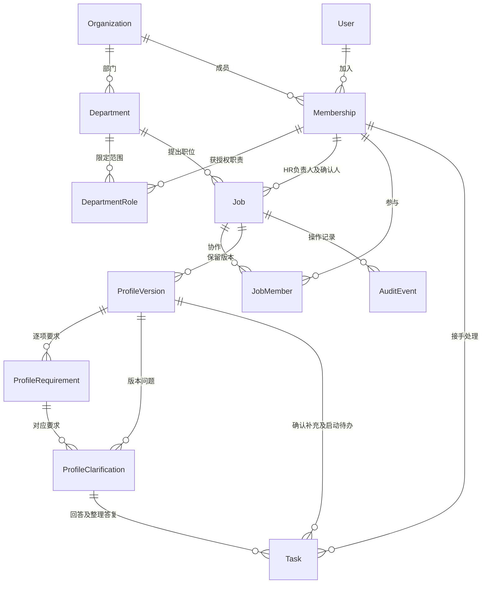

# 第一步实施交付：基础与建岗确认

日期：2026-09-23。对应 [开发交接](03_开发交接与数据库关系.md) 的第一步。

## 现在可以怎样使用

1. HR 使用团队账号进入“今天”，从“新建职位”填写名称、部门、地点、人数和用人负责人，可选择获授权的 HR 协作者。
2. 在右侧详情保存对外 JD 与内部招人要求。要求分必须满足、优先考虑、排除信号，保留来源与待核实标记。排除信号必须解释岗位关系和依据。
3. 提交确认后，用人负责人在自己的首页收到待办，HR 在“等待他人”看到进度。
4. 负责人可以确认，也可以写明需要补充的内容。后者会为 HR 创建补充任务；HR 保存新版本后，旧补充任务完成，再次送审会生成新的确认任务。
5. 确认通过后，HR 收到启动招聘待办，自行决定开始招聘。职位可以暂停、关闭、重新开启，关键调整保存原因；关闭撤回未完成任务。
6. 调整画像保存新版本，旧版本及确认信息继续可查；刷新、重新登录不会丢失已保存内容。

网页沿用深色侧栏、浅色内容区、蓝色主操作和右侧详情，颜色来自知遇首页既定变量。只开放已经能处理实际工作的“今天”“职位”，其他入口随完整流程开放。页面中的面试日程明确说明当前尚未开放，不显示虚构日程或数字。

## 已落地的工程与数据

- `apps/admin`：替换旧 Ant Design Pro 模板及模拟接口，使用 React、TypeScript、Vite、Tailwind CSS、shadcn/ui、Semi Design。
- `apps/api`：Django／DRF，会话认证、CSRF、组织及对象权限、事务、版本校验、操作记录。
- PostgreSQL 18.4：在本机 55432 端口建立项目独立实例；不改动本机既有 5432 数据库。Docker 服务与 Compose 本轮不可用，提供 Compose 配置但未执行容器验证。
- 外部首页 `apps/web`、无关 Oracle CSV、本地未跟踪的 ToC 方案均未修改或提交。

本阶段实际建立的关系：

Candidate 与 Application 仍按交接文档分别建设，但本阶段尚未创建这两组业务表；没有以职位表或浏览器假状态替代人才与应聘数据。后续真实评估必须关联已确认画像版本和本次简历输入，不能把最新未确认草稿用作正式判断依据。

数据库约束包括组织成员唯一、部门名称唯一、职位人数正数、画像版本唯一、确认人和时间一致、排除信号理由、待办完成时间一致、同一画像同类待办唯一、同一 HR 建岗请求唯一。已有职位修改事务内加锁并验证 version；过时或重复操作不能覆盖新结果。网络丢失建岗响应后，原样重试返回已建职位，不重复创建。

## 验证证据

- PostgreSQL 后端业务测试 **16 项通过**：完整状态流程、跨组织／部门／角色限制、伪造关联、协作授权、已确认版本保持不变、撤回与补充、职责撤销、真实会话与 CSRF、并发修改，建岗请求去重、默认禁止自审和必要要求未明确时阻止送审。
- Playwright **6 条流程通过**：HR 建岗到负责人确认及启动招聘；失败恢复与窄屏；另一 HR 的数据隔离及退出；补充后重新送审；响应丢失重试不重复建岗。
- 类型检查、代码检查、数据库迁移检查与前端生产构建通过。
- 实际检查 1440 × 1000 桌面和 390 × 844 窄屏截图。修复了标签样式缺失导致的内容挤压，并将窄屏详情内部不横向溢出加入断言。未声称完成完整读屏或所有浏览器兼容性验收。
- 已核对本地页面的真实请求、持久化和权限。浏览器测试使用独立 `recruitment_e2e` 数据库，测试资料均为虚构，不混入体验工作库。

前端构建仍提示一个约 814 KB（压缩前）的主脚本体积提醒，当前包含 Semi 表格；构建成功。正式发布前再结合真实数据量检查加载性能，当前未进行生产性能验收。

建岗确认流程后续修复（F06/F07）：保存招人要求时，关闭按钮和 Escape 均不会提前关掉详情；保存失败后保留内容并允许重试。负责人未提交的备注以及未保存的状态调整原因，关闭时提示确认；拒绝关闭后继续编辑。提交期间相关输入暂停编辑，避免把后输入的文字误当成已提交内容。这些行为已加入现有浏览器流程验收，未改变角色权限、确认规则或数据库关系。

## D01 对照与本次独立增量：F06 澄清问答

已核实文档提交 `a5fc3731f4632a3c7f83d8650bcf681c6c822be7` 是本分支祖先，无需重复合入。没有因为本次文档同步迁移或修改外部首页。D01 已有主线继续使用现有模型；下一项独立交付补齐网页内的逐条澄清，而不是提前创建 D02–D07 全部实体。

作为招聘 HR，我希望把某条招人要求的疑问交给指定负责人回答，以便整理明确依据后再送审。作为被指定负责人，我希望从本人待办直接看到原问题和原要求，以便回答具体问题并保留依据。

| 当前场景 / 对应规则 | 本次可验证结果 |
|---|---|
| D01 / AC02–AC03 | 保留建岗→提交→指定负责人确认→HR 启动；启动／恢复还会重查双方负责人授权，失效时阻止操作 |
| F06 / DB01 | 问题只能指向当前职位、当前草稿的一条要求；其他职位条件 ID、无权限 HR、仅配置管理员和外部组织访问均被拒绝；非指定负责人不能回答 |
| F06 / DB03 | 回答后画像仍为草稿，不改条件内容或待核实标记；HR 保存 v2 后仍能读到 v1 的原问题与答复 |
| F06 / DB06 当前范围 | 提问／答复、来源待办与操作记录同事务；测试在提问落审计前中断，确认问题、待办与版本均回滚；未接入外发，不能算外部闭环验收 |
| F06 / DB07 当前范围 | 提问响应丢失后相同请求只保留一个问题和待办；答案原样重试不重复完成；两连接提交不同答案只接受一个；换版／关闭撤回旧问题，不能继续作答 |
| F06 / F02 | 负责人回答结束原待办并生成 HR 整理答复待办；HR 保存新版完成整理待办。当前草稿有待回答问题时不能正式送审 |
| AC29 当前页面 | 澄清问答实测 390、1024、1440px；输入失败保留、离开提醒、任务直达澄清标签；不代表全系统所有页面验收 |

迁移 `0005` 只新增 ProfileClarification 并扩展现有 Task：问题请求在组织内唯一，已回答必须同时有答案和时间；问题类 Task 必须有 clarification 外键，同一问题同类任务唯一。其他画像任务保留原唯一关系。已有数据原地迁移，不删库；若要回退该迁移，须先备份问答并处理新增类型任务，否则旧约束不能接纳新记录。

测试累计后端 16 项、浏览器 6 条，通过真实 PostgreSQL 及独立验收库。新增主要测试见 `apps/api/tests/test_jobs.py` 中 clarification 与 activation 用例、`apps/admin/tests/jobs.spec.ts` 的澄清闭环；现有构建体积提醒仍在，不宣称生产发布完成。

D01 剩余差异仍明确保留：职位复制、基础信息再编辑、工作类型／薪资、权重和评价标尺、完整授权管理、通用审批扩展及真实飞书均未完成；AC01 当前覆盖内部职位，AC04 尚无真实评估可验。DB02/04/05/08/09/10 对应的应聘、评估、排期、文件等部分进入后续切片。Q01–Q07 没有被本次实现默认为已获批准。

## 如何运行和继续

本地工作台 `http://localhost:5174/`；Django 为本机 8100。当前开发工作副本为 `/Users/sshoperator/AI-Recruitment-implementation`，分支 `codex/recruitment-foundation`，与首页任务所在工作副本隔离。启动和测试步骤分别见 [后台说明](../../apps/admin/README.md) 与 [后端说明](../../apps/api/README.md)。本地体验账号密码只放在该工作副本 `.local/体验账号.txt`，不进版本库。

本轮没有合并到 main，也没有正式部署。后续任务若要继续本轮代码，应先切到上述分支或其后续分支，避免从仍保留旧后台的 main 重新起步。

## 仍未完成

本次不是整个 P0 交付。下一段从简历文件保护、导入与疑似重复复核、Candidate／Application 独立记录、人工复核继续，之后再做排期、候选人真实确认入口、面评与业务决策。AI、飞书、渠道发布与回传未删除，当前尚未实现或接入，也没有以演示结果冒充。Flutter 工程尚未创建。

当前没有成员授权配置页面、多组织切换页面、建岗后的基础字段编辑页面或生产账号接入。职位名称、地点、人数与确认人目前在建岗时填写；已有职位的 JD 和画像可以版本化调整。正式团队使用前由维护人员配置真实组织、部门与成员授权，并在对应后续流程中补齐管理入口。

## 与最新 04–07 规格的映射

提交前已读取主分支 `a5fc373` 新增规格，当前切片并非其中 F01/F02/F04/F06/F07 的全部能力。只把下列已实现部分标为本地已验证；飞书、复制、审批扩展、个人偏好、任务转交、权重标尺等仍为后续工作；网页澄清问答已在本次增量交付中实现。

| 规格逻辑 | 当前等价实现／边界 |
|---|---|
| F01 / AC01 认证与隔离 | Django User、Membership、同源会话及 CSRF；只支持当前组织的内部账号，未接入飞书或候选人登录 |
| F02 来源待办 | Task.kind=review/revise/start 对应确认／补充／启动，clarify/clarify_followup 对应回答问题／整理答复；由来源动作完成，不提供任意勾选完成；期限与转交后续实现 |
| F04 / AC02 建岗及启停 | Job、JobMember 和 change-status；建岗 request_id 防重复；复制、基础字段再编辑、薪资及工作类型字段待补齐 |
| F06 画像规则 | ProfileRequirement 对应 ProfileCriterion；text 对应描述，kind 对应必须／优先／排除，needs_verification 保留待明确标记；权重和评分标尺在真实评估前补齐 |
| F06 澄清 | ProfileClarification.profile 对应 profile_version，requirement 对应 criterion；固定指向本版本 ProfileRequirement，不重新创建 ProfileCriterion 表；request_key 使用 UUID。问题、答案与画像审批分开保存 |
| F07 / AC03 要求确认 | 当前单人画像确认以 ProfileVersion 的 submitted_by/at、confirmed_by/at、status/review_note，Task.review 的指定人及处理时间、AuditEvent 的动作记录共同保存；同一画像只有一次送审，退回重建版本。未实现编制或多级审批，不把画像已确认称为 HC 已批 |
| RoleGrant | 当前 DepartmentRole 承担部门角色授权，JobMember 限定 HR 协作；尚未扩展人才库、到期授权和管理配置页 |
| row_version / expected_version | 当前统一字段为 version，事务内锁定 Job 后检查；409 返回中文冲突提示，前端保留输入，需重新读取；返回最新摘要和统一错误封装待接口扩展时调整 |
| approved active profile | Job.active_profile 指向已确认的本职位版本；新草稿不改该指针。旧确认版本保留 confirmed 历史，是否当前生效由 active_profile 决定 |
| 状态映射 | Job.open = recruiting；Profile.pending = in_review、changes_requested = returned；Task.pending/done = open/completed |
| 分页／错误包 | 沿用 DRF count/results/next/previous 和 errors；对应 total/items 等逻辑含义。后续客户端共用此实际契约，不能再并行造第二套状态 |
| DB01/DB03/DB07 的当前范围 | 一致组织关联、稳定版本、事务冲突、最小授权、保护历史已有针对测试；涉及尚未建设的应聘、面试、文件与外部集成部分不计完成 |

新增规格要求的默认禁止自审已在创建、送审和确认处校验；必须满足的规则仍标为待核实时，接口拒绝送审或确认。当前并不默认获准 HC 审批、跨岗共享或对外发布等 Q 类待定事项。

## D02 独立增量：受控导入与人工复核（2026-09-23）

本节是当前最新实现状态；上文“尚未创建 Candidate/Application”“只开放今天和职位”等描述为 D01 当时的交付快照。本次已开放候选人入口，包含应聘记录、人才档案、导入记录；完整业务契约见 [09 进人与复核实施契约](09_D02进人与复核实施契约.md)。以下是 D02 的人工业务切片，不等于 D02 全部能力或整个 P0 完成。

### 使用流程

1. 获授权 HR 为已开始招聘、有正式画像的职位导入 PDF/DOCX，写明来源；单份 20MB、单批 20 份。每份分别接收和提取，失败不会撤销同批已接收文件；导入记录可重新打开继续处理。
2. 查看按 PDF 页／DOCX 段保留的实际文字。扫描件、加密件、损坏或复杂文件明确失败原因；可重试提取，或保存明确标为“人工摘录”的新版本。不会推断学历、经历或产生虚构评分。
3. 人工填写姓名和联系方式；缺联系方式时写明待补充情况。在本人有 HR 权限的人才范围内查同名、同电话、同邮箱；均不自动合并。选已有主档要写核对依据，另建同名主档要写区分依据。不能覆盖既有主档联系方式。
4. 确认后进入本次应聘。已有同岗进行中应聘就关联其材料；已结束则另建次数。人才档案也可单独“加入职位”，不会自动复制其他职位材料；原记录保留。所有应聘列表和人才历史均按访问者获授权职位裁剪。
5. HR 对照正式要求与本次材料人工复核：通过生成“待安排面试”；缺材料指定本岗 HR 与截止时间；不通过写明原因，仅结束本次应聘。补充说明后交回复核。待安排或暂停中的应聘也可记录撤回／招聘取消原因后结束；职位还有进行中应聘时不能直接关闭。
6. 首页真实待办可直达应聘。各次判断保留操作者、理由、正式画像和输入材料版本；新的复核不覆盖旧记录。身份确认也校验 HR 刚才读取的文字版本，其他人改过摘录必须重新核对。应聘版本或正式画像已变时返回冲突，网页保留尚未提交的说明，重新加载后再决定。

### 实体及接口映射

| 规格实体 | 本次实际实现及边界 |
|---|---|
| Candidate | 人才主档，组织／姓名／规范化电话／邮箱／缺联系方式说明／创建人；没有全局招聘阶段。暂未实现档案归档、全局合并撤销和结构化教育经历 |
| Application | candidate、job、attempt_no、owner、source、stage、version、closed_at、close_reason。DB 条件唯一限制同人同岗仅一条进行中应聘；已结束再次进入须新次数 |
| ApplicationEntry | 每次人工加岗／导入确认的持久请求凭据，保存请求键、操作者、目标应聘和来源。响应丢失后重复请求不会重开后来已结束的应聘 |
| ImportBatch / ImportItem | 目标职位、来源、预计数、逐份原件、身份核对内容／操作者、本次应聘。接收数／完成数从真实明细计算；列表不返回简历全文 |
| ResumeDocument | 私有 UUID 文件键、原文件名、file_type、字节数、SHA256、上传人、access_state、可空 candidate。PDF/DOCX 类型对应规格 mime_type；原件接口统一附件流，不暴露本地路径 |
| ResumeParse | 按原件递增版本，实际文字／错误、提取器或人工来源、操作者、请求键。组织继承受保护的 document；当前文字保存在数据库受权限控制的字段，不另建公开文本文件 |
| ApplicationResume | 固定指向 parse，document 从 parse 推导，assigned_by 和时间；不是随“最新解析”漂移的指针。已关联材料不允许原地改解析，补充走新导入 |
| ReviewDecision / StageEvent | 只追加，保存独立人工结果、跟进人和期限、前后阶段、正式画像、固定输入 parse ID 集合。没有以人工结论冒充 EvaluationRun，真实 AI 未接通 |
| Task | 沿用现有表，新增可空 application；数据库要求画像来源和应聘来源互斥。app_review／need_info／schedule；待补充必须有期限。同应聘同类待处理任务唯一，允许后续新一轮待办 |
| AuditEvent | 沿用现有职位审计，增 application 外键；动作、阶段事件、待办及审计同事务。复核依据留在受控 ReviewDecision，不把全文写入职位审计 |
| 文件下载能力 | DepartmentRole 新增独立 resume_download 授权；必须同时具备当前职位 HR 对象权限。现有账号没有因迁移自动取得下载权。权限撤销／文件停止访问立即生效 |

新增 API 仍统一在 `/api/v1/`：`imports` 创建／列表／详情；`imports/:id/upload` 逐份上传；`imports/:id/items/:item/parse|matches|confirm` 重试／人工摘录／疑似核对／确认；`candidates` 主档列表／详情及 `:id/apply` 加入职位；`applications` 列表／详情及 `:id/review` 人工处理；`documents/:id/download` 受控原件下载。具体请求字段见后端 README。Web 与后续 Flutter 共用这些记录，不建立独立客户端状态库。

迁移 0006 创建上述实际使用实体并扩展 Task、AuditEvent；0007 增加文件范围／解析结果／跟进期限约束及任务与应聘查询索引。旧 D01 数据原地迁移，不清库。回退前须备份全部新增业务及私有文件，不能直接丢弃已导入材料。组织一致性和外键选择由统一业务入口检查，数据库唯一／状态约束补充保障；未声称 PostgreSQL 已为所有跨表组织关系建立复合外键。

### 验证与剩余边界

- 后端累计 25 项：新增真实文字提取、空白扫描件失败与人工版本、重复请求、同名分开、同人多岗、同岗再次应聘、两数据库连接并发加岗和相反复核、材料与画像变更冲突、角色隔离、独立下载权限撤销、文件停止访问、待补充跟进和人工复核事务回滚等场景。
- 浏览器保存可重复的导入→扫描件人工补录→疑似核对→人工补充／复核→首页待办直达流程，同时检查响应丢失后原样重试、同名两人、旧应聘结束后新次数、并发处理冲突保留输入；既有 6 条建岗／澄清回归保留，累计 7 条浏览器流程通过。
- 390、1024、1440px 应聘详情已截图并检查内部横向溢出；不代表完整读屏或所有浏览器认证。测试文件全部虚构，浏览器原件保存在独立 `.local/e2e-resumes`，不与体验原件混用、不提交 Git。
- 本地 pypdf 6.19.0 与 DOCX XML 实际提取可用；没有 OCR，也没有真实 AI 评估。子进程 CPU 10 秒、父进程等待 15 秒、页数和文字量有限制。Linux 另设 768MB 地址空间限制；macOS 不支持相同限制，不能把本地验证称为生产解析沙箱。生产资源隔离、恶意文件扫描及 Q05 保留策略仍待落实。
- F10 既有人才全历史合并／撤销、F11 主档字段编辑与结构化经历、F12 真实 AI 与 EvaluationInput、F13 批量复核、F14 可跨应聘复用的 CapabilityEvidence 尚未交付。本次人工理由和输入版本留痕不冒充完整能力证据库。
- 仅 HR 可进入当前候选人切片；负责人、面试官的细粒度字段视图、人才库跨部门授权随后实现；管理员配置权不等于简历读取权。飞书、渠道、排期与候选人真实确认仍未接通。

下一项独立工作可从 F14 有来源的能力证据与人工核实继续；D03 消费真实 schedule 待办建设预约与候选人确认。外部 AI／渠道凭据不足不阻止这些工作；Q 类规则仍保留待定状态。

最终检查：Ruff、格式、Django 检查、迁移一致性、前端代码检查／类型检查／生产构建通过。现有主包体积提示仍在（约 837KB，压缩约 245KB），未作生产性能验收。
