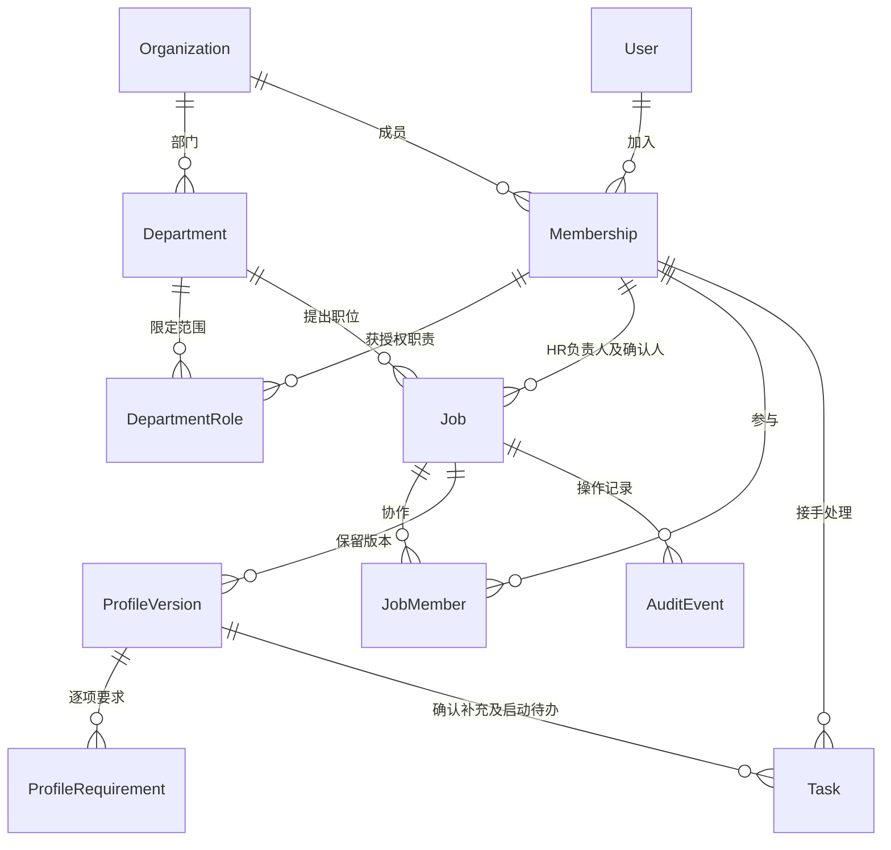

# 第一步实施交付：基础与建岗确认

日期：2026-09-23。对应 [开发交接](03_开发交接与数据库关系.md) 的第一步。

## 现在可以怎样使用

1. HR 使用团队账号进入“今天”，从“新建职位”填写名称、部门、地点、人数和用人负责人，可选择获授权的 HR 协作者。
2. 在右侧详情保存对外 JD 与内部招人要求。要求分必须满足、优先考虑、排除信号，保留来源与待核实标记。排除信号必须解释岗位关系和依据。
3. 提交确认后，用人负责人在自己的首页收到待办，HR 在“等待他人”看到进度。
4. 负责人可以确认，也可以写明需要补充的内容。后者会为 HR 创建补充任务；HR 保存新版本后，旧补充任务完成，再次送审会生成新的确认任务。
5. 确认通过后，HR 收到启动招聘待办，自行决定开始招聘。职位可以暂停、关闭、重新开启，关键调整保存原因；关闭撤回未完成任务。
6. 调整画像保存新版本，旧版本及确认信息继续可查；刷新、重新登录不会丢失已保存内容。

网页沿用深色侧栏、浅色内容区、蓝色主操作和右侧详情，颜色来自知遇首页既定变量。只开放已经能处理实际工作的“今天”“职位”，其他入口随完整流程开放。页面中的面试日程明确说明当前尚未开放，不显示虚构日程或数字。

## 已落地的工程与数据

- `apps/admin`：替换旧 Ant Design Pro 模板及模拟接口，使用 React、TypeScript、Vite、Tailwind CSS、shadcn/ui、Semi Design。
- `apps/api`：Django／DRF，会话认证、CSRF、组织及对象权限、事务、版本校验、操作记录。
- PostgreSQL 18.4：在本机 55432 端口建立项目独立实例；不改动本机既有 5432 数据库。Docker 服务与 Compose 本轮不可用，提供 Compose 配置但未执行容器验证。
- 外部首页 `apps/web`、无关 Oracle CSV、本地未跟踪的 ToC 方案均未修改或提交。

本阶段实际建立的关系：

Candidate 与 Application 仍按交接文档分别建设，但本阶段尚未创建这两组业务表；没有以职位表或浏览器假状态替代人才与应聘数据。后续真实评估必须关联已确认画像版本和本次简历输入，不能把最新未确认草稿用作正式判断依据。

数据库约束包括组织成员唯一、部门名称唯一、职位人数正数、画像版本唯一、确认人和时间一致、排除信号理由、待办完成时间一致、同一画像同类待办唯一、同一 HR 建岗请求唯一。已有职位修改事务内加锁并验证 version；过时或重复操作不能覆盖新结果。网络丢失建岗响应后，原样重试返回已建职位，不重复创建。

## 验证证据

- PostgreSQL 后端业务测试 **11 项通过**：完整状态流程、跨组织／部门／角色限制、伪造关联、协作授权、已确认版本保持不变、撤回与补充、职责撤销、真实会话与 CSRF、并发修改，建岗请求去重、默认禁止自审和必要要求未明确时阻止送审。
- Playwright **5 条流程通过**：HR 建岗到负责人确认及启动招聘；失败恢复与窄屏；另一 HR 的数据隔离及退出；补充后重新送审；响应丢失重试不重复建岗。
- 类型检查、代码检查、数据库迁移检查与前端生产构建通过。
- 实际检查 1440 × 1000 桌面和 390 × 844 窄屏截图。修复了标签样式缺失导致的内容挤压，并将窄屏详情内部不横向溢出加入断言。未声称完成完整读屏或所有浏览器兼容性验收。
- 已核对本地页面的真实请求、持久化和权限。浏览器测试使用独立 `recruitment_e2e` 数据库，测试资料均为虚构，不混入体验工作库。

前端构建仍提示一个约 808 KB（压缩前）的主脚本体积提醒，当前包含 Semi 表格；构建成功。正式发布前再结合真实数据量检查加载性能，当前未进行生产性能验收。

建岗确认流程后续修复（F06/F07）：保存招人要求时，关闭按钮和 Escape 均不会提前关掉详情；保存失败后保留内容并允许重试。负责人未提交的备注以及未保存的状态调整原因，关闭时提示确认；拒绝关闭后继续编辑。提交期间相关输入暂停编辑，避免把后输入的文字误当成已提交内容。这些行为已加入现有浏览器流程验收，未改变角色权限、确认规则或数据库关系。

## 如何运行和继续

本地工作台 `http://localhost:5174/`；Django 为本机 8100。当前开发工作副本为 `/Users/sshoperator/AI-Recruitment-implementation`，分支 `codex/recruitment-foundation`，与首页任务所在工作副本隔离。启动和测试步骤分别见 [后台说明](../../apps/admin/README.md) 与 [后端说明](../../apps/api/README.md)。本地体验账号密码只放在该工作副本 `.local/体验账号.txt`，不进版本库。

本轮没有合并到 main，也没有正式部署。后续任务若要继续本轮代码，应先切到上述分支或其后续分支，避免从仍保留旧后台的 main 重新起步。

## 仍未完成

本次不是整个 P0 交付。下一段从简历文件保护、导入与疑似重复复核、Candidate／Application 独立记录、人工复核继续，之后再做排期、候选人真实确认入口、面评与业务决策。AI、飞书、渠道发布与回传未删除，当前尚未实现或接入，也没有以演示结果冒充。Flutter 工程尚未创建。

当前没有成员授权配置页面、多组织切换页面、建岗后的基础字段编辑页面或生产账号接入。职位名称、地点、人数与确认人目前在建岗时填写；已有职位的 JD 和画像可以版本化调整。正式团队使用前由维护人员配置真实组织、部门与成员授权，并在对应后续流程中补齐管理入口。

## 与最新 04–07 规格的映射

提交前已读取主分支 `a5fc373` 新增规格，当前切片并非其中 F01/F02/F04/F06/F07 的全部能力。只把下列已实现部分标为本地已验证；飞书、复制、审批扩展、个人偏好、任务转交、权重标尺与澄清问答等仍为后续工作。

| 规格逻辑 | 当前等价实现／边界 |
|---|---|
| F01 / AC01 认证与隔离 | Django User、Membership、同源会话及 CSRF；只支持当前组织的内部账号，未接入飞书或候选人登录 |
| F02 来源待办 | Task.kind=review/revise/start 对应确认／补充／启动；由来源动作完成，不提供任意勾选完成；期限与转交后续实现 |
| F04 / AC02 建岗及启停 | Job、JobMember 和 change-status；建岗 request_id 防重复；复制、基础字段再编辑、薪资及工作类型字段待补齐 |
| F06 画像规则 | ProfileRequirement 对应 ProfileCriterion；text 对应描述，kind 对应必须／优先／排除，needs_verification 保留待明确标记；权重和评分标尺在真实评估前补齐 |
| F07 / AC03 要求确认 | 当前单人画像确认以 ProfileVersion 的 submitted_by/at、confirmed_by/at、status/review_note，Task.review 的指定人及处理时间、AuditEvent 的动作记录共同保存；同一画像只有一次送审，退回重建版本。未实现编制或多级审批，不把画像已确认称为 HC 已批 |
| RoleGrant | 当前 DepartmentRole 承担部门角色授权，JobMember 限定 HR 协作；尚未扩展人才库、到期授权和管理配置页 |
| row_version / expected_version | 当前统一字段为 version，事务内锁定 Job 后检查；409 返回中文冲突提示，前端保留输入，需重新读取；返回最新摘要和统一错误封装待接口扩展时调整 |
| approved active profile | Job.active_profile 指向已确认的本职位版本；新草稿不改该指针。旧确认版本保留 confirmed 历史，是否当前生效由 active_profile 决定 |
| 状态映射 | Job.open = recruiting；Profile.pending = in_review、changes_requested = returned；Task.pending/done = open/completed |
| 分页／错误包 | 沿用 DRF count/results/next/previous 和 errors；对应 total/items 等逻辑含义。后续客户端共用此实际契约，不能再并行造第二套状态 |
| DB01/DB03/DB07 的当前范围 | 一致组织关联、稳定版本、事务冲突、最小授权、保护历史已有针对测试；涉及尚未建设的应聘、面试、文件与外部集成部分不计完成 |

新增规格要求的默认禁止自审已在创建、送审和确认处校验；必须满足的规则仍标为待核实时，接口拒绝送审或确认。当前并不默认获准 HC 审批、跨岗共享或对外发布等 Q 类待定事项。
