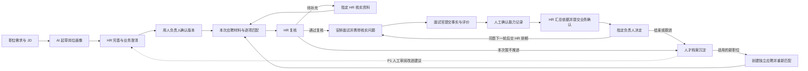

# 人才画像：先定岗位要求，再用证据了解人选

日期：2026-10-03。状态：可评审、可拆分开发的产品方案；本文件不代表功能已上线。

用户已明确两项方向：**岗位画像与候选人画像连通，先制定岗位要求；人才画像必须具有 AI 功能。** 本文的页面布局、交互细节和切片顺序是据此提出的设计建议。04–07 的正式功能边界与 Q 类待定规则继续有效，不因本方案自动批准跨部门共享、自动淘汰或后续阶段功能。

## 1. 这部分要解决什么问题

HR 不应反复把 JD、简历、AI 报告和面试评价拼在一起。人才画像应让 HR 连续完成三件事：**说清要什么人，看清目前有什么证据，知道下一步找谁核实。**

| 对象 | 回答的问题 | 唯一数据来源与边界 |
|---|---|---|
| 岗位画像 | 这个职位需要哪些能力，如何验证？ | 职位的要求版本；与职位详情“招人要求”共用，不另建一套标准 |
| 候选人画像 | 这个人有哪些经历、能力证据，哪些尚未核实？ | 候选人主档案及获授权的来源记录；一个人保留一份主档 |
| 本次岗位匹配 | 这个人应聘这个职位，哪些要求有依据、哪些待补充？ | 具体应聘＋正式岗位画像版本＋本次材料版本；不同职位分别判断 |

候选人画像不做“全公司人才总分”，不把一次不适合某岗位写成这个人的永久标签。简历写过、AI 找到原文、面试官核实，代表不同证据强度，必须区分。

## 2. 当前基础与实际断点

本轮实测范围仅为 `#talent-profiles` 入口：页面能打开，当前是“人才画像尚未接入”占位；未发生生成、确认、招聘决策或数据写入。截图留在本机 `.local/talent-profile-design/01-current-placeholder.png`，不纳入 Git。其余现状来自当前源码检查，没有重新运行业务验收或真实模型调用。

| 环节 | 当前代码基础 | 本模块需要补的连接 |
|---|---|---|
| 岗位标准 | `ProfileVersion`、`ProfileRequirement`、澄清问答、提交和指定负责人确认已有实现 | 在人才画像入口复用；增加 AI 起草、要求检查、来源与差异预览 |
| 人与应聘 | Candidate、Application、简历解析和绑定、加入职位、人工复核已有实现 | 同屏呈现按人事实和按岗判断，避免重复建档 |
| AI 初面 | 已有真实模型调用代码、报告、原文引用校验和题目入库路径 | 固定本次应聘、正式画像及材料版本；与本模块共享授权后的证据，不能直接认定为已核实 |
| 面试 | 已有排期、参与人及待确认状态 | 邀请发送、候选人／面试官确认动作、已提交面评与证据回写仍需补齐；待确认状态不代表确认链已实现 |
| 长期能力记录 | 06 已定义 CapabilityEvidence，但当前模型尚未落地 | 增加来源、人工确认、修订、撤回和来源权限检查 |
| 正式岗位评估 | 06 已定义 Evaluation、EvaluationItem 等，但当前未有对应模型 | 保存逐项结果、输入版本、执行信息与人工复核引用，不能把个人 AI 初面历史当正式评估 |

主要源码：`apps/admin/src/app.tsx`、`pages/job-detail.tsx`、`pages/intake.tsx`、`pages/ai-screening.tsx`；后端 `apps/api/recruitment/models.py`、`views.py`、`intake.py`、`interviews.py`、`ai_screening.py`、`llm.py`。

现有 AI 初面按候选人去重后取一条应聘，目标职位又可另选；这不适合直接接入按岗画像。连接时应明确选择“人＋本次应聘”，由应聘确定职位，跨岗位操作先进入对应应聘。历史报告目前受创建者范围限制，不能借新页面扩大可见性。

## 3. 页面怎么安排

保留用户当前的“人才画像”导航与路由，作为集中工作入口。职位详情、候选人详情仍能进入相同记录，切换入口不需要重新填写。沿用当前蓝白工作台、现有组件与下拉框样式，本次不改全站导航或视觉方向。

### 3.1 默认进入“岗位画像”

顶部两个业务标签：**岗位画像｜候选人画像**。进入时默认岗位画像；从职位或候选人深链进入时带入明确上下文。跨标签保留当前职位、筛选和阅读位置。

| 区域 | 内容与动作 | 设计目的 |
|---|---|---|
| 标题与范围 | 人才画像；我的／授权职位范围 | 说明看到哪些数据 |
| 工作队列 | 待完善、待负责人确认、已生效；点击直接筛选对应记录 | 先处理事情，不铺满无动作的统计卡 |
| 职位列表 | 职位、部门、要求版本、当前状态、待澄清项、下一责任人 | 快速找到卡住的岗位；草稿版本与生效版本分列 |
| 选中职位的内容 | JD 摘要、岗位要求、澄清问答、版本记录 | 复用职位详情内容与业务动作 |
| 当前主要操作 | 无草稿：AI 起草画像；有草稿：继续完善／提交确认；已生效：查看人选匹配 | 每个状态只突出下一步 |

未选职位时先选已有职位；没有职位时按权限引导创建职位。没有“脱离职位新建画像”按钮，避免重复维护岗位数据。

### 3.2 岗位画像编辑

直接带入已保存的职位名称、JD、业务目标与获授权的澄清答复；业务目标不清楚时允许补充，不强迫填写一大张表。HR 点击“AI 起草画像”后，看到可逐条编辑、删除、采用的草稿：

| 每条要求 | 示例（虚构） |
|---|---|
| 要验证的能力 | 能独立负责区域渠道拓展 |
| 具体表现 | 说明如何寻找合作伙伴、推动签约并追踪后续效果 |
| 类型 | 必须满足／优先考虑；排除信号在更多设置中展示岗位相关理由 |
| 判断依据 | 项目背景、本人职责、过程、成果的统计口径 |
| 来源 | 来自 JD 的哪段，或 AI 建议、业务负责人补充 |
| 待澄清问题 | 要求独立负责，还是参与执行即可？ |

不要求 HR 先调权重、写提示词或配置模型。AI 补充的建议必须标出来，不能伪装为业务已提出的硬条件。HR 采用并保存后形成现有画像草稿，再交指定负责人确认。

已有正式版本时，AI 修改显示逐项差异，保存为新版本。新版本确认前继续使用原生效版本；确认后提示受影响的人选评估，旧报告保留当时依据，不自动改写人工决定。

### 3.3 候选人画像与岗位匹配

从已确认岗位点击“查看人选匹配”，默认只列该职位的本次应聘。候选人画像也可以独立按人查看，但未选职位时仅展示事实和证据，不产生岗位匹配分。

首屏按阅读顺序呈现：**人选＋本次职位／应聘次数 → 有依据的概要 → 岗位要求对照 → 待核实项 → 下一步**。

| 岗位要求 | 当前材料判断 | 依据与来源 | 可做的下一步 |
|---|---|---|---|
| 独立负责渠道项目 | 有材料支持，尚未人工核实 | 简历指定版本第 2 页，原文与时间 | 查看原文；标为本轮核实项 |
| 团队管理经验 | 信息不足 | 现有材料未写清团队规模和本人职责 | 生成追问；交 HR 补充 |
| 岗位必要资格 | 人工核实存在差距 | 指定材料及核实记录 | 查看核实记录；由 HR 决定本次应聘下一步 |

表中内容均为设计示例。列表不按 AI 综合分默认排名。正式岗位评估按 07 的待试点校准口径同时返回“分数＋依据覆盖率＋必须项缺口”：覆盖情况和缺口直接可见，总分收在“评估详情”，同时写明职位、版本、材料时间及限制。只对有依据可评价项计算加权分，未知项不伪造负分；无可评价项分数为空。

主操作随真实应聘状态改变：待复核显示“通过复核／待补充／暂不推进”；待安排显示“安排面试”；面试中显示“准备本轮核实”；面评待收齐时指明等待谁。不能在任意状态都放同一排推进按钮。

“能力记录、原始材料、应聘历史、操作记录”放在次级标签。宽屏用列表＋详情、原文按需展开；1170px 等普通窗口优先保证中文内容宽度，不强挤三栏。关闭详情恢复列表位置与键盘焦点，下拉菜单内部滚动不改变表单布局。

## 4. AI 具体负责哪些事

| AI 能力 | 输入 | 给 HR 的结果 | 人确认后才发生的事 |
|---|---|---|---|
| 起草岗位画像 | 当前职位 JD、业务目标、已回答澄清 | 可编辑要求、原文出处、AI 补充建议、待问问题 | 保存草稿，再提交指定负责人确认 |
| 检查要求是否清楚 | 当前画像草稿 | “沟通能力强”等模糊描述的具体化建议、冲突条件、缺少验证办法的项 | HR 采用改写；需要业务判断的发起澄清 |
| 整理候选人匹配证据 | 已确认画像＋本次授权材料 | 按每条要求整理支持／明确不满足／信息不足；逐条引用来源 | HR 复核并记录自己的判断，AI 不直接推进或淘汰 |
| 生成核实问题 | 人选材料、岗位要求、待核实项、本轮目标 | 主问题、追问、需要听到的事实依据；可选已有题库内容 | HR／面试官选择并保存到本场面试准备 |
| 归纳已提交评价 | 已提交且可读的面评、原始能力证据 | 能力记录草稿、相互矛盾的意见与出处 | 获授权人员确认后形成能力记录，保留作者与来源 |
| 提出岗位改进建议 | 后续有足够且获授权的招聘反馈样本 | 哪条标准值得调整、依据与影响 | P1 的负责人审核后生成新版草稿；不自动学习上线 |

前四项是本模块的主干；面评归纳依赖面评真实落地；样本学习按 F25 后续范围建设。首版不需要单独聊天机器人、向量库或多智能体招聘平台。

AI 生成入口旁显示使用的职位／版本／材料，HR 无需重复上传已有简历。仅生成草稿不会自动发送消息、创建大批待办、保存到共享题库或改变招聘状态。真实核实任务在 HR 选择负责人并采用后产生。

AI 返回不合法结构、引用不存在、服务超时或未配置时，显示明确失败与重试，保留原输入及最近成功结果，允许继续人工编辑。校验失败的内容不进入已确认依据；材料中找不到某项不能当作不具备该能力。

## 5. 完整闭环：每一步都有接手人

| 谁操作 → 动作 | 前提 | 改哪些记录 | 结果 → 交给谁 | 失败如何继续 |
|---|---|---|---|---|
| HR → AI 起草并保存 | 有职位操作权，来源可读 | AI 执行记录；采用后保存 ProfileVersion／Requirement 草稿 | 可确认的要求 → 指定负责人 | 模型失败仍可手填；不覆盖生效版 |
| 负责人 → 确认或退回 | 本人被指定、有权限、版本未过期，待澄清项已处理 | 画像状态、生效指针、来源 Task、AuditEvent | 正式标准或补充事项 → HR | 他人已修改则刷新差异，保留输入 |
| HR → 分析本次人选 | 正式画像、本次应聘和授权材料齐备 | Evaluation／Item、输入关联和执行信息 | 逐项依据与待核实项 → 经办 HR | 部分无依据标信息不足；失败可人工复核 |
| HR → 待补充或通过复核 | 当前应聘仍可复核，版本有效 | 复用 ReviewDecision、阶段事件、来源待办与下一待办 | 补资料交指定 HR；通过交排期 HR | 重复点击返回同一结果；冲突不覆盖新决定 |
| HR／面试官 → 准备本轮问题 | 属于本场协作范围 | 保存已采用的问题与来源要求／评估关联 | 本轮验证目标 → 面试官 | 不必等待 AI，可手动录入；未采用不生成待办 |
| 面试官 → 提交评价 | 本人是参与者，评价具有事实依据 | Feedback／Revision／Item，完成本人反馈任务；生成证据草稿 | 待核实项有回应 → HR／指定业务负责人 | 草稿与提交分开；失败保留草稿，不冒充已提交 |
| 有权人员 → 确认证据 | 能读来源，具备证据确认权限 | CapabilityEvidence 修订 | 保留可追溯事实 → HR 汇总 | 意见冲突并列显示；确认证据不等于业务批准 |
| HR → 提交业务确认 | 选择已提交面评、可读依据版本和指定接收人，预览亮点、缺口与待决定事项 | DecisionRequest、对应 Task 与审计；外部发送另记真实状态 | 待决定事项 → 指定业务负责人 | 失败保留预览；重复提交不重复建任务 |
| 指定负责人 → 决定下一步 | 本人有权处理且事项／版本有效；暂缓填复查时间，不推进填原因 | F19 业务决定、应聘阶段与下一待办同事务提交 | 下一轮交 HR 排期；先联系／暂缓交跟进 HR；结束保留档案 | 过期或他人已处理显示最新结果；未接通测评仅建跟进待办 |
| HR → 为已有人员加入新职位 | 对人和目标职位都有权限，目标可招聘 | 复用加入职位接口创建新 Application 与待办 | 新岗位重新匹配 → 新岗位 HR | 同岗进行中打开已有应聘，结束后新次数 |

“同意下一轮”只产生待安排事项；“安排成功”“邀请已发送”“候选人已确认”“面评已提交”分别显示。人才画像展示原业务任务，不再维护一套独立招聘状态。

当前人工复核动作只覆盖复核／补充等入口，不能直接承接面试后的业务决定。第三步必须接入或同步交付 F19 的明确业务确认与阶段流转，并与负责面试模块的任务对齐 F16 邀请／确认能力；任一段缺失时只报告该切片已完成，不称招聘全流程闭环。网页可以先完成受控的业务确认，飞书仍需单独真实接通与验收。

## 6. 数据、权限和 AI 可信度

### 6.1 复用当前实现，按切片增加缺口

| 能力 | 实施建议 |
|---|---|
| 岗位草稿／确认 | 直接复用 ProfileVersion、ProfileRequirement、ProfileClarification 与现有保存／提交／确认动作；不新增同义岗位画像表 |
| AI 调用 | 复用 `llm.chat_completion` 及已有 JSON／引用校验经验，新增本任务的输入输出校验；不把 AI 初面报告接口当所有业务的通用容器 |
| AI 来源追溯 | 按 06 的 AIExecution 语义保存用途、模型／提示版本、输入摘要、状态、失败原因；采用后的业务草稿可回溯执行。只补当前切片必要字段，不先建设通用任务平台 |
| 业务目标与要求出处 | 当前模型没有完整承接这些字段；第一步需增量保存有版本的业务目标／输入快照，以及每条要求的来源种类、位置和生成执行关联。来源可以是 JD、澄清答复、人工补充或 AI 建议，不能仅存一段总来源文字而丢掉逐项出处 |
| 正式岗位匹配 | 按 06 增量实现 Evaluation、EvaluationItem、EvaluationInput；固定确切画像要求、ApplicationResume／ResumeParse，绑定本次应聘 |
| 能力证据 | 按 06 实现 CapabilityEvidence：来源应聘、具体解析／面评修订、定位、作者、确认人、时间、修订或撤回原因；人工记录明确标识 |
| 面评回流 | 复用 Interview／Participant，接 F18 的 Feedback 与修订；只有已提交面评可作为确认来源，未提交草稿默认本人可见 |
| 待办与留痕 | 扩展既有 Task／AuditEvent 的明确来源关联；采用幂等请求键与版本校验，同次事务完成业务状态与待办变化 |

现有 ProfileRequirement 与规格 ProfileCriterion 采用等价映射。当前未具有完整稳定能力标识、权重与评分标尺字段；第二切片正式 F12 评估前，必须按 06/07 补充必要字段与迁移。权重、标尺、舍入口径绑定已确认画像的 scoring_schema_version，HR 不必每次分析重新设置；没有已确认评分口径时不让模型自由给分。具体推荐阈值仍待同岗试点，不能把本方案视为阈值批准；跨版本逐项比较不只靠同名文本关联。

岗位的稳定能力维度与个人的可复用能力事实分开维护；匹配结论属于应聘，人工确认属于对应判断。可通过查询组织页面的数据不用重复存储；需要留痕、重试或冻结历史的业务结果才持久化。

### 6.2 必须保持的规则

1. 列表、搜索、数量、详情、原文、导出、给 AI 的输入使用同一授权范围。候选人可见不意味着所有历史应聘可见；看不到来源的内容不能进入 AI 摘要再泄露出来。
2. 默认继承来源权限。跨部门共享方式属于 Q03；未确认前不开放。面试官只看本场必要资料，管理员配置权不自动产生简历阅读权。
3. AI 只分析岗位相关职责、技能和可核验经验。不以年龄、性别、婚育、民族、健康、宗教等信息或其代理指标判断人选，不推断性格、忠诚度等缺乏依据的标签。
4. 简历和 JD 中的文本只是材料，不能改变模型指令、权限或操作范围。只向组织已批准的模型连接提交最小必要信息，移除无关联系方式；未批准连接时保持人工路径。本轮不传送真实候选人材料进行试验。
5. 引用必须落在本次授权且锁定版本的材料范围，能定位页／段；引用真实不等于事实已验证。来源修订或撤回后标记依赖结果需复核；历史不静默改写。
6. 新画像、新材料、新面评不自动覆盖旧结果。显示“基于旧版，待重新分析”，由 HR 触发重新生成；保留人工已经做出的决定。
7. AI 初面历史只能在原授权范围使用。没有应聘／画像／材料版本的旧报告不补造出处；可供原有权限内阅读，但不能直接升级成正式评估或已确认能力。
8. 模型调用前和结果写入／返回前重新校验授权与版本。任务运行中权限撤销或材料变更时，不把结果放进当前有效画像；重复提交不重复创建记录或推进状态。
9. AI 不自动确认岗位标准，不自动淘汰、录用或发送邀请；样本学习不自动改变标准。岗位要求未确认时允许讨论草稿，但不出正式人选匹配结论。
10. 超时不伪称成功。长耗时任务需要持久状态和可恢复重试；按实际需求选择现有运行方式，不为了此入口一次性安装额外平台。不得在等待模型期间长时间锁住岗位或应聘记录。

## 7. 交付顺序与验收

以下是本模块内的开发切片，不重排既有 P0/P1/P2/P3。每步交付页面、接口、持久化、权限和必要测试；前两步完成也不能宣称全闭环上线。

| 切片 | 可用成果 | 完成条件 |
|---|---|---|
| 第一步：岗位 AI 画像 | 人才画像默认岗位工作台；从已有 JD 起草、编辑、澄清、提交确认，与职位页共用版本 | 刷新不丢；两入口一致；AI 失败可人工继续；确认权限、过期版本和历史通过检查 |
| 第二步：本次人选匹配 | 选定应聘与材料，按正式要求逐项展示证据、分数、覆盖率和必须项缺口；链接既有人工复核和排期 | 固定画像评分标尺；无可评价项分数为空；一人多岗不混数据；版本可追溯；无来源输出被拦截；复核真实产生下一待办 |
| 第三步：核实与证据回流 | 对齐 F16 邀请／确认；本轮问题、面评提交、人工确认能力记录；接入 F19 网页业务确认及下一轮／结束，再次加入职位 | 问题能追到哪条要求；面评草稿不当正式证据；业务决定真实更新阶段与待办；新职位独立应聘；有完整接手人与失败恢复 |
| 后续：岗位改进建议 | 按 F25 根据已授权样本提出修改建议 | 显示样本、依据和影响；采纳产生草稿并重新确认，不改旧决定 |

### 必须保存的验收场景

- HR 从已有职位生成并修改 AI 草稿 → 负责人退回补充 → HR 完善 → 正式确认 → 职位页与画像页显示相同生效版本。
- 同一人有两个职位应聘，切换后要求、材料、评估、下一步与权限都随本次应聘变化；人才数仍为 1，应聘数为 2。
- 简历没有带队人数时显示“信息不足”，不能写成“管理能力不足”；没有证据时 AI 不补造经历或引用。
- AI 将材料外文字当引用、生成错误格式或超时，结果不能被标记为可靠依据；输入不丢，人工处理可继续。
- 新版岗位标准确认后旧评估仍可阅读，明确版本差异；重新分析保存新记录，原人工决定不被覆盖。
- HR 通过复核后进入真实待安排；面试官提交本人面评后，对应核实项可查看结果，并由有权限的人确认证据。
- HR 预览并提交业务确认，指定负责人选择下一步：同意下一轮只生成待安排；暂缓记录复查时间；不推进保留原因。确认证据不等于已经完成这次业务决定。
- 未提交面评、不可见历史、撤销权限后的材料不能通过搜索、数量、摘要、AI 上下文或下载泄露。
- 新职位复用档案不复用旧岗位分数；同岗进行中不重复建应聘；重复点击、并发修改、失败重试不重复流转。
- 加载、无职位、无匹配人选、未确认画像、模型未配置、引用失败、无权限和过期操作均有可继续路径；键盘、关闭焦点、普通窗口和窄屏可完成主要任务。

这些是待实施验收场景，本轮没有把设计检查等同于通过业务测试。

### AI 效果怎么验证

上线前使用虚构或获批准的脱敏材料，覆盖信息完整、缺失、矛盾、多次应聘、来源不可见与材料中夹带指令的情况。记录以下指标，先建立基线，再与 HR 确定目标，不编造节省时间或准确率：

| 指标 | 口径 |
|---|---|
| 来源可定位率 | 可定位到锁定材料版本的引用条数／全部引用条数；引用校验失败的结果不得进入可靠依据 |
| 信息不足误判率 | 人工确认应为信息不足、却被 AI 写成不满足的项数／人工确认的信息不足项数 |
| 草稿修正成本 | HR 从生成草稿到可提交所花时间与修改项数，按岗位场景分别记录 |
| 核实闭环率 | 已有人工核实结论的到期核实项／到期应核实项；区分等待面试与遗漏处理 |
| 画像实际使用 | 有人查看逐项依据并完成人工复核的应聘数／生成正式匹配结果的应聘数 |

不能用 AI 自评代替人工对照，也不能把“采用率高”直接当作判断正确。正式招聘结论仍由有权限的人作出。

## 8. 一个 HR 使用例子

以下完全虚构，不来自实际候选人资料。

HR 要招区域渠道经理，已有 JD。进入人才画像选择该职位，AI 拆出渠道开发、合作推进、结果复盘三类要求，并提出“需要独立负责还是参与即可”的澄清问题。HR 发给指定负责人，负责人确认具体标准，画像形成正式版本。

HR 打开该职位的人选甲：渠道项目有简历出处，团队管理未写清。系统显示待核实项，HR 采用两道追问放入本轮面试准备。面试官面后提交本人职责、项目过程和依据，HR 确认哪些能力记录可以沉淀，再按业务决定安排下一轮或结束本次应聘。

后来另一个获授权职位需要该能力，HR 为同一人才加入新职位，使用新岗位要求重新分析。已有事实在权限允许时复用，旧岗位结论保留；无须重建人才档案，也不会把旧岗位分数直接搬过来。

## 9. 依据与下一开发起点

实施依据：[02 页面布局](02_内部工作台布局方案.md)、[03 开发交接](03_开发交接与数据库关系.md)、[04 角色与范围](04_角色功能与范围矩阵.md)、[05 功能规格](05_UI与功能颗粒度规格.md)、[06 数据字典](06_数据库字典与实体关系.md)、[07 接口与验收](07_接口状态与开发验收.md)、[09 进人与复核契约](09_D02进人与复核实施契约.md)。涉及 F06/F07、F11–F14、F17/F18/F19；F25 保持后续。

优先实施第一步“岗位 AI 画像”：先让 HR 从已有 JD 得到能编辑、能确认、其他模块能引用的正式标准。完成后继续第二、三步，才能将人才画像称为贯通招聘判断与人才复用的闭环能力。
