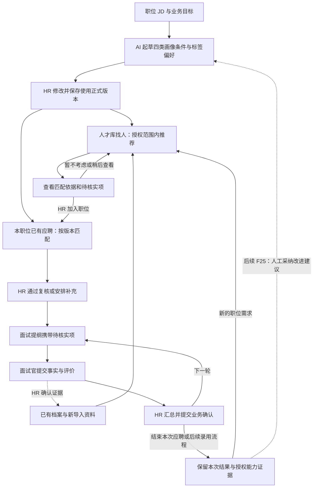

# 参考飞书职位画像的人才画像闭环设计

日期：2026-10-03。状态：产品设计与开发验收基线，未代表以下功能已经上线。

本方案落实用户“完全参考飞书招聘职位画像，设计人才画像并形成系统闭环”的要求，补充 [10 人才画像方案](10_人才画像设计与闭环方案.md)。重点补齐四类画像条件、标签偏好、人才库推荐、加入职位及反馈更新之间的连接；沿用 10 的 AI、人工复核、面试和业务确认规则，不另建一套人才档案或招聘流程。

用户已确定：企业 HR 正在使用飞书招聘及其浏览器插件；本项目的岗位标准由有职位操作权限的 HR 经 AI 起草、修改后“保存并使用”，无需另交用人负责人审批。AI 不能自动启用标准，尚待核实的必须项不能生效。面试后的业务确认、编制和 Offer 审批不因这条规则取消。

本文中“飞书已确认”限于官方资料中核实的能力；字段细化、证据状态、计算口径及闭环实现属于本项目设计，不能宣传成飞书内部算法或当前租户的完整界面复刻。本文不改变既定 P0/P1/P2/P3，不将尚未获批的跨部门共享、自动淘汰或外部集成视为已授权。

## 1. 对照飞书：每项参考能力落到哪里

| 飞书已确认的能力 | 官方依据 | 本项目的对应设计 |
|---|---|---|
| 建职位时可开启职位画像与标签偏好 | [HR 手册：创建职位](https://www.feishu.cn/hc/zh-CN/articles/381040174542) | 职位详情“招人要求”与“人才画像→岗位画像”共用一个正式版本；标签偏好随版本保存 |
| 设置工作、教育、技能和项目要求；截图按工作经历、教育经历、技能／项目关键词三组展示 | [HR 手册：10.2 及职位画像截图](https://www.feishu.cn/hc/zh-CN/articles/381040174542) | 页面沿用三组，技能与项目保留不同事实类型；逐条说明判断依据 |
| 标签可新增、删除，并设加分、必备、排除 | [新版职位画像详解](https://bytedance.feishu.cn/docx/WLF8d2IbYoUfcyxQBqucg5kVnQh) | 对应优先考虑、必须满足、排除信号；后两类仍交人工核实和决定 |
| 候选人展示总体／分项匹配星级、命中标签、其他标签，并能回看职位画像 | [HR 手册：候选人画像截图](https://www.feishu.cn/hc/zh-CN/articles/381040174542) | 保留概览、分项、命中及其他有依据标签；星级需有已配置的本项目标尺，并提供原文与缺口 |
| 管理员在智能化设置开启画像生成；该说明中的开关默认关闭 | [新版职位画像详解](https://bytedance.feishu.cn/docx/WLF8d2IbYoUfcyxQBqucg5kVnQh) | 组织配置 AI 可用性；岗位操作仍由有权 HR 自行定稿，管理员不逐岗审批 |
| 复制职位可自动抽取标签；编辑职位信息后自动重算更新标签 | [新版职位画像详解](https://bytedance.feishu.cn/docx/WLF8d2IbYoUfcyxQBqucg5kVnQh) | 复制只带新草稿；JD 变化提示重新生成及逐项差异，经 HR 保存使用后生效 |
| 人才库可依据职位画像推荐人选 | [HR 手册：10.2 人才推荐](https://www.feishu.cn/hc/zh-CN/articles/381040174542) | 增加“人才库找人”入口；尚未应聘也能被推荐，HR 选择后才加入职位 |
| 通过职位标签持续优化招聘目标、统一招聘标准 | [更新日志：2023.04 新版职位画像](https://www.feishu.cn/hc/zh-CN/articles/726329177535) | 调整条件和偏好形成新版；新标准用于新匹配，旧决定和报告保留 |
| 已有人才可加入职位，产生投递 | [HR 手册：候选人管理](https://www.feishu.cn/hc/zh-CN/articles/381040174542) | 复用本项目“加入职位”动作；同岗已有进行中应聘时打开已有记录 |
| 招聘助手识别、查重和导入人才；已有投递人才进入人才库 | [HR 手册：插件及 10.1 人才入库](https://www.feishu.cn/hc/zh-CN/articles/381040174542) | 将插件视为飞书的数据入口；本项目接收获授权的材料后保留来源和版本，不假装插件已直连本系统 |

“新版职位画像”详解来自更新日志 2023.04 条目；HR 手册本次读取的更新时间为 2026-03-16。已核对匿名可读正文和 HR 手册公开截图，但没有登录企业租户验证配置；不能仅凭“新版”标题认定其为当前完整规格。详解自身图片要求授权，未绕过权限。

公开资料没有给出星级公式、权重、推荐阈值或画像读写 API，也没有证明必备／排除会自动淘汰。AI 起草、逐项引用校验、版本保护和面试证据回流采用本项目既有设计。尤其是飞书描述的职位变更后自动更新标签，在本系统改为待采用建议，以遵守用户已确定的 HR 保存使用规则。

## 2. 使用者看到的整体流程

**定标准 → 从投递和人才库两边找人 → 看逐项匹配 → HR 推进 → 面试核实 → 业务决定 → 沉淀人才 → 为新职位再次匹配。**

图中“下一轮”实际先交给 HR 创建排期待办，再安排和确认；不会跳过排期。录用后的 Offer 与入职属于既定后续范围，只有真实办理完成才显示相应结果。

### 四种记录，各自负责一件事

| 记录 | 回答什么 | 禁止混用 |
|---|---|---|
| 岗位画像版本 | 这个职位当前要什么人？ | 不复制成“职位页一份、画像页另一份” |
| 人才主档与证据 | 这个人有哪些可追溯经历？ | 不挂一个全公司通用匹配分 |
| 人才库推荐 | 这个人值得为这个职位进一步查看吗？ | 被推荐不算投递，不增加应聘人数，不触发邀约 |
| 本次应聘与评估 | 这个人本次应聘该职位，依据是什么、到了哪一步？ | 不覆盖其他职位或历史应聘的结论 |

## 3. 岗位画像怎么设置

### 3.1 从职位进入，先生成再改

HR 选择已有职位，自动带入职位名称、JD、业务目标与已回答的澄清。可以“AI 起草画像”或直接手工填写，再“保存草稿”或“保存并使用”。再次生成只产生可采用的建议，不能覆盖正在编辑的内容或当前生效版。

画像界面参考飞书分为“工作经历、教育经历、技能／项目”三组，承载下列四类信息。下表具体字段和判断口径是本项目建议；第三组内技能与项目分别记录证据。某类与该岗位无关时可以不设条件，不强迫 HR 填满所有内容。

| 类别 | HR 可以设置的内容 | 候选人端拿什么核对 | 必须避免的误判 |
|---|---|---|---|
| 工作经历 | 相关职责、业务场景、本人责任、相关经验时长；必要时限定近期经历 | 任职起止、实际职责、工作内容原文 | 公司名相同不代表职责相同；重叠任职不重复累计年限；日期不完整则待核实 |
| 教育经历 | 岗位确需的专业知识或学历条件；允许的等价经验写在同条要求中 | 教育记录、专业、证书或人工核实记录 | 未写学历不等于学历不符；不默认用学校名气代替能力 |
| 技能 | 技能名称、完成何种任务、要求独立完成还是参与、验证办法 | 简历、项目、作品或已提交面评中的具体事实 | 只出现关键词不等于熟练；语义相近必须给原文，不能补造掌握程度 |
| 项目 | 项目类型、本人角色、复杂程度、产出及可解释成果 | 项目背景、本人动作、结果口径及时间 | 团队成果不能全归个人；未披露数字不直接判失败 |

每条要求保存：**类别、稳定标识、条件描述、必须／优先、判断办法、原始来源、是否仍待澄清**。来源分别标“JD 原文”“业务目标”“澄清答复”“HR 补充”“AI 建议”。AI 建议不能伪装成已确定的岗位硬条件。

必须项之间按“全部需要核对”展示；同一条中存在替代关系时明确写成“甲或乙”，例如“具备相关专业知识，或有能证明同等能力的项目经历”。首版不引入自由编程式条件表达式；含混或矛盾的条件提示 HR 改清楚。

“必须满足”表示招聘标准的重要性，不能让系统自动淘汰。只有材料明确反证才列“有依据的差距”；没写、无法定位、时间不明均列“待核实”。保留原有排除信号，要求岗位相关理由并交人工复核，不做一票自动否决。

### 3.2 标签偏好：加分、必备、排除

画像编辑页每组提供添加／删除标签；“启用标签偏好”后可以将标签归到“加分、必备、排除”，对应现有要求类型“优先考虑、必须满足、排除信号”。未启用偏好时标签只辅助检索，不产生隐藏硬条件。启用时未分类标签默认加分，新增或移动到必备／排除需 HR 明确选择并完善判断办法；关闭时若存在必备／排除项，先展示影响，只能作为新版草稿编辑，不能悄悄降低现行标准。

使用能解释到岗位任务的标签，例如“渠道建设”“数据分析”“独立项目交付”。必备标签需有可核验标准；排除标签需有岗位相关理由，命中后进入人工复核，不直接淘汰或隐形过滤。标签和详细要求是同一标准的两种呈现，不能各自存一套互相矛盾的规则。

- AI 可从 JD 提议标签，由 HR 采用、修改或删除；不得自动启用。
- 标签只指向相关要求或补充检索偏好。同一能力已是要求时只计算一次，不再因同义标签重复加分。
- 候选人的标签命中必须说明证据来源。系统推测和人工核实分开显示；未经核实的标签不能变成“已具备”。
- 偏好不限制人才档案访问范围，也不默认扩大到全公司人才库。
- 修改标签同样产生新画像版本；只为临时寻找人选改变筛选时标“本次筛选”，不改正式画像。
- 不使用年龄、性别、婚育、民族、健康、宗教等属性或代理标签评价人选；所谓性格、忠诚度等无依据推断不进入画像。

### 3.3 启用、修改与关闭的含义

飞书建岗可选择开启画像；本项目已有“正式岗位匹配必须有已生效标准”的约定，因此不照搬一个能绕过标准的开关。采用三个清晰状态：未设置、草稿待完善、已生效；同时允许“启用人才库推荐”按职位开启或暂停，默认由 HR 明确开启。

组织级“智能化设置”承接 AI 连接与画像助手的可用性，有管理权限的人配置；未启用或未获得模型使用授权时显示原因，HR 仍可手工维护标准。组织可用性、职位标准是否生效、是否开展人才库推荐是不同状态，界面不能用一个模糊开关代替。此分工是本项目设计，不宣称与飞书默认配置完全相同。

保存并使用前检查职位权限、当前编辑版本、必须项是否已明确、来源关联和字段合法性。HR 可自行补充并确认业务标准，不需要另一个审批人；确认的是“这个岗位如何要求”，不是提前证明某个候选人合格。

有生效版时修改从新版草稿开始，旧版继续使用。新版生效后标记旧匹配“标准已更新，待重新分析”；已作人工决定不回滚，历史报告不重写。暂停人才库推荐只停止该入口的新推荐，不撤销标准、不结束任何应聘。

复制职位可带入要求和标签用于起草，但不复制生效状态、审批结果或人才。编辑 JD 后提示“职位需求已变化”，可以重新提取标签并比较新增／修改／删除项；HR 采用、检查并保存使用后才切换正式标准。旧标准仍可阅读，但需提示与当前 JD 存在差异。

## 4. 人才画像页面与匹配详情

保留 10 的顶层“岗位画像｜候选人画像”，不再新增一级导航。选中岗位后，右侧提供“画像条件｜人才库找人｜本职位应聘｜版本记录”；四个入口分别办事，数据指向同一个职位与画像版本。

| 界面 | 首屏内容 | 主要操作 |
|---|---|---|
| 岗位画像列表 | 职位、部门、正式版本、草稿状态、待澄清项、负责 HR | AI 起草、继续编辑、查看人选 |
| 画像条件 | JD 摘要、三组条件、加分／必备／排除标签、版本与保存人 | 修改；保存草稿；保存并使用 |
| 人才库找人 | 当前职位与标准版本、检索范围、资料时间、匹配依据概要 | 查看依据、加入职位、暂不考虑 |
| 本职位应聘 | 应聘次数、阶段、当前评估版本、必须项缺口、下一接手人 | 复核、补资料、安排面试；动作受真实阶段限制 |
| 候选人画像 | 按人归纳的工作／教育／技能／项目证据、授权历史 | 选职位查看匹配；未选职位只看事实 |

推荐卡不铺满一个大百分比。示例：“6 项要求中 4 项有材料支持、1 项有明确差距、1 项待核实；2 项必须条件中 1 项待核实”。点开任意项能看到：**职位要求 → 当前判断 → 来源原文 → 证据状态 → 下一步核实问题**。这些数字只是虚构界面例子。

参考飞书的呈现，匹配详情保留“总体匹配”“工作经历”“教育经历”“技能／项目”四个概览，已配置标尺时可展示总体与分项星级；命中标签高亮，同时显示未命中和待核实项，不能只突出优点。下方展示“其他有依据的标签”，供 HR 发现画像之外的相关经历；这些标签不参与当前标准计分，来源与权限规则不变。提供“查看当前职位画像”及版本链接，防止看分时不知道依据哪套要求。

“有材料支持／有依据的差距／信息不足”是匹配结果；“来自简历陈述／已由人工核实／存在矛盾／已撤回”是证据状态，两者独立展示。没有出处的 AI 描述不能作为已支持项。

同一候选人在另一个职位打开时重新带入对应标准、材料和应聘。关闭详情回到原筛选和滚动位置；键盘能完整操作，关闭抽屉焦点回到原入口。沿用已确认蓝白工作台和下拉框样式，不改变全站视觉。

### 匹配度的计算与展示

沿用 [07 分数口径](07_接口状态与开发验收.md) 的“匹配分＋依据覆盖率＋必须项缺口”，而不是给 AI 一个自由生成总分的提示词。首个可用版本在评分标尺尚未确定时只展示逐项结果和条数，分数为“未配置”，不能输出装饰性的 90 分。

有正式评分标尺后，按生效画像固定的权重和标尺计算：匹配分只聚合有证据可评价的要求；信息不足项不编成零分。覆盖率单独反映可评价权重占比，明确不满足但有证据的项也属于可评价项。权重总和为零或无可评价项时匹配分为空。排除信号单列，不用隐藏扣分代替人工决定；标签不得重复计分。

分项星级与总体星级必须使用同一版本中明示的映射规则；该规则是本系统待校准的展示标尺，不冒称飞书算法。没有标尺或某维度没有可评价项时显示“未配置／资料不足”，不能画零颗星冒充差评，也不把星级解释为录用成功概率。

分数必须同时标出职位、画像版本、材料版本和分析时间。不同岗位、不同标准版本的裸分不混排；覆盖很少的高分不能被标成高可信推荐。推荐阈值与权重模板仍须同岗试点，本文不替业务批准固定的“80 分以上推进”等规则。

## 5. 人才库推荐如何接进正式招聘

推荐先限定 HR 对目标职位、人才和来源材料的权限，再匹配。人才存在于库中不等于它的全部历史面评可用。推荐列表、数量、摘要、原文与 AI 输入范围一致；来源权限撤销时，依赖它的结果也不能继续显示。

当前代码的人才可见范围来自 HR 可操作职位下的已有应聘；没有独立的“尚无任何应聘的人才库”授权实现。因此第一个推荐切片只覆盖已有授权主档，包括其他职位或已结束应聘中的可读人才。新建独立储备人才、独立分库和跨部门共享须另补明确的入库与权限契约，不能把当前页面改名“人才库”就声称这些已实现。

| HR 的动作 | 前提与产生的结果 | 下一步与失败恢复 |
|---|---|---|
| 找匹配人才 | 选定职位、有效画像和获授权人才范围；生成该范围的推荐结果，不创建应聘 | 返回分析进度、成功／失败人数；失败项可重试，没算完不能显示“全库已完成” |
| 查看匹配 | 同时可读目标职位与所有展示来源；显示版本、逐项依据、待核实内容 | 缺材料可转人工核查，不因未写而判不合适 |
| 调整本次筛选 | 筛选来源、资料时间及岗位相关条件；不改变正式标准 | 清除筛选可恢复；未知字段保留“未填写”入口，不默默消失 |
| 加入职位 | HR 确认候选人、目标职位、来源及要关联的材料；同时有材料向目标流程使用的权限 | 创建真实应聘、材料版本关联与复核待办，再生成正式岗位评估；缺材料可明确进入待补充，不伪称评估完成 |
| 已有同岗进行中应聘 | 返回已有记录及允许阅读的状态 | 按钮变为“查看本次应聘”；不创建第二条、不重复创建待办 |
| 同岗历史已结束 | 显示历史次数，HR 明确再次加入 | 新建下一次应聘；旧决定留在旧应聘，重新匹配当前标准 |
| 暂不考虑 | 保存本职位、当前画像版本下的处理理由及操作者 | 仅从该推荐队列的默认视图移走；可撤销，不拒绝其他应聘、不形成全局负面标签 |
| 暂无合适人选 | 明确展示已查看范围、缺口和资料新旧 | HR 可调整检索、收集新资料，或修改画像生成新版；系统不自动降低必须条件 |

已有进行中应聘的人选可以在推荐检索中被找到，但单独显示“已在本职位流程中”；默认找人队列排除这些重复入口，不对 HR 隐藏真实应聘。处于其他职位流程不自动禁止查看，是否可加入取决于原有权限和业务规则，不自动终止另一职位。

已有限制联系记录的人选遵循原有授权和联系限制，不能因高匹配分直接发邀约。归档、合并、删除或撤回材料分别重新检查；合并后的旧链接重新授权，不用旧推荐绕过限制。

**推荐顺序不等于录用排序。** 未校准前按匹配处理状态分组，组内默认按资料更新时间，HR 可调整普通筛选；正式评估列表继续遵循 10，不按 AI 总分默认排名。保留“待核实”“存在差距”和人工抽查入口，不让系统只展示自己认为好的样本。

## 6. 面试、结果与画像怎样回流

候选人加入职位后复用 10 的正式流程，不另造画像专用状态机。每一步至少绑定“本次应聘＋画像版本＋材料版本＋处理人”。

1. **HR 复核：** 通过后产生排期待办；待补充则记录具体问题、责任人与期限；暂不推进须岗位相关原因。AI 不替 HR 完成这一步。
2. **准备面试：** 从待核实要求生成问题建议；HR 或面试官采用后进入本场提纲，问题能追溯到具体要求。AI 草稿不会自动写共享题库或发邀请。
3. **面后核实：** 面试官提交自己负责的事实与评价；只有已提交反馈可作为后续来源。HR 或授权人员确认能力证据，矛盾意见并列，不自动覆盖旧证据。
4. **业务决定：** HR 汇总亮点、缺口和依据交指定负责人；下一轮、补充、暂缓、结束分别产生真实阶段和待办。人才画像不取代这项业务确认。
5. **人才沉淀：** 保留本次结果、结束原因和可授权复用的事实；新职位推荐重新计算，不沿用旧岗位得分。来源受限时，不能复用其摘要或标签来绕过权限。
6. **优化标准：** 后续 F25 汇总“哪条要求经常需要补问”“哪些标准存在含混或不合理限制”等证据；HR 采用后只形成新版草稿，再保存并使用。不能把历史录用结果直接当成真理自动训练上线。

新版标准、新简历或新面评到来后，旧结果保留且标记需复核；HR 明确重新分析后产生新结果。旧版“暂不考虑”理由继续保留，新版队列可重新展示并标注“曾在旧标准下暂不考虑”，避免永久屏蔽或悄悄恢复自动联系。

## 7. 与企业现用飞书及插件怎样衔接

现有可确认链路是：**招聘网站 → 飞书招聘助手 → 飞书人才库／投递**。不能把它画成插件已经直接向本系统传数据。飞书登录、消息通知接口与飞书招聘业务数据授权也不能混为一谈。

本次设计落在本项目内，先使用本项目已有、获授权的职位和材料跑通。没有明确迁移决定前，企业已在飞书处理的应聘继续在那里处理；本项目不得生成一份可以独立推进的重复流程来冒充同步。

| 情况 | 本项目显示和允许的操作 | 真实流程归属 |
|---|---|---|
| 本系统原生职位与应聘 | 本系统的画像、复核、约面、面评和业务确认按实施进度使用 | 本系统 |
| HR 授权提供材料用于分析，但没有飞书业务数据连接 | 明确标“手动导入”，保存来源和导入时间；分析结果供 HR 参考 | 飞书里的应聘由 HR 回飞书处理；不能显示同步状态 |
| 未来接通飞书招聘的已批准只读接口 | 按实际可读字段关联外部职位／人才／投递 ID，展示最后成功读取时间与更新失败 | 外部应聘只读，不让本地阶段变化冒充飞书变化 |
| 未来批准可写集成或迁移 | 先确定每类记录和应聘的唯一流程主系统，核验实际 API 与权限，再实施写入与回读 | 一条应聘只有一个阶段事实来源；失败、冲突和未知结果能核对 |

“手动导入仅作分析”必须走不创建本地应聘的材料分析入口，不能直接复用当前会创建应聘的导入确认或加入职位流程。现有 AI 初面虽然允许不关联应聘，但其参考报告不等于本方案的正式画像匹配；外部只读材料要在来源、画像和材料版本绑定补齐后才进入正式匹配。该入口未完成前，不把飞书在途投递导成可推进的本地应聘来演示闭环。

授权接入时至少核验：组织连接、职位对应、人才身份、投递对应、简历版本、删除／撤权事件与同步方向。同名职位不能自动绑定；同名人选不能自动合档；重复事件不能新增一份人才或应聘。API 不支持的动作保留“到飞书处理”或人工核对，不使用未授权抓取补洞。

这是一条完整的设计边界，不是已经开通 API 或实现双向同步的承诺。本轮不安装新插件、不修改企业租户、不传送真实简历测试模型。

## 8. 复用现有实现，最少增加哪些连接

2026-10-03 本次源码核对时，工作区已有他人正在推进的岗位画像与 AI 草稿改动；以下仅说明可复用接口与模型，不能代替迁移、运行或业务测试结果。10 的早期“占位页面”检查记录保留其原时点，不用它否定后续代码进展。

| 对象／能力 | 实施边界 |
|---|---|
| `Job.active_profile`、`ProfileVersion`、`ProfileRequirement` | 继续承载标准与生效版本；在要求上增量补四类维度和跨版本稳定标识，不新建同义画像表 |
| `ProfileGeneration` 与 `profile_ai.py` | 复用已有 AI 生成、来源校验、过期状态和采用逻辑；四类条件与标签输出仍须人工采用 |
| 标签偏好 | 绑定具体画像版本；引用已有要求的偏好不重复建相同要求或重复计分；只有实际需要的关联进入迁移 |
| `Candidate`、`ResumeDocument`、`ResumeParse` | 复用主档和材料版本；推荐不向 Candidate 增加全局匹配分或唯一职位 |
| 人才库推荐 | 以候选人、目标职位、画像版本、授权输入版本为上下文；推荐记录与正式应聘分开，不能为满足评估外键先建假应聘 |
| `Application`、`ApplicationResume`、`ReviewDecision`、`StageEvent` | 加入职位、关联材料和 HR 决定复用现有业务入口及去重、并发规则 |
| `Evaluation`、`EvaluationItem`、`EvaluationInput` | 沿用 06 的正式评估设计，严格绑定真实应聘与材料；推荐结果不能直接冒充已完成的 HR 复核 |
| `CapabilityEvidence`、面评与业务确认 | 依照 06、07、10 后续落地；画像页只展示它们的真实事实，不维护第二份阶段 |

人才库匹配和应聘评估共享同一套“要求→证据→判断”的计算和引用校验逻辑，但保留各自的授权入口及输入关联。人才库推荐使用候选人获授权的材料；加入职位后显式关联本次材料，再建立正式评估，不能无条件复制推荐时可读的所有历史材料。

现有 `POST /api/v1/candidates/{id}/apply/` 接收 `request_key、job、source`，复用进行中应聘或创建下一次应聘，并创建复核待办；**目前不绑定简历**。实施 C 时增量扩展该受控动作，接收 HR 选定的材料解析 ID，在同一事务内检查同组织、同候选人、目标职位及材料使用权限并创建 `ApplicationResume`；不要求 HR 再上传同一份文件。仅有阅读权不自动授权把材料开放给目标团队，不符合条件时提示选择可用材料或补充资料。对已有应聘只追加明确选定且未关联的输入，不覆盖旧输入、旧评估和阶段。

本系统当前 `AIScreening` 的参考报告没有完整固定画像及解析版本的关系，不能拿它直接充当人才库推荐存储或正式 `Evaluation`。可以复用模型调用及引用校验经验，不能补造历史报告的输入出处。

普通筛选可直接查询，不保存另一份人才副本。需要保存的 AI 推荐运行、逐项结果与 HR 处理记录才增量持久化，固定候选人、职位、画像、执行、输入材料及要求关联。具体表名在进入 C 时与 F12 一并定稿；JSON 只放结构化结果快照，不承载任意对象编号或整套招聘关系。正式 `Evaluation` 保持绑定真实应聘，不为推荐将应聘外键改为空。未进入这一切片前不预建通用推荐引擎、向量库或学习平台。

动作契约：保存并使用要有职位版本检查；分析和加入职位要有幂等请求标识；“暂不考虑”绑定该岗位和画像版本；生成结果写入和返回时再次检查权限及输入版本。正在调用模型时不长时间锁住职位、人才或应聘。

## 9. 分步交付与可核验结果

这些是设计切片，不宣布一次性开发完全部阶段。既有画像起草切片可继续；新增人才库找人安排在正式匹配能力具备后，依赖工作逐项验收。F25 学习建议、Offer／入职保持既定后续范围。

| 顺序 | 使用者能完成什么 | 对应功能及验收出口 |
|---|---|---|
| A：标准统一 | AI 起草、四类条件、标签偏好、HR 保存并使用、两入口同版本 | F06/F07；不用另人审批，AI 和待核实必须项不能直接生效 |
| B：按岗看人 | 本次应聘逐项匹配、材料依据、缺口、复核与下一待办 | F12/F13；一人多岗不混，评分未配置时不伪造分数 |
| C：从库里找人 | 在现有授权主档中按同一画像找人、看证据、选择材料并加入职位，复用 B | F11/F12 的本次设计补充；推荐不计为应聘，重复加入安全，未加入也能看依据 |
| D：招聘证据回流 | 面试问题、提交面评、确认事实、业务决定、再次复用人才 | F14/F16–F19；不能用页面上的“完成”代替真实邀请、确认、反馈或决定 |
| 后续：优化与外部衔接 | 根据样本提出标准建议；按实际授权接飞书数据 | F25 与 Q02/Q03；每个外部成功有回读证据，不能提前承诺双向同步 |

F33 的自然语言全库检索仍按 P1→P2，F37 的同岗召回与再触达仍按 P2。C 的有界推荐不隐含这两项全部能力，也不新增自动联系或全库语义索引；进入开发排期时须明确 C 在现有阶段中的安排。

必须保留以下自动化验收场景；本次为文档检查，尚未执行这些业务测试：

| 编号 | 场景 | 必须观察到的结果 |
|---|---|---|
| TP01 | HR 保存含未核实必须项的草稿并尝试启用 | 草稿保留；启用被阻止并定位具体项；核实后 HR 可直接保存使用 |
| TP02 | 在职位页修改并使用 v2，再从画像页打开 | 显示同一 v2；v1 及其旧评估可追溯 |
| TP03 | AI 把“参与项目”当“独立负责”，或伪造引用 | 引用／判断待人工复核；不成为已核实事实、不自动推进 |
| TP04 | 同一技能既设要求又有同义偏好标签 | 展示命中原因但不重复计分；删除偏好不删除能力证据 |
| TP05 | 简历未写必须资格 | 显示信息不足及核实动作，不能伪装成明确不满足或直接淘汰 |
| TP06 | 人才被推荐但 HR 尚未加入职位 | 人才数不变、应聘数不变、无邀约和复核待办；能阅读授权依据 |
| TP07 | 两个请求同时把同一人才加入同一职位 | 只有一条进行中应聘及下一待办；返回已有记录或可处理冲突 |
| TP08 | 同人应聘 A、B，HR 在 A 推荐中暂不考虑 | B 及其应聘不变；不生成全局负面标签；A 可撤销该处理 |
| TP09 | 权限撤销或材料撤回后打开旧推荐 | 原文、摘要、标签、数量均按新权限过滤；旧缓存不能泄露 |
| TP10 | 只读到旧岗位标准的分析任务晚到 | 保存为旧版记录或标过期；不能顶替当前结果、不能覆盖人工决定 |
| TP11 | 面评还在草稿，或同一要求的两条意见矛盾 | 草稿不当正式证据；正式矛盾并列交人工核实 |
| TP12 | 提交面评后业务负责人同意下一轮 | 生成 HR 排期待办；未安排前不能显示面试已约好 |
| TP13 | 新职位使用历史人才 | 不重建人才；使用新职位画像重新匹配；不搬用旧岗位分数 |
| TP14 | 从飞书手动带入材料且无业务 API | 显示手动来源和时间；不显示已同步、不自动修改飞书应聘 |
| TP15 | AI 超时、分页分析部分失败、评分未配置 | 输入和最近成功结果可读，失败可重试，人工流程可继续，无假分数或假完成 |
| TP16 | 查看命中标签、其他标签和分项星级 | 标签均能追到授权来源；其他标签不暗中加分；缺材料的维度不显示零星差评 |
| TP17 | 复制职位或编辑 JD 触发重新提取标签 | 只产生新草稿／待采用建议；不复制生效状态、不自动更换正式标准 |
| TP18 | 把阅读范围内但不得向目标团队共享的材料选入新应聘 | 后端拒绝越权绑定；已有应聘和资料不丢，不通过摘要或标签间接泄露 |

试点只使用虚构或经批准的脱敏样本。记录画像修改耗时、推荐查看后加入职位比例、信息不足误判率、引用可定位率、待核实项完成率，并对未推荐样本做人工抽查。先建立基线再定目标，不把录用率或 AI 自评当成唯一质量指标。

## 10. 一个贯穿全程的例子

以下为虚构业务例子，不对应实际人才或企业岗位。

HR 为“区域渠道经理”保存画像 v1：工作经历要求独立拓展渠道，技能要求分析渠道表现，项目要求能说明个人推动签约的过程；“渠道体系搭建”设为偏好标签。教育条件只在岗位确有需要时设置，不强制凑齐。

人才库找人展示甲：拓展经历有简历出处，数据分析有项目依据，但独立签约责任尚不清楚。甲还未投递，系统只给推荐记录。HR 看原文后加入职位，生成本次应聘；甲已有另一个职位的流程，不被覆盖。

HR 将“本人负责签约的哪一步”带入一面。面试官提交核实事实，HR 确认相应能力证据并向业务负责人汇总；负责人决定下一轮，HR 才进入排期。如果本次结束，人才仍保留，结束理由属于这次应聘。

下次新职位需要渠道体系建设时，授权范围内的事实可以再用，匹配按新岗位重算。HR 发现原来的要求表达不清，可改成 v2 并保存使用，旧应聘依然保留按 v1 判断的历史。这才构成“定标准、找人、验证、沉淀、再使用”的闭环。
