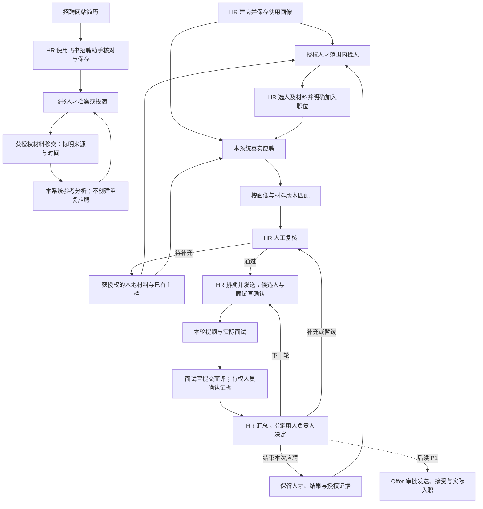

# 多角色业务闭环、状态与验收

日期：2026-10-03。性质：设计方案与后续验收基线；本次只编写文档，没有实施下列新增流程或运行这些业务测试。

阅读入口：[功能概览](README.md) → [各端详细功能](01_各端功能详细设计.md) → 本文 → [数据库与权限](03_数据库与权限设计.md)。沿用 [04 功能范围](../04_角色功能与范围矩阵.md)、[07 接口与状态](../07_接口状态与开发验收.md)、[09 进人与复核](../09_D02进人与复核实施契约.md)、[10 人才画像](../10_人才画像设计与闭环方案.md)、[11 飞书画像对照](../11_飞书职位画像对照与人才画像闭环设计.md)。

## 1. 闭环的成立条件

当前用户实际使用的是 HR 端。以下三个后台工作视图、两个内部协作入口共用账号、业务记录和后端权限；菜单切换不复制招聘流程。候选人的邀请确认是受限任务入口，不增加一个内部管理端。

| 必须成立的关系 | 设计约束 |
|---|---|
| 事情有负责人 | 每个待处理事项指向业务对象、具体处理人和必要期限；不能只显示“待处理”而不知道找谁 |
| 操作有真实结果 | 业务写入、原待办结束、下一待办和审计同步提交；失败不能先扣待办数量 |
| 人和应聘分开 | 一个人可有多次、多个职位应聘；拒绝 A 职位不影响 B 职位，也不把人永久标成“不合格” |
| 一条应聘只有一个流程主系统 | 本地应聘在本系统推进；企业既有飞书应聘继续在飞书推进，除非另行明确迁移或写入方案 |
| 判断能找到依据 | 正式匹配、问题、面评和业务决定引用确定版本；简历陈述、人工核实与 AI 建议分别标识 |
| 权限随来源走 | 来源撤权后，摘要、标签、报表、下载和 AI 上下文也不能继续泄露来源内容 |
| 下一步能恢复 | 缺资料、拒绝邀请、改期、模型失败、外发失败、人员停用分别进入明确处理路径 |

**已确认规则：** 有职位操作权限的 HR 直接“保存并使用”岗位画像，不另交用人负责人审批；AI 不能自动生效，待核实必须项必须先处理。业务澄清回答不是审批。面后的业务决定、编制及 Offer 审批不因这条规则取消。

**源码核对边界：** 当前可见职位、画像、导入、复核、排期、AI 初面、题库和企业背书相关代码；部分工作区改动仍由其他任务开发。发现模型或接口不等于已完成迁移、可用界面、外部连接或验收。

## 2. 两条材料入口汇入一套有权限的判断

图中“下一轮”先产生 HR 排期待办；“补充或暂缓”进入下文规定的跟进／复查状态，不绕回已结束的旧复核动作。实线表示设计的业务连接，不表示所有连接已经实现。

### 2.1 飞书插件到本系统：先说清流程归属

| 步骤／操作者 | 前提与操作 | 保存的事实／下一责任人 | 失败与恢复 |
|---|---|---|---|
| 1．HR 在招聘网站使用助手 | 在兼容且有权访问的简历页识别，核对基本资料、相似人才，选择新建或更新 | 飞书平台保存的人才、简历或投递；HR 跳转平台核对 | 页面不支持、识别不准、联系方式受限时人工核对；不宣称全站抓取 |
| 2．HR 确认飞书投递 | 选择职位形成投递；只入人才库则没有该职位投递 | 飞书是该次投递的阶段事实来源；后续平台经办人负责 | 同名职位／人才不能自动映射；疑似重复先核实 |
| 3．HR 移交获授权材料 | 本项目确有用途且可使用该材料；明确“飞书在途，仅作分析” | 来源系统、来源标识或可核对出处、取得方式、时间、材料版本及使用范围；交分析 HR | 没有可核验外部 ID 时留空并标人工来源，不制造飞书 ID 或“已同步” |
| 4．本系统生成参考分析 | 只使用本次授权输入；清楚展示职位标准来源、引用与不足 | `AIScreening` 等参考报告及核实记录；交 HR 看原文 | 不能调用会新建本地应聘的导入确认／加入职位动作；正式隔离入口未完成时不开放该链路 |
| 5．HR 回飞书处理 | 阅读建议后自行作业务决定；外部链接需经权限核验 | 阶段变化仍在飞书；本系统报告不自动成为飞书面评或决定 | 本系统不展示未经回读的外部处理结果；人工反馈标注记录人和时间 |
| 6．未来接通正式接口 | 明确租户授权、字段、映射、读写方向及唯一主系统 | 外部对象映射、最后成功读取时间、处理事件和真实回读结果 | 只读连接无写按钮；超时未知先核对，旧事件不回滚新状态 |

企业在用飞书不等于本系统已获得招聘业务 API；飞书登录、消息发送、日程和招聘数据授权分别核验。第三方广告填充、插件采集、渠道邮箱收取投递是不同入口，不共用一个“已接通”状态。

本地记录增加外部参考链接不等于完成托管迁移。未来迁移必须明确截止点、在途任务、历史依据、映射去重及撤销旧操作入口；本次不设计一键双向接管。

未来获批只读接口的镜像复用 `Application` 并固定 `workflow_system=feishu`，不赋予本地阶段动作。外部阶段不能可靠映射时，本地 `stage=NULL`，保留外部原码并显示“未知外部阶段”；`external_lifecycle=active/closed/unknown` 单独表达外部是否结束，未知按未解除活跃占用处理，同岗再次加入前须核对。缺失真实结束时间不能用导入／同步时间补成 `closed_at`。未映射镜像单列统计，排除本地阶段时长与转化；手动只分析路径不创建镜像应聘。

### 2.2 本系统原生应聘：各端如何交接

以下为设计的主路径；表中的新增实体以数据库文档为准，不能据此声称全部已存在。

| 环节／功能 | 谁操作、需要什么条件 | 修改记录、产生结果 | 交给谁／失败怎样继续 |
|---|---|---|---|
| 建岗与要求 H02 | 经办 HR 明确部门、负责人、JD、业务目标；可联系指定用人负责人 B01 澄清 | `Job`、`ProfileVersion` 草稿、要求和澄清；企业引用 H09 可选且须同组织 | 澄清交具体接收人；未回答的关键要求保留待核实，不让 AI 猜测补齐 |
| 标准生效 H02 | 有职位操作权的 HR 检查版本、必须项及未决关键澄清后保存并使用 | 正式画像、生效指针、历史和审计；完成该版本旧确认待办，不新建他人审批 | HR 继续招人；冲突保留输入并展示差异；HC 未定不显示“编制已批” |
| 导入建档 H03 | HR 选择本地托管职位，核对身份与材料使用范围 | 导入／解析记录、主档、应聘、固定解析版本的材料关联、复核待办 | 交经办 HR；疑似重复待核对，单份失败可重试，不丢整批 |
| 库内找人 H05 | 目标职位有有效画像，HR 对目标职位、人才、输入材料均有权限 | 推荐运行与逐项依据；尚未创建应聘，无排期／复核待办 | HR 看原文后选择；部分失败逐项显示，未处理项不计完成 |
| 加入职位 H05→H03 | HR 明确候选人、目标职位、来源及选用解析版本；有向目标流程使用材料的权限 | 同事务创建／复用 `Application`，关联所选 `ApplicationResume`，创建必要待办 | 交本职位 HR；同岗已有进行中记录返回该记录，历史结束则明确新次数 |
| 按岗匹配 H04 | 真实应聘、有效画像、明确材料版本；本人可使用全部输入 | 新 `Evaluation`、输入关系、逐项结论／引用；初面参考报告可供对照，不替代正式评估 | HR 复核；材料不足写信息不足，模型失败允许人工继续 |
| 人工复核 H04→H06 | 经办 HR 看原文及当前版本，填写有依据的决定 | `ReviewDecision`、阶段事件、原任务结束；通过产生排期任务，补充产生跟进任务 | 排期 HR／指定补资料 HR；版本竞争返回冲突，AI 不自动通过或拒绝 |
| 提纲准备 H06/I02/H08 | 本轮面试对象已明确，读取本轮画像、待核实项及可用题库版本 | `InterviewGuide` 与题目快照；采用 AI 建议后成为本场内容 | 分配面试官 I01；题目必须指向要求或核实目的，不能泄露其他应聘资料 |
| 排期邀请 H06 | HR 查候选人与全部必需面试官冲突，选择时间、方式和地点 | 面试／排期版本／参与人，提交后发送记录；邀请发送与本人答复分别记 | 候选人受限入口与面试官 I01；外发失败重试原指令，拒绝／改期回 HR |
| 实际面试 I01/I02 | 查看当前有效排期；仅获取本场被授权材料 | 实际发生结果与记录者；过时邀请不能确认新排期 | 本场面试官 I03；未到场／中断交 HR 跟进，过时钟点不自动算完成 |
| 提交面评 I03 | 分配的面试官检查自己的事实、依据和建议，主动提交 | `Feedback`／修订／条目，完成本人反馈待办；可形成待核实证据草稿 | HR H07；草稿不作正式依据，提交失败保留草稿，不能代写他人面评 |
| 汇总与业务决定 H07/B02 | HR 选已提交且可共享的依据、指定处理人；对方有事项权限 | `DecisionRequest`、输入快照和任务；决定与阶段、下一任务同事务写入 | 下一轮交 HR；补充交跟进人；暂缓有复查日；结束只关闭本次应聘 |
| 沉淀与复用 H10/H05 | 可读来源且具有复用权限；保留联系限制与资料时效 | 主档保留；`CapabilityEvidence` 记录来源、确认人和适用范围；新岗重新匹配 | 下次经办 HR；不搬旧岗位分数，不自动联系，不给全公司开放历史面评 |

## 3. AI 初面、岗位匹配与共享内容的连接

### 3.1 两种 AI 结果必须分清

| 对象 | 输入和适用场景 | 可以流向哪里 | 不能代替什么 |
|---|---|---|---|
| AI 初面参考报告 `AIScreening` | HR 提供的简历文字，或明确选定的应聘／画像／解析版本；可附获准企业背书上下文 | HR 阅读、核实问题、明确采用到本场提纲，或脱敏后存题库 | 不代表候选人参加了面试、面试已完成或 HR 已复核 |
| 初面核实 `AIScreeningVerification` | HR 记录问题答复、依据、状态与后续跟进 | 供正式流程查看；转长期能力证据仍检查来源、作者和权限 | 不自动变成指定面试官已提交的 `Feedback`，也不自动改变阶段 |
| 正式岗位评估 `Evaluation` | 确定的真实应聘、画像版本、本次关联材料及评分规则 | 逐项依据、信息不足、HR 人工复核、本轮问题 | 不替代业务录用决定，不使画像自动生效 |
| 共享题库 `QuestionTemplate` | 不带候选人隐私的通用问题及参考要点 | 选择具体版本后进入本场提纲 | 题库更新不覆盖已经准备／执行的面试记录 |
| 企业背书 `EnterpriseEndorsement` | 启用且允许使用的企业事实、介绍与内容 | JD／沟通背景、初面提问上下文、HR 说明材料 | 企业宣传不证明候选人有该能力，不作为候选人匹配得分依据 |

当前工作区可见 `AIScreening.profile`、`resume_parse`、`source_context` 和核实记录的新增实现，需随对应任务验证；旧报告没有明确绑定时保持“历史参考”，不得补造输入出处。本设计不把它们重复建成另一套正式评估表。

“AI 初面”现有名称指简历分析与提问辅助，不等于语音／视频自主访谈。自主初面仍属旧规格 X01，未因本设计进入首期。

### 3.2 来源更新后的处理规则

| 发生变化 | 历史如何保留 | 当前处理如何继续 |
|---|---|---|
| HR 使用画像 v2 | v1 报告、复核和面评引用不变 | 当前旧匹配标“标准已更新”；HR 选择新分析，不能自动撤回过去决定 |
| 新简历／解析修正 | 新材料和新解析独立版本，旧引用仍可定位 | HR 明确关联本次应聘后才能成为新输入；不能向所有旧职位自动广播 |
| 面评提交或修订 | 已提交旧版与新修订都保留，注明作者、时间和原因 | 未处理的业务请求提示依据变化，HR 刷新后重发；已决定事项保留历史，必要时另发跟进请求 |
| 能力证据被质疑／撤回 | 不静默改写原始面评或简历 | 下游匹配提示来源不再可靠；需要重新核查的事项交原经办 HR |
| 题库题目修改／删除 | 已采用的问题保留版本快照与来源；记录其来源已更新／停用 | 未采用建议可重选；在场提纲由有权人明确更新，历史面试不被重写 |
| 企业信息／背书更新或停用 | 历史报告保留当时的合法输入快照及时间，不冒充当前口径 | 新分析使用新启用内容；未提交沟通稿提示更新，不自动改候选人的能力结论 |
| 来源权限撤销／资料删除请求执行 | 最小业务审计保留与内容可读性分开，依最终保留政策处理 | 即使快照存在也重新授权；移除受限内容和派生展示，未发外部指令停止 |

L03 负责共享内容的使用质量、停用与责任协调；A02 配技术字典和模板；HR 决定具体岗位标准。日常题库维护、背书校正不默认增加层层审批，也不授予内容管理员简历读取权。

## 4. 状态必须表达同一个事实

### 4.1 已有代码与目标状态的区别

| 对象 | 2026-10-03 源码可见内容 | 本方案采用的规则／实施前需处理 |
|---|---|---|
| `Job` | `draft/open/paused/closed` | 招聘中沿用 `open`；07 的 `recruiting` 是历史设计名，不另造并行枚举 |
| `ProfileVersion` | `draft/pending/confirmed/changes_requested/withdrawn`；HR 启用标识 | 新主路径为 HR 草稿→保存使用 `confirmed`；历史生效版也保留确认事实，以 `Job.active_profile` 指定当前版，`based_on` 记录继承关系；兼容旧待确认记录，不能继续强制他人审批 |
| `Application` | 当前约束有待复核、待安排、面试中及 `first_interview_passed/second_interview/offer_sent/hired/talent_pool` 等 | 后文是目标业务流；`pending_decision/needs_followup/on_hold` 等尚需迁移；已有枚举不证明对应业务成立 |
| `Interview` | `unscheduled/pending_confirmation/confirmed/completed/cancelled`、排期版本与参与人 | 响应、邀请、真实到面及面评闭环分别验收，不由场次状态存在反推已完成 |
| `Task` | `pending/done/cancelled`，目前源约束覆盖画像、澄清、应聘复核与排期 | 面试反馈、业务决定等按来源显式扩展；复用同一待办，不写第二套招聘阶段 |

现有 `Application` 约束把 `hired` 与空 `closed_at` 组合保留；07 目标把真实入职视为终态。进入 F32 前必须先盘点历史事实、设计迁移和约束修正，不能盲目重命名后声称已入职。旧枚举与新业务语义的映射由迁移逐条核对；无法判定的历史记录列为待核对。

### 4.2 本地应聘目标流转

| 当前阶段 | 允许的业务动作与处理人 | 目标阶段／必须同时发生的事 |
|---|---|---|
| `pending_review` | HR 要求补充 | `needs_information`；缺口、处理人和期限齐备，原复核任务结束 |
| `pending_review/needs_information` | HR 依据材料通过复核 | `ready_to_schedule`；形成复核决定与排期待办，不生成虚假面试 |
| `needs_information` | 指定 HR 补充并提交复核 | `pending_review`；绑定新增材料版本、保留旧依据，创建复核任务 |
| `ready_to_schedule` | HR 保存有效排期 | `interviewing`；保存本轮场次，人员未答复仍为待确认 |
| `interviewing` | 本轮全部场次无法继续：均已取消，或仅剩场次被候选人拒绝／未到／中断 | `needs_followup`；生成经办 HR 跟进任务、原因和期限，不自动淘汰；仍有可继续场次时保留 `interviewing`，只跟进受影响场次 |
| `needs_followup`，面试恢复事项 | HR 明确重约／继续联系 | 重约→`ready_to_schedule` 并生成本轮排期待办；继续联系仍为 `needs_followup`，更新责任人和期限；有结束权限者也可说明原因关闭 |
| `interviewing` | HR 预览已提交面评并提请指定业务负责人决定 | `pending_decision`；保存业务请求和依据快照，不能用未提交草稿冒充完整面评 |
| `pending_decision` | 指定人同意下一轮 | `ready_to_schedule`；旧决定完成，新轮次排期任务唯一，轮次要求明确 |
| `pending_decision` | 指定人要求先联系／补证据／测评 | `needs_followup`；指明事项、责任人、期限；未接通测评时只显示跟进事项 |
| `pending_decision` | 指定人暂缓 | `on_hold`；复查日期必填，到期产生复查任务而非自动通过 |
| `pending_decision` | 当前有效业务请求被撤回／到期失效 | `needs_followup`；旧请求置 `withdrawn/expired`，取消旧决定待办，创建经办 HR 整理依据／重新发起任务及期限；旧卡片失效 |
| `pending_decision`，P0 无 Offer 能力 | 指定人认可录用方向，交 HR 后续办理 | 决定 `result=followup`，说明已认可的方向及待办事项；应聘为 `needs_followup`，明确办理 HR 和期限，不生成“已同意”悬空阶段 |
| `needs_followup/on_hold` | HR 完成补充或到期复查后再次提交 | `pending_decision`；新请求引用新依据与原请求，不能覆写旧决定 |
| 可处理的非终态 | 经办 HR 在允许动作中记录退出／拒绝／职位取消；或指定业务人决定不推进 | `closed`；原因与结束时间齐备，撤销无效待办及未发通知，不删除人 |
| `pending_decision`，仅 P1 | 已授权业务人认可进入 Offer 准备 | `offer_pending`；仍需实际条款与审批，不等于已发送 |
| `offer_pending`，仅 P1 | 候选人接受有效的已批准已发送 Offer | `onboarding`；本人响应和入职交接创建，不计已入职 |
| `onboarding`，仅 P1 | HR 核验实际到岗／记录放弃 | `hired/closed`；真实入职或结束事实，保留原 Offer 与回执 |

P0 认可录用方向通过上表 `followup → needs_followup` 接 HR 办理，不跳造 `offer_sent/hired`。从本系统转到飞书办理须先明确正式交接方案，不能靠新增一条飞书投递就声称完成闭环。

已结束应聘再次加入同岗创建下一次 `attempt_no`，不直接把终态改回招聘中。明确的误操作纠正走有权限、有理由的修正流程，保留原事件；不对历史结论开放任意修改阶段。

### 4.3 邀请、确认、面试、面评、业务决定分别计状态

1. **排期已保存：** 当前时间、方式、地点和人员版本有效；未代表消息已经发出。
2. **邀请已发送：** 提供方接受或有真实发送结果；未代表候选人阅读、答复或到场。
3. **参与人已确认：** 每人响应属于当前排期版本；仅所有必需参与人确认后场次才显示 `confirmed`。
4. **申请改期／拒绝：** 保存本人响应与原因，同时创建或更新经办 HR 跟进任务；申请人不能直接抢占新时段，拒绝本次邀请不等于退出应聘。HR 改期后生成新版本，旧邀请不能确认新版。
5. **实际面试结果：** HR／获授权人员记录 `outcome`、记录人和时间。`held` 对应真实完成 `completed`；`no_show/aborted` 以受控结束本场动作记为 `cancelled` 并保留明确原因，页面优先显示“未到场／中断”。它们不关闭应聘、不自动提交面评，也不因时间经过自动结算。
6. **面评草稿／提交：** 本场面试官写本人草稿，主动提交才供后续正式使用；每名必需反馈者分别计任务，不能一人提交就替全场完成。
7. **业务决定：** HR 汇总并发起后，指定人提交下一步；面评“建议通过”不能直接当作这个决定。

候选人基础确认和改期属于 F16、D03 的必要受限入口。可以先交付适合手机使用的任务页面；完整 Flutter App 属后续体验扩展，不能以 App 尚未开始为由省略确认闭环。

辅助对象按 [03 数据库设计](03_数据库与权限设计.md) 保持独立状态：推荐执行为 `queued/running/succeeded/failed/needs_review`，HR 处理为 `unhandled/not_now/added`；前者成功不等于后者加入职位。面评修订区分 `draft/submitted`；业务请求区分 `draft/pending/decided/deferred/withdrawn/expired`，请求暂缓 `deferred` 与应聘 `on_hold` 同次提交；到期复查创建新的处理事项，不将旧决定改回待处理。

取消／拒绝／未到／中断与恢复待办、必要应聘阶段变化须同事务提交；已取消场次重约创建同轮新场次，不能自动增一轮。业务请求撤回／过期同样与 `needs_followup` 和 HR 任务同事务提交；只处理当前有效请求，旧历史请求的迟到事件不能回退已推进的应聘。`pending_decision` 必须始终有一个当前有效请求和明确处理人，不能在请求消失后保留无人负责的等待状态。

## 5. 负责人、管理员和协作角色怎样介入

| 场景 | 谁处理 | 允许发生的结果 | 不允许的捷径 |
|---|---|---|---|
| 团队滞留／超期 L01/L04 | 招聘负责人看获授权团队汇总与明细 | 找到卡在哪个事项、责任人和期限，再协调 L02 | 看到团队数据不等于能改所有职位、复核、面评或录用 |
| HR 调岗／休假 L02/A01 | 有转交权的负责人选择符合职位资格的新 HR；管理员处理成员停用 | 明示转交范围，调整职位／应聘负责人和未结待办，保留旧操作者；旧会话立即失权 | 不重写历史面评作者、已提交决定或把历史动作算到新 HR 名下 |
| 没有合格接手人 | 招聘负责人或管理员按权限协调 | 停用权限可以立即执行；未结事项进入明确待分配列表，限制外发并告警负责人 | 不能为保待办而保留离职人员访问，也不能悄悄丢弃事项 |
| 面试官更换 I01/I03 | HR 修改当前排期并明确材料范围 | 新参与者获得本场必要资料，旧者未来访问失效，旧反馈作者保留 | 不能继承旧人草稿或直接把旧确认算给新参与者 |
| 指定业务人不可用 B02 | 有授权的经办人撤回旧请求并指定有效接收人 | 保留撤回原因及历史，新请求绑定当前依据；旧卡片失效 | 部门负责人身份不能直接处理任何人的待定请求 |
| 外部／模型运行异常 A03/A04 | 管理员检查连接、错误、重试和撤销 | 只见必要运行元数据；重新执行前重查业务仍有效 | 不能借排障查看原简历、修改业务结论或任意重放请求体 |
| 规则／资料治理 A02/A05 | 授权管理员按已确认政策执行 | 配置版本、脱敏审计、明确范围的导出／清理，保留结果 | 配置角色不自带全库读取、薪资、原文件下载或自由导出 |

同一人兼 HR、主管或管理员时，每次操作仍匹配“对应角色能力＋该能力的对象范围”。不能拿 HR 的修改能力配主管的全部门读取范围，也不能拿管理员的全组织配置范围配 HR 的简历读取权。

## 6. 事务、重复请求和异常恢复

事件名称在本节是业务含义，不要求新建通用事件总线；优先复用 `StageEvent`、`AuditEvent` 与现有受控业务入口。

| 动作 | 同一数据库事务内的最小提交 | 事务外动作及失败语义 |
|---|---|---|
| 保存使用画像 | 检查职位权限／版本／必须项；保存正式版本与生效指针、旧任务处置和审计 | 下游旧报告显示版本变化；AI 草稿生成不长时间锁职位 |
| 确认导入／加入职位 | 请求键与摘要、人才／职位锁、活跃应聘唯一、选定材料绑定、阶段事件和复核待办 | 解析／评估异步执行；失败不回滚已确认身份，不伪装已有评估 |
| HR 复核 | `ReviewDecision`、`Application.version/stage`、`StageEvent`、新旧待办和审计 | 消息待发送；外发失败不重复做业务决定 |
| 排期／改期 | 固定顺序锁候选人与涉及面试人员，查冲突；保存新版本、参与人、响应初始状态、撤销旧授权与提醒 | 提交后外发会议／邀请；未知结果查证，不能再建一场撞期面试 |
| 提交面评／修订 | 当前参与资格、作者和版本、反馈新修订、本人待办与审计；必要证据只生成草稿 | 后续汇总重新检查实际已提交来源；不自动发业务请求 |
| 业务决定 | 指定人、请求／应聘版本与证据有效性检查；决定、阶段、任务、审计、必要外发记录 | 网页与飞书指向同一请求；重复回调返回同一事实，不再生成下一轮 |
| 转交／撤权 | 授权变更、可明确转交的未结事项、撤销令牌及审计；无接手人留下待分配事实 | 排队导出、通知、AI 任务执行／返回前重验权限 |

重复请求：同一组织、动作、请求键及相同内容返回原结果；相同键但不同内容返回冲突。批量逐对象报告成功／失败，重试只补失败项，不声称整批成功。

并发修改：所有关键动作携当前版本，后端事务内再次检查；409 时保留用户输入，展示可读的最新结果，不能“最后保存覆盖前人”。正在等待模型时不占长事务。

外部接入：验签／来源／时效 → 连接确定组织 → 外部事件去重 → 重查操作者和业务版本 → 事务提交 → 返回响应。`IntegrationEvent` 与 `OutboxDelivery` 按接入切片增加；本地调用成功和对方业务成功分开。

外发状态至少区分待发送、处理中、已确认成功、失败、结果未知、已取消；网络超时可能已经成功，先查询外部编号或人工核对，不能盲目重发造成重复邀请／决定。重试前检查连接、取消、期限、对象版本和接收人权限。

## 7. 报表必须与操作对象一致

| 指标／使用端 | 取数与口径 | 下钻验证 |
|---|---|---|
| 待处理／等待他人 H01 | 当前有效业务待办，按责任人和可见来源过滤 | 每条能进入真实事项；消息已读不减少业务待办 |
| 团队职位与应聘 L01/B03 | 授权范围内职位；应聘按记录统计，人才另按人去重 | 一人两岗显示 1 人、2 条应聘；按部门筛选与明细一致 |
| 排期、已确认、实际到面 H06/L04 | 分别取场次、当前版本响应、实际发生结果 | 取消／未到不算实际完成；排期成功不算到面 |
| 待面评 I03/H07 | 当前必需反馈人尚未提交；一场多人分别计任务 | 场次数与待反馈人数分列，不能互相充当分母 |
| 业务决定 B02/L04 | 明确请求及已决定结果；暂缓／未回复单列 | 不把 AI 推荐、面试官建议或“已发卡片”算为通过 |
| 推荐转应聘 H05 | 有界推荐运行内、HR 明确加入后的真实应聘记录 | 已有本岗应聘不重复计新增；明确时间窗，不当作录用率 |
| 导入／连接运行 A04 | 文件、批次、事件、外发次数分别统计 | 故障详情脱敏；失败重试不重复计人才或成功业务数 |

日期按展示时区换算为 UTC 半开区间查询。尚无真实 Offer／到岗数据时不展示招聘完成周期或已入职转化率；不拿当前阶段存量当历史漏斗。自动订阅与复杂对话报表保持 F34/F35 原分期。

## 8. 可直接转为测试的验收清单

下列都是未来实现必须检查的场景，本次未执行这些业务验收。测试采用虚构或获批脱敏资料；后端权限／事务测试与关键页面流程测试配合，外部能力另附真实回读证据。

| 编号／覆盖功能 | 触发场景 | 必须观察到的结果 |
|---|---|---|
| WF01 H02/B01 | HR 修改 AI 草稿并保存使用；另有必须项未核实 | 核实完整时 HR 直接生效，无另人审批；未核实时保留草稿并指出具体阻碍 |
| WF02 H02 | 两个入口同时修改职位画像 | 一个明确版本生效，旧提交冲突且输入不丢；职位和画像页读同一版本 |
| WF03 H03 | 同名但联系方式／经历冲突 | 提示人工核对；不自动合档，不暴露无权查看的人才 |
| WF04 H03/H05 | 并发把同人加入同岗，或重试已完成请求 | 只有一条活跃应聘及必要待办；旧请求重放不会重开已结束应聘 |
| WF05 H03/H10 | A、B 两岗均在途，A 结束后再入 A | B 不变、人才主档仍一份；A 新建下一次数，旧原因可查 |
| WF06 H05 | 仅查看推荐但没有点击加入职位 | 无新增应聘、复核任务、邀约或人才副本 |
| WF07 H05/H03 | 能阅读旧岗位材料但不得向目标团队使用 | 加入绑定被后端拒绝；不通过摘要、标签或 AI 复制绕过 |
| WF08 H04 | 初面报告存在，但未做 HR 复核 | 报告仍为参考；应聘阶段不变，不标面试已完成 |
| WF09 H04 | 简历未写必须资格／模型伪造引用／服务超时 | 分别标信息不足、引用异常、执行失败；无假分数，人工核查可继续 |
| WF10 H04/H02 | 画像 v2 生效后 v1 分析才返回 | 旧结果保留且标版本变化，不成为当前有效结论、不覆盖人工决定 |
| WF11 H06 | 同一候选人在 A/B 两岗被并发安排同一时间 | 只有一个有效排期成功；另一个报告冲突且不泄露另一岗位细节 |
| WF12 H06/I01 | 排期保存后发送失败，或发送成功但无人响应 | 分别显示发送待处理／待确认，不显示已约妥；重试不多建面试 |
| WF13 H06/I01 | 从 v1 改到 v2 后使用 v1 邀请确认 | 不能确认 v2；旧响应留历史，当前必需人员重新确认 |
| WF14 F16 | 候选人用本人受限入口确认／申请改期 | 只见自己的必要安排；改期交 HR，不直接改时间，不见评分面评 |
| WF15 H06 | 到计划时间后未到场或面试中断 | 需记录实际结果；不自动完成，不计正常到面 |
| WF16 I03/H07 | 面试官保存草稿或修改他人反馈 | 草稿不计已提交；改他人被拒绝；原作者与修订历史可查 |
| WF17 H07/B02 | 面评提交后变更，负责人手持旧业务请求 | 发现依据变化并要求刷新／重发；已决定旧请求不被静默覆写 |
| WF18 B02/H06 | 指定人同意下一轮；网页／飞书重复提交 | 一条决定和下一轮排期待办；未实际安排前无虚假面试 |
| WF19 B02/H01 | 暂缓并设置复查日期 | 暂缓与期限保存，到期交明确责任人复查，不自动通过 |
| WF20 L01/L02 | 主管有团队读取权但没有职位经办权 | 可以看范围内进度，不能修改该岗位画像／复核；有转交权时只能走受控转交 |
| WF21 A01/A04/A05 | 管理员排障或查审计 | 能看必要配置元数据；无授权不能查看简历、薪资、原件或导出 |
| WF22 多角色 | 兼任 HR、主管、管理员的账号跨范围操作 | 每个动作校验对应授权范围；角色组合不扩大职位经办和材料使用范围 |
| WF23 L02/A01 | HR 停用且还有在途任务，接手人不足 | 旧访问立即失效；明确待分配事项仍可协调，不丢任务、不冒名历史操作 |
| WF24 H08/I02 | 题库编辑或删除已采用题目 | 旧提纲保留当时内容；新场次取当前可用版本，不重写历史 |
| WF25 H09/H04 | 企业背书停用／内容改变／含内部备注 | 新 AI 输入排除停用和内部备注；旧快照标历史，企业内容不变成人才能力证据 |
| WF26 H03/H04 | 飞书在途材料仅移交来分析，API 未接通 | 无本地可独立推进应聘；显示手动来源／时间，不显示已同步 |
| WF27 A03/A04 | 外部回调重复、乱序、验签失败或连接撤销 | 无重复业务记录；旧事件不回滚状态，非法事件拒绝且日志脱敏 |
| WF28 A04 | 外发超时未知而管理员重试 | 先核对结果，再按幂等标识恢复；没有两份邀请或两个业务决定 |
| WF29 H10/A05 | 来源撤权后打开旧报告、导出或排队 AI 结果 | 重新授权后过滤或拒绝，原文与派生内容均不泄露 |
| WF30 L04/B03 | 一人两条应聘三场面试，一场取消 | 人、应聘、场次和实际完成分别统计，下钻与权限范围一致 |
| WF31 H07 | P0 记录认可录用方向但无 Offer 功能 | 有真实后续办理任务，不显示已发 Offer／已入职 |
| WF32 P1 F31/F32 | 已接受 Offer 但尚未实际到岗 | 只显示待入职；实际核验后才增加入职数，保留有效版本和响应 |
| WF33 H07/B02/H01 | 当前业务请求撤回／过期，随后收到旧卡片操作 | 应聘与新 HR 跟进任务同次进入 `needs_followup`，旧任务取消；旧卡片拒绝，历史请求迟到事件不回退已推进阶段 |
| WF34 H06/H01 | 本轮全部场次取消，或唯一场次被拒绝／未到／中断 | 应聘进入 `needs_followup` 且 HR 有原因、期限和恢复待办；重约转 `ready_to_schedule`，继续联系有责任人，有权结束才关闭；尚有有效场次时只跟进受影响场次 |
| WF35 H07/B02 | P0 业务认可录用方向，但没有 Offer 能力 | 决定保存 `followup` 及具体结论，应聘为 `needs_followup`，产生办理 HR 任务和期限；无已发 Offer／已入职／无责任人的“已同意” |
| WF36 I03/H10/H05/H04 | 已提交面评形成已确认能力证据，获准用于新岗位匹配 | 推荐与正式评估分别固定该证据修订的输入关系；能追到本次实际使用的事实，原岗位分数不复制；撤回证据后依赖结果受限或需重新核查 |
| WF37 H04/H10 | 尝试把无应聘来源的手动核实直接变成人才库通用事实 | 首期拒绝创建没有业务权限根的人工能力证据，保留参考核实记录；不为通过校验建假应聘，不借人才主档可见性开放全部人工记录 |

## 9. 分期出口与仍需确认的业务规则

| 交付出口 | 必须连通的最小内容 | 不可提前宣称 |
|---|---|---|
| D01／画像补齐 | H02/B01/A01 必需部分；AI 草稿→HR 保存使用→统一标准 | HC 已审批、人才匹配和所有外部渠道已接通 |
| D02／按岗判断 | H03/H04/H01；材料→身份→版本绑定→正式评估／人工复核→真实排期待办 | 有报告就等于 AI 判断正确或面试闭环完成 |
| 有界推荐切片 | H05 接 H03/H04，在已授权主档中找人并选择材料加入职位 | 无应聘人才的独立分库、跨部门共享、F33 全库语义检索或 F37 自动再触达 |
| D03／协作闭环 | H06/H07/I01–I03/B02/B03，F16 候选人受限响应；排期→确认→真实面试→面评→业务决定→下一步 | 只有待确认状态和提交按钮就算全流程可用 |
| 管理与共享内容 | L01–L04/A01–A05 按权限落地必需部分，H08/H09 与提纲／分析连接 | 把配置管理员当全库业务管理员，或把报表／内容治理都视作已上线 |
| D04／外部真实验收 | 实际获授权渠道、飞书业务卡／通知和各自回调；重复、失败与未知结果能恢复 | 消息接通等于招聘业务 API 接通，或一个渠道验证代替全部渠道 |
| 后续原分期 | F25 标准建议、F27 纪要、F29–F32 测评／背调／Offer／入职、F33–F41 扩展 | 自动学习上线、自动拒绝／录用、无界联系或一次性实施全部范围 |

以上 D01–D04 沿旧规格表示业务交付出口；总纲的 S1–S5 表示本次跨端依赖顺序，两者不互相取代。例如 S3 集中补齐 D03 协作缺口，S5 检查 D04 外部真实结果；独立题库与企业背书切片仍可继续。

保持 [04 的 Q01–Q07](../04_角色功能与范围矩阵.md) 未定事项：编制／Offer 决策权限、真实连接、跨部门资料共享、合档责任、保留期限、提醒规则和自动化范围。安全可执行默认是最小授权、只读／草稿、明确责任人与真实状态；不是默认批准对外动作。

本方案新增需要实施时核对的事项：团队转交权限授予谁、共享题库／企业背书由谁维护、面试哪些参与者必须反馈、业务请求依据更新的重发操作，以及本地／飞书的正式交接范围。当前文档给出了无越权的处理基线，实际启用前按具体场景确认；不要求这些问题先全部开会定完，才能推进独立切片。
