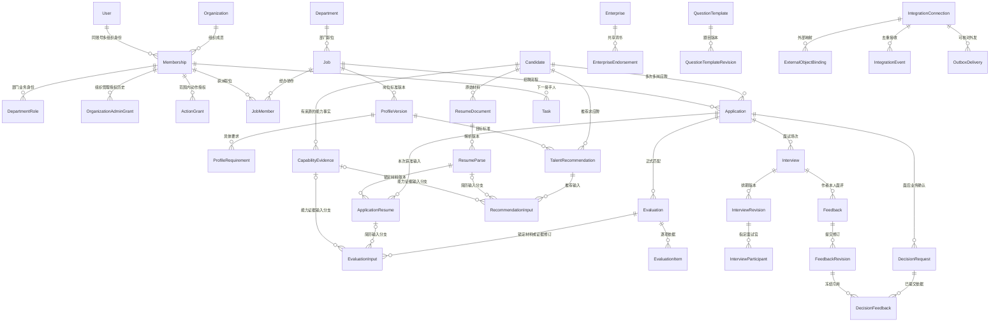

# 多角色工作台（三）：数据库与权限设计

日期：2026-10-03。本文是设计方案，不是建表、迁移或上线记录。适用“招聘 HR、招聘负责人、系统管理员”三个后台角色，以及面试官、用人负责人两个事项协作入口；所有入口使用同一账号体系、业务后端和数据源。

前置依据：[现有数据库字典](../06_数据库字典与实体关系.md)、[接口与状态](../07_接口状态与开发验收.md)、[进人与复核契约](../09_D02进人与复核实施契约.md)、[人才画像方案](../10_人才画像设计与闭环方案.md)、[飞书画像对照](../11_飞书职位画像对照与人才画像闭环设计.md)、[飞书业务基线](../../飞书招聘/README.md)。本文将它们具体映射到当前源码，不新建五套用户、人才、职位或待办。

## 1. 现状、复用与增量边界

2026-10-03 静态核对 `apps/api/recruitment/models.py`、`access.py`、`intake.py`、`interviews.py`、`ai_screening.py`、`question_bank.py`、`employer_brand.py`。工作区其他任务仍在推进；下列“代码已有”仅证明模型或相应路径存在，不证明生产数据库、完整界面、飞书授权或所有验收已完成。实施前重新核对最新迁移。

| 领域 | 当前代码已有 | 本次设计补足；未实施前不能宣传已具备 |
|---|---|---|
| 身份与权限 | Organization、Department、Membership、DepartmentRole、JobMember；部门角色含 hr、manager、interviewer、supervisor 和动作 resume_download | 组织管理员独立授权；敏感动作与角色拆开；按事项限权、授予与撤回留痕 |
| 职位与画像 | Job、ProfileVersion、ProfileRequirement、ProfileGeneration、ProfileClarification；HR 直接保存并使用 | 画像分组、稳定要求标识、评分标尺等增量；不恢复画像审批 |
| 进人与复核 | Candidate、Application、ResumeDocument、ResumeParse、ApplicationResume、ImportBatch/Item、ApplicationEntry、ReviewDecision、StageEvent | 独立人才库授权、显式材料共享、加入职位时选定解析版本、终态修正 |
| 面试 | Interview、InterviewRevision、InterviewParticipant、创建/改期/取消路径；返回邀请状态仍有 not_sent | 响应、正式面评、面后业务确认、通知及回执；不能把排期创建等同邀请成功 |
| AI 与共享内容 | AIScreening 已有可空 application/job/profile/resume_parse、来源上下文和企业快照；AIScreeningVerification；QuestionTemplate/Event；Enterprise/Endorsement/Issue | 正式 Evaluation 与人才推荐；共享内容版本、发布权限、面评证据引用；旧报告不补造出处 |
| 待办与审计 | Task 来源目前是画像/澄清/应聘；AuditEvent 必须关联 Job | 扩展具体事项来源；覆盖无职位的权限、企业素材、模型和连接操作 |
| 外部集成 | 企业实际使用飞书平台与招聘助手；不等于本系统业务数据接口已开通 | 连接、身份/对象映射、事件、外发、核对、撤权等按获批接口增量实现 |

三个必须显式解决的差异：当前 `JobMember` 只有 job/member，并没有完整职责枚举；当前人才查询依赖有权限职位下的应聘；当前 Application 将 `hired`、`talent_pool` 列为 `closed_at=NULL` 的阶段。这些均不能直接视为目标模型已经满足。

## 2. 共用规则与关系图

- 复用现有整数主键，不为了统一样式改为 UUID。请求幂等键沿用 UUID。`→` 表示外键，`?` 可空；未标 `?` 的目标新增字段为必填。`str(n)`、`text`、`int`、`bool`、`decimal(p,s)`、`ts`、`json` 分别表示限长文本、长文本、整数、布尔、定点数、带时区时间和有结构校验的快照。
- 现有字段名、长度和枚举以迁移为准；表中“增”表示需要迁移。“拟”表示设计已有或本次提出、当前 models.py 尚无。领域根对象保存 organization；从属对象可沿必填父外键推导组织，不为形式重复所有列。
- 后端从登录成员确定组织；所有 FK 写入检查同组织、同候选人、同职位或同应聘关系。普通外键不能自动保证这些跨表条件。
- 业务对象沿用 `version` 乐观锁；已生效标准、解析结果、提交面评和决定依据冻结。版本递增与当前指针更新同事务。时间存 UTC，展示时用指定时区。
- 文件在受控存储中，表中仅文件键和摘要；不存公开链接或令牌。引用使用 PROTECT，停用代替误删；授权清理走第 11 节，不能以 PROTECT 永远拒绝清理。
- JSON 仅承载模型输出、内容快照和不可变定位信息；权限、应聘、材料、收件人等核心关系使用具体外键。输入 ID 列表快照不能成为授权来源。

图中包含目标增量，不代表所有表已创建。Task 按具体 kind 连接业务对象；图中省略多条连线，实际 FK 见第 8 节。

## 3. 账号、角色、作用范围与敏感动作

### 3.1 最小数据结构

| 实体 | 字段及类型 | 约束、索引与业务含义 |
|---|---|---|
| Organization〔已有〕 | name:str(100)；增 status:active/suspended、timezone:str(64) | 停用阻止新业务；恢复不自动补发旧通知 |
| Membership〔已有〕 | organization→Organization、user→Django User、active:bool；增 disabled_at:ts? | UQ(organization,user)；员工只有一个组织成员记录，兼任身份不重建账号 |
| Department〔已有〕 | organization、name:str(100) | UQ(organization,name)；本次不强加树结构或递归部门继承，跨部门需分别授权 |
| DepartmentRole〔复用〕 | membership、department、role:hr/manager/interviewer/supervisor；增 granted_by→Membership?、granted_at、revoked_at?、expires_at? | 有效记录条件 UQ(member,department,role)；范围和身份同条记录，保留撤销历史；旧 resume_download 按下述迁移 |
| OrganizationAdminGrant〔拟〕 | membership→Membership、granted_by→Membership?、reason:str(500)、granted_at:ts、revoked_at:ts? | 仅组织配置能力；有效记录按 membership 条件唯一；初始化首位管理员由经授权的部署流程记录原因，不由普通用户自升权 |
| JobMember〔复用〕 | job→Job、membership→Membership；增 active:bool、assigned_by→Membership? | 继续 UQ(job,member)，当前只代表 HR 经办协作；不把面试官塞入本表后自动获得整岗操作权 |
| ActionGrant〔拟〕 | membership、capability:str(40)、scope_kind:organization/department/job、department→Department?、job→Job?、approved_by→Membership、granted_by→Membership、reason:str(1000)、granted_at、expires_at?、revoked_at? | scope_kind 与目标 FK 精确匹配；三种范围分别条件唯一；IDX(member,capability,revoked_at,expires_at)。能力来自后端固定白名单，不接受任意脚本/JSON 权限表达式 |
| ExternalIdentity〔沿用06设计〕 | user→User、connection→IntegrationConnection、external_subject:str(200)、verified_at、revoked_at? | UQ(connection,external_subject)；飞书回调身份经服务端验证后映射，不相信前端传入飞书用户编号 |

`OrganizationAdminGrant` 是组织角色；Django `is_staff`/`is_superuser` 是运维能力，不作为企业管理员入口授权。正常业务请求不能因 superuser 跳过租户与材料检查；受控运维访问另行留痕。

授权表“有效条件唯一”以 `revoked_at IS NULL` 表达；过期授权续授前结束旧行再建新行，过期时间在每次鉴权时检查，不使用当前时间函数做不稳定的唯一索引条件。

首批 ActionGrant 仅实现实际用到的 `resume_download`、`candidate_export`、`salary_view`、`material_share`、`shared_content_manage`；没有对应功能的动作不提前开放。每个动作允许的 scope_kind 固定：共享内容维护先只组织范围；简历、薪资、导出按部门或职位；跨部门材料使用还必须有第 5 节的具体材料共享记录。看普通联系方式属于授权业务上下文，身份证件、生日等非必要字段默认不出现在协作端、统计或模型输入。

敏感授权的依据由企业指定、覆盖目标范围的有权业务责任人确认并记录，管理员落实配置；管理员不能仅凭配置身份自行产生业务数据授权。`approved_by` 与 `granted_by` 分开留存依据与范围，是否必须由不同人员或多级审批按企业既有规则确认；尚未确认时不预设双人审批制度，也不建设审批引擎。首位授权责任人的任命属于部署前业务配置，不假设存在第二名 HR。此控制不用于岗位画像保存，岗位标准仍由获授权 HR 直接保存并使用。

### 3.2 后端判定规则

| 身份/动作 | 必须同时成立的条件 | 不随之获得 |
|---|---|---|
| HR 经办职位 | 同组织有效成员；目标部门有效 hr；为 Job.owner 或有效 JobMember | 别的部门/未获派职位；候选人全部历史 |
| 招聘负责人看团队 | 目标部门有效 supervisor；只读被授权范围内进度、负荷、卡点及必要摘要 | 原始简历、联系方式、薪资、代替 HR 决定、代写面评 |
| 招聘负责人分配 | 同部门 supervisor；新负责人是该部门有效 HR；显式记录移交 | 靠分配接口读取未授权材料；将自己加入职位却不具备 HR 身份 |
| 系统管理员配置 | 组织有效 OrganizationAdminGrant；动作属于账号/配置/连接/运行维护白名单 | 全库简历、AI 原始输入、薪资、业务审批与代写反馈 |
| 面试官执行 | 当前/实际面试版本的 InterviewParticipant；读取本场指定材料；有效成员 | 同岗位其他人、他人面评草稿、候选人其他应聘、默认下载 |
| 用人负责人协作 | ProfileClarification.assignee 或 DecisionRequest.reviewer 是本人；来源同组织、任务仍有效。B03 进度另需目标部门有效 manager，只读获授权职位状态、人数、预计节点及待本人事项摘要 | 部门全部候选人原文与个人联系信息；批准岗位画像；更改 HR 标准或其他人的面评 |
| 下载/导出/薪资查看 | 业务对象本就可读；存在 capability 与范围共同覆盖此对象的有效 ActionGrant；材料 active | 因在别的部门有同能力就跨范围调用；借导出放大原有可读范围 |

授权逐条计算为 `存在一条覆盖此对象且包含此能力的有效授权`，再与该对象的业务关系相交。不能先把各部门的能力并起来、再把范围并起来。例：甲部门 HR＋甲职位协作＋乙部门下载授权，不能下载甲职位简历；甲职位只读＋乙职位经办也不能编辑甲职位。

用户切换工作台只改变界面；后端每个读取、统计、导出、文件下载和 AI 输入都重新按当前对象判断。旧任务、历史模型结果、分享摘要都不是永久授权。当前 `visible_jobs` 对 manager 的部门可见方式需逐入口调整，负责人轻入口改为“指定事项与必要职位摘要”，防止直接复用旧列表扩大阅读范围。

## 4. 职位、画像与标准版本

| 实体 | 沿用字段与本次增量 | 约束和关联 |
|---|---|---|
| Job〔已有〕 | organization、department、owner/approver→Membership、enterprise→Enterprise?、title、jd:text、headcount:int、status:draft/open/paused/closed、version:int、active_profile→ProfileVersion?；增 jd_version:int | headcount>0；owner 同部门有效 HR；active_profile 必须是本职位已生效版本。approver 兼容原字段名，业务含义为默认用人协作人，不再表示画像审批前提 |
| ProfileVersion〔已有〕 | job、number:int、jd_snapshot、business_goal、source、status、created_by、confirmed_by/at、activated_by_hr；增 based_on→ProfileVersion?、scoring_schema_version:str?、scoring_snapshot:json?、jd_version:int | UQ(job,number)；confirmed 内容冻结。新版本由有职位操作权 HR 保存使用，切换 Job.active_profile；旧版留原确认人与时间 |
| ProfileRequirement〔已有〕 | profile、kind:must/preferred/exclusion、text、rationale、needs_verification、position、generation 及逐项来源；增 key:str(64)、dimension:work/education/skill/project、weight:decimal(6,3)?、evidence_instruction:text | UQ(profile,key)；key 跨版本标识同一要求，不由可编辑文字生成。排除须岗位相关理由；必须项 needs_verification=true 阻止生效 |
| ProfileGeneration〔已有〕 | job?、creator、request_key、job_version?、purpose、model、prompt_version、input_snapshot、status:running/succeeded/failed/stale、result、error | 最新工作区已有新建预览：purpose=job_profile_preview 时 job/job_version 同空且条件 UQ(creator,request_key)；已建岗生成两者必填且 UQ(job,creator,request_key)。输入变更标 stale；采用不等于生效，不改旧要求/人工决定 |
| ProfileClarification〔已有〕 | organization、profile、requirement、requester、assignee、question、request_key、status:pending/answered/withdrawn、answer、answered_at | requirement 属于该 profile；指定人答复，HR 整理；答复不自动改变画像，不自动清除必须项待核实标记 |

标签优先复用 ProfileRequirement 的要求与类型。`必备/加分/排除` 分别映射 must/preferred/exclusion；需要多个检索标签时增明确的 RequirementTag(profile_requirement,label)，同要求标签规范化唯一。标签和要求不能重复计分。临时筛选不改正式标准。

目标选定：历史已生效版本仍保持 `confirmed` 和原确认人/时间，由 `Job.active_profile` 指向当前版本，`based_on` 记录新版基于哪版起草；不再把历史已确认版本改为 withdrawn/superseded。既有 `pending/changes_requested/withdrawn` 保留其发生时含义，不伪造确认人或 HR 激活记录；若旧记录已缺失确认信息，标记历史证据不全，不补造。旧画像审批待办在 HR 真正保存使用时受控结束，面后业务确认不受影响。

## 5. 人才、材料、来源与正式应聘

| 实体 | 字段及目标增量 | 约束、状态和索引 |
|---|---|---|
| Candidate〔已有〕 | organization、display_name、phone/email、经历字段、created_by；增 status:active/archived/merged、redirected_to→Candidate? | 姓名/电话/邮箱索引但不无条件唯一；同名/同联系方式只提示查重。不得增加全局职位、阶段、匹配分；合并不得成环 |
| ResumeDocument〔已有〕 | organization、candidate?、file_key:uuid、original_name、file_type、size、sha256、uploaded_by、access_state:active/quarantine/deleted；增 source_kind、source_reference、received_at、retention_due_at? | 原文件不可覆盖；candidate 未确认时只允许上传者/被指定处理者访问。SHA 用于重试校验，不据此自动合并人 |
| ResumeParse〔已有〕 | document、version、parser_version、status:succeeded/failed、text/error、actor、request_key；后续需异步时才增 queued/running | UQ(document,version)、UQ(document,request_key)；成功必须有内容，失败有原因；重解析新增版本，不能替换旧评估输入 |
| ImportBatch / ImportItem〔已有〕 | batch：organization/job/actor/source/request_key/total；item：batch/document/application?/identity_payload/confirmed_by | 保留单批、单项幂等；当前确认入岗会创建应聘，不能拿此入口导入飞书在途记录“仅分析” |
| Application〔已有〕 | organization、candidate、job、owner、attempt_no、source、stage、version、closed_at、close_reason；增 workflow_system:local/feishu、external_state:str?、external_lifecycle:active/closed/unknown?、external_updated_at:ts? | UQ(candidate,job,attempt_no)；当前活跃条件仅 closed_at IS NULL，接入外部镜像时按下述分支调整。IDX(org,job,stage)、(candidate,created_at)；外部主流程仅可由核验事件更新 |
| ApplicationResume〔已有〕 | application、parse→ResumeParse、assigned_by、created_at；增 use_kind:submitted/supplement、revoked_at?、share→MaterialShare? | UQ(application,parse)；经 parse 反查文件即可，不重复存 document。须同候选人、同组织、active 文件及目标使用许可；解析版本在加入时固定 |
| MaterialShare〔拟，跨范围材料/跨岗证据复用时〕 | source_kind:resume/capability、document→ResumeDocument?、capability_evidence→CapabilityEvidence?、target_job→Job、granted_by、approved_by、reason、created_at、revoked_at?、expires_at? | source_kind 对应 document/evidence 恰一非空；分别有效条件 UQ(document,target_job)、UQ(capability_evidence,target_job)。分享前需来源处分权限；只批准这份材料或这条证据修订用于目标职位，不开放来源应聘/全份面评。未实现时不开放跨范围材料或跨岗证据使用 |
| ApplicationEntry〔已有〕 | organization、request_key、actor、application、source；增 request_digest:str(64) | UQ(org,request_key)；相同键相同内容返回原结果，键复用不同材料/职位报冲突，不重新开岗 |
| TalentPool / TalentPoolEntry〔沿用06后续〕 | pool：organization/name/category/active；entry：pool/candidate/source_application?/added_by/reason/review_due_at?/removed_at? | UQ(org,pool.name)、有效 UQ(pool,candidate)；只有真正启动独立分库时创建和单独授权，不拿假应聘充人才库授权 |

加入职位事务：检查人/职位/材料各自权限→锁候选人及目标活跃应聘→返回已有或建立下一次应聘→写明确选定的 ApplicationResume→写进入事件和复核 Task→提交。当前 `/candidates/{id}/apply/` 仅收 request_key、job、source，尚不接收材料；这一增量必须真实实现，不由前端自行关联。

同人同岗历史终结后可再次应聘；同人不同岗独立。`talent_pool` 是人才沉淀方式，目标不再将其作为永不结束的应聘阶段；转入储备时结束本次应聘并保留原因，独立分库未实现可先在已结束授权主档中查询。`hired` 必须绑定已核实入职记录并关闭应聘。现有这些阶段不能自动批量转成“已完成”：先列出存量逐条确认，缺实际日期/来源则标待核对，不能捏造 Offer 或入职事实。

## 6. 匹配、推荐、人工复核与能力事实

| 实体 | 字段（均为设计增量，另注明已有） | 关系与约束 |
|---|---|---|
| AIExecution〔沿用06〕 | organization、task_kind、provider、model_version、prompt_version、input_digest、status:queued/running/succeeded/failed/cancelled、started_at?/finished_at?、safe_error? | 执行不等于业务结果；重用现模型调用，不先替换已有 ProfileGeneration/AIScreening 历史 |
| Evaluation | application→Application、profile→ProfileVersion、execution→AIExecution、version:int、status、recommendation、total_score:decimal(5,2)?、evidence_coverage:decimal(5,2)?、scoring_snapshot:json | 必须是真实应聘；UQ(application,version)，标准属于应聘职位；无评分标尺或依据不足时分数 NULL，AI 不自由填写裸分 |
| EvaluationInput | evaluation、source_kind:resume/capability、application_resume→ApplicationResume?、capability_evidence→CapabilityEvidence?、share→MaterialShare? | resume 分支必须且仅有 application_resume，并与 evaluation 同应聘；capability 分支必须且仅有 capability_evidence。分别条件 UQ(evaluation,application_resume)、UQ(evaluation,capability_evidence)；证据须同候选人、固定 confirmed 修订并满足来源权/目标使用权，跨岗必填指向该修订和目标职位的有效 share |
| EvaluationItem | evaluation、requirement→ProfileRequirement、finding:supported/not_met/unknown、reason:text、score:decimal?、evidence_locations:json | UQ(evaluation,requirement)；要求属于该画像，引用先指本次 EvaluationInput.id，再按来源类型定位解析页/段或证据修订/允许的出处。服务端逐项核验，不能引用未进入输入集的材料、旧面评或候选人全局摘要；未知不是不合格 |
| TalentRecommendation | candidate、job、profile、execution、input_digest、status:queued/running/succeeded/failed/needs_review、created_by、request_key、handling:unhandled/not_now/added、handled_by?/at?、handling_reason?、application? | 不要求 application；UQ(created_by,job,request_key)；画像属于 job，应用 created_by 当前授权范围。加入后 application 必须为同人同岗；不存跨岗位全局分数 |
| RecommendationInput | recommendation、source_kind:resume/capability、parse→ResumeParse?、capability_evidence→CapabilityEvidence?、share→MaterialShare? | source_kind 对应 parse/evidence 恰一非空；分别条件 UQ(recommendation,parse)、UQ(recommendation,capability_evidence)。与推荐为同候选人；证据仅限固定 confirmed 修订，跨岗证据必填有效 share，解析材料须有目标用途许可；不需要先建 Application |
| RecommendationItem | recommendation、requirement、finding、reason、evidence_locations | UQ(recommendation,requirement)；要求属于推荐画像；引用仅能指本次 RecommendationInput.id 及其允许的定位，不能借候选人 ID 读取全部证据。共享计算逻辑但不把推荐伪装为 Evaluation；结果返回时再次检查每份输入 |
| ReviewDecision〔已有〕 | application/reviewer/request_key/action/reason/followup_owner?/due_at?/previous_stage/result_stage/profile?/input_parses；增 evaluation→Evaluation? | UQ(application,request_key)，追加不可覆盖；need_info 必须责任人和期限。现 input_parses 是历史快照，新正式评估用关系输入，不把快照当授权 |
| StageEvent〔已有〕 | application、actor、from_stage/to_stage、request_key、created_at；增 source_kind、decision_request?/review_decision? | UQ(application,request_key)；实际阶段与事件同事务；外部变化按真实来源标明，不伪造“HR已操作” |
| CapabilityEvidence〔沿用06并补权限根〕 | candidate、source_application?、requirement_key?、capability_label、statement、source_kind:resume/feedback/manual、resume_parse?/feedback_revision?、locator:json?、status:draft/confirmed/retracted、authored_by、confirmed_by?/at?、supersedes→CapabilityEvidence? | 每行即一条固定内容修订；resume 必填 resume_parse 且 feedback_revision 为空，feedback 反之且只引用已提交版本，manual 两者为空但首期必须填 source_application；同组织/同候选人，明确的 source_application 必须与源材料/面评一致。confirmed 必填确认人/时间；修改内容追加新行，supersedes 不成环；IDX(candidate,status,capability_label) |

标准、材料或已提交面评变化后旧匹配保留，显示输入已过期。人工重新分析创建新结果，不回滚原决定。推荐中的“暂不考虑”仅作用于该职位/画像版本，可撤销；不得使其他应聘结束。面试问题可以来自未知项，但只有实际提交的面评或人工核实才形成能力事实。

TalentRecommendation 每行是一名人选的一次推荐；批量发起时按父请求键＋candidate ID 派生稳定子 request_key，逐人复用/重试，不能给整批所有人共用同一个行幂等键。

证据真正进入新岗位匹配的链路是：提交面评→有权者确认一条 CapabilityEvidence 修订→对新职位显式授予 MaterialShare→作为 capability 分支的 EvaluationInput/RecommendationInput→逐项结果引用该输入。确认面评不自动确认抽取的证据，证据确认不自动分享，分享也不把旧岗位结论复制成新岗位结论。同一原始出处同时作为简历和能力证据输入时需识别共用来源，不能重复累计支持度或权重。

每次读入、生成结束、结果展示都检查来源当前可读与目标用途许可：直接来源权限或明确共享仅能提供获准的证据内容/片段；共享一条证据不授予整份面评或源应聘读取权，点击源链接仍另行鉴权。share 的来源 FK、target_job 必须与输入和目标一致；来源尚无应聘时也必须有明确的目标使用许可，不能利用 source_application 为空绕过共享。resume 分支的分享由 ApplicationResume.share 或解析材料授权链核验，不与 capability 共享混用。输入摘要固定具体证据行 ID、内容摘要及共享编号，不能改为自动读取“这项能力最新一条”。加入职位后，HR 选择采用的证据经再次校验后写入新正式评估的 EvaluationInput，不直接把推荐结果标为正式评估。

manual 首期必须依附一个真实 source_application 并继承该范围，不能让所有来源为空而形成全组织可见的人工标签；无应聘的独立分析核实先保留在原授权范围的 AIScreeningVerification，不能为了形成能力证据而创建假应聘。独立人才库后续先明确入库和授权根，再单独扩展。来源文件/面评权限撤销、具体共享到期/撤回或证据变为 retracted 时，沿输入关系将依赖结果标记过期或受限，停止新分析使用，并限制已存摘要/标签/原文的展示；保留历史标识不表示继续公开内容。修订后的新证据需重新授权和重新分析，不能悄悄替换旧评估输入。

## 7. 排期、本人面评与用人负责人确认

| 实体 | 字段及必填关系 | 状态、唯一性和关键约束 |
|---|---|---|
| Interview〔已有〕 | organization、application、round_no、purpose、request_key、organizer、current_revision?、status、completed_at?/cancelled_at?；增 outcome:held/no_show/aborted?、outcome_recorded_by→Membership?、outcome_recorded_at:ts? | UQ(org,request_key)；同应聘同轮允许取消后重约，不做 UQ(application,round_no)。outcome 与记录人/时间成套；未到场和中断不伪装为正常完成 |
| InterviewRevision〔已有〕 | interview、version、starts_at/ends_at、timezone、mode、location/meeting_url、status、change_reason | UQ(interview,version)，每场仅一个 current；start<end，现场必填地点/视频必填链接；改期新版本不覆盖 |
| InterviewParticipant〔已有〕 | revision、membership、required:bool、duty:str；增 feedback_required:bool | UQ(revision,membership)；required 表示必须出席，feedback_required 表示必须交本人面评，两者不能混用；按职责设定后保存本场值。改期重新关联，旧版本保留 |
| InterviewResponse〔沿用06〕 | revision、membership?、candidate?、response:pending/accepted/declined/change_requested、responded_at?、source、comment? | 回应人恰一；按成员/候选人分别条件唯一；只接受当前排期版本，confirmed 由必需回应计算 |
| CandidatePortalGrant〔沿用06；本期受限邀请凭证〕 | organization、candidate、application、interview_revision、purpose:interview_respond、token_hash:str(128)、expires_at:ts、revoked_at:ts?、used_at:ts?、max_uses:int、use_count:int=0、issued_by→Membership | UQ(token_hash)，0≤use_count≤max_uses；三者必须属于同一候选人/应聘。仅保存不可逆摘要，验证有效性和必要身份后才读取本次时间/地点及执行接受、拒绝、申请改期；不开放主档、面评或其他应聘 |
| RescheduleRequest〔沿用06〕 | interview、requested_revision、requested_by_member?/candidate?、proposed_windows:json、reason、status:pending/accepted/rejected/withdrawn、resolved_by?/at? | 申请人恰一；接受必须对应新排期或明确处理结论，不能直接把申请改为预约 |
| InterviewGuide / GuideQuestion〔沿用06〕 | guide：interview/profile/version/status/saved_by；question：guide/order/question/purpose/followups/template_revision?/requirement?/evidence_location? | UQ(interview,version)、UQ(guide,order)；问题快照不受题库后续编辑影响；本场未采用的 AI 问题不当已问 |
| Feedback〔沿用06〕 | organization、interview、author→Membership、current_revision?、status:draft/submitted | UQ(interview,author)；作者需是实际面试有效排期参与者。以场次+作者为身份，不以排期行 ID 建第二份面评 |
| FeedbackRevision / FeedbackItem〔沿用06〕 | revision：feedback/version/profile→ProfileVersion/guide→InterviewGuide?/status/summary/remaining_questions/next_step/correction_reason?/submitted_at?；item：revision/requirement?/capability_label/finding/evidence/rating? | UQ(feedback,version)；提交冻结，修订说明理由。固定 profile，若使用提纲则固定 guide 版本；二者须同应聘职位，requirement 必须属于该固定 profile；未问未核实不能填确认结论 |
| DecisionRequest〔沿用06〕 | organization、application、requester、reviewer、version、kind、status:draft/pending/decided/deferred/withdrawn/expired、evaluation?、evidence_snapshot:json、result?/reason?/revisit_at?/expires_at?/decided_at?、request_key | UQ(application,request_key)；同应聘同 kind 仅一个 pending；IDX(reviewer,status)。固定所交材料版本，指定人/状态/版本匹配后才能决定 |
| DecisionFeedback〔沿用06〕 | decision_request、feedback_revision | UQ(request,feedback_revision)；必须为该应聘已提交且双方可读的版本；面评后续修订需提醒当前确认，不能静默替换快照 |

排期锁定候选人和参与成员，固定顺序加锁后检查所有已知有效场次；区间为 `[start,end)`，跨应聘也查同人冲突。没有接通外部日历时，只能声称本系统已知日程无冲突。通知、回应、到场、完成、面评提交分别存事实。只有记录真实面试 held 后才可标 completed；no_show/aborted 用受控结束本场动作写 cancelled 和明确原因，业务页面按 outcome 展示“未到场/中断”，不自动结束应聘或生成面评。

候选人基础确认页属于 F16 首期必要链路，不等待完整 App。Invitation 的业务语义由 CandidatePortalGrant＋OutboxDelivery＋InterviewResponse 承载，不另外建一张同义邀请主表。改期、取消、替换收件人时撤销旧 grant；过期链接只显示安全提示，不暴露新安排。接受/拒绝写本次 InterviewResponse，申请改期另写 RescheduleRequest 并交 HR；候选人不能直接改排期。重复同一回复幂等，矛盾回复/已处理请求返回当前状态及联系 HR 入口；响应、凭证使用记录和下一待办同事务。候选人身份与内部 Membership 分开，不凭收到一个链接获得内部角色。

GET 打开页面只读取必要信息，不确认出席、不消费答复次数；邮件/聊天预览不能触发回复。接受、拒绝、申请改期只能由明确 POST 动作提交，带单次动作幂等键，在事务中检查并消费有效凭证；重复同键不重复消费或生成待办。令牌使用足够随机的秘密值，不能由候选人编号推算。

面评草稿仅作者可读；HR 可看“未提交”状态并催办，不能读草稿或冒名提交。背靠背比较默认在本人提交后且获指定协作范围才能看允许共享的他人已提交评价。主管仅查看缺评与时效摘要，不自动获得全部评价原文。

本地完整状态目标沿用 07：`pending_review → ready_to_schedule → interviewing → pending_decision`；负责人决定下一轮回待安排，补充进入 needs_followup，暂缓进入 on_hold 并指定复查时间，结束进入 closed。这些新阶段须同步模型约束、业务入口、待办和报表，不能只加前端标签。负责人认可录用方向不等于 Offer 已审批/已发送；Offer、OnboardingCase 等仍属原 P1，本方案不提前生成记录。

三个出口不能留下无主的应聘：DecisionRequest 撤回/过期时写终结原因，结束旧确认待办，并将本地应聘转 needs_followup、交 HR 整理或重发；本轮所有场次取消/拒绝/未到场/中断时给 HR 跟进任务，由 HR 选择重约回 ready_to_schedule、继续联系到 needs_followup 或有权限地结束；P0 认可录用方向而 Offer 能力未具备时，记录该决定并进入 needs_followup＋具体办理人/期限，不冒充已发 Offer。上述事项、阶段和待办同事务，外部主流程只记录建议/跟进，不写本地权威阶段。

## 8. 待办、通知、内容库与 AI 初面复用

### 8.1 一套事项与下一接手人

扩展已有 Task，保持当前 `pending/done/cancelled` 枚举，不另外创建“主管待办表”“管理员待办表”。在现有 profile/clarification/application 外，按实际切片增 `interview_revision?、feedback?、decision_request?、enterprise_issue?` 外键、`due_at、requester?、reassigned_by?、version`。组织从业务根推导，来源外键必须匹配 kind，不能全空或指向互不相关对象。

| kind | 权威来源与完成动作 | 防重与撤销规则 |
|---|---|---|
| clarify / clarify_followup | ProfileClarification 的回答/HR整理 | 沿用 clarification+kind；撤回问题同时取消待办 |
| app_review / need_info / schedule | ReviewDecision / Application 的受控动作 | 当前应聘同类型仅一个 pending；完成旧任务与创建下一任务同事务 |
| interview_reply〔增〕 | 当前排期版本回应 | 有效 UQ(interview_revision,assignee,kind)；改期旧回应任务失效，新版重新确认 |
| feedback_submit〔增〕 | 本人 FeedbackRevision 提交 | 有效 UQ(feedback,kind)，反馈本身 UQ(interview,author)；assignee 必须等于作者，不能改期重复催同一份 |
| business_decision〔增〕 | DecisionRequest 决定 | UQ(decision_request,assignee,kind)；旧请求过期或撤回同步取消；assignee 等于当前 reviewer |
| followup〔增〕 | Application 后续处理；decision_request 可空，用于追溯已有决定 | 有效 UQ(application,kind WHERE status=pending)；必填 assignee/due_at 和跟进原因，关联决定时必须同应聘。无业务决定的整轮取消/拒绝等直接挂 Application，不能建假 DecisionRequest |
| enterprise_issue〔按需接入〕 | EnterpriseIssue 回答与请求人反馈关闭 | 原 Issue 已有完整状态可直接聚合；确有统一催办需求再投影 Task，不能两处独立改状态 |

“重新分配”先校验新成员具备该事项权限，再改唯一权威 assignee 与待办、撤销旧提醒并留审计。来源动作决定任务完成，不提供任意点击完成跳过业务的接口。对长期缺接手人的事项显式提示，不能悄悄分配给管理员。

Notification（站内消息）和 OutboxDelivery（外发）各自状态独立于 Task；消息已读不完成待办，发送成功不完成面试。通知仅含安全摘要和受控链接，点开重新授权。

### 8.2 共享素材不复制业务主档

| 实体 | 现有字段 | 目标增量与使用关系 |
|---|---|---|
| Enterprise | organization/name/industry/introduction/remark/sort_order/enabled/deleted_at | 复用企业主档；增 version:int，编辑并发检查；停用不抹掉已用历史 |
| EnterpriseEndorsement | organization/enterprise?/category/title/body/sort_order/enabled/deleted_at | 增 current_revision 与版本记录 EndorsementRevision(endorsement,version,title,body,category,published_by,published_at,status)；UQ(endorsement,version)。只有正式启用内容进入新 AI 输入 |
| EnterpriseIssue | enterprise/requester/assignee/question/source_reference/status/answer/follow_up_note/version/endorsement?/endorsement_snapshot | 现 pending→answered→closed 分别为核实、待反馈、已闭环；回答人不替请求人确认已反馈。快照固定当次引用，新增正式版本后引用其 FK |
| QuestionTemplate / Event | organization/request_key/content/job_title/dimension/difficulty/reference_answer/version/deleted_at；event 保存 actor/action/version | 新增 QuestionTemplateRevision(question,version,content,dimension,difficulty,reference_answer,changed_by,created_at)，UQ(question,version)；现 Event 只有操作记录，不足以还原旧题目正文 |
| AIScreening | creator/application?/job?/enterprise?/profile?/resume_parse?/source_context/enterprise_snapshot/input_digest/request_key/result/created_at/deleted_at | 保留原入口与作者授权；不得把无应聘旧报告硬转换为正式 Evaluation。材料或画像不足时明确参考分析；增输入快照 schema_version/模型版本等只在确有缺口时补 |
| AIScreeningVerification | screening/question_index/version/status/answer/evidence/next_step/contact_name/due_on/recorder/request_key | 现五题索引约束 question_index<5，状态 pending/supported/contradicted/unresolved/withdrawn；UQ(screening,index,version) 与 UQ(screening,request_key)。若接入面评，增 feedback_revision?/requirement? 具体 FK，不靠姓名推断实际参与人 |

共享内容默认向有业务阅读资格的 HR 提供启用版本；维护/发布改为明确 `shared_content_manage`，不因任一部门 HR 身份就自动拥有全部组织内容修改权。此处是目标收敛；当前 require_editor/can_manage 对 HR/supervisor 的宽授权需迁移评估，不能宣布已受细粒度控制。面试官只读取本场提纲和指定背书快照，管理员配置权不产生内容业务修改权。

初面核实不是正式面评，EnterpriseIssue 不是岗位要求澄清，AI 报告不是录用决定。相互转用需要显式来源、授权和采用动作；不通过改状态名字把三者合并成一个万能记录。

## 9. 飞书、插件与唯一流程主系统

企业实际链路是“招聘网站→飞书招聘助手→飞书人才库/投递”。插件不直接写本项目；飞书登录/消息权限不等于招聘数据接口权限。

| 实体〔均待按授权实施〕 | 关键字段 | 数据约束与真实含义 |
|---|---|---|
| IntegrationConnection | organization/provider/purpose/external_account_id/credential_ref?/scopes:json/status/last_success_at?/safe_error? | UQ(org,provider,purpose,account)；purpose 区分登录、消息、招聘；凭据只存安全存储引用 |
| ExternalObjectBinding | connection、kind:job/candidate/application、external_id:str(200)、job?/candidate?/application?、verified_by?/at?、external_version?、last_read_at?、access_state:active/revoked/deleted | 对象 FK 恰一且匹配 kind；UQ(connection,kind,external_id)，本地对象在同连接同 kind 亦唯一；同名不自动绑定。外部 ID 的存在不自动授予本地权限 |
| IntegrationEvent | connection/external_event_id/event_type/payload_digest/received_at/verified_at/status/processed_at?/safe_error? | UQ(connection,event_id)；同键不同负载报警；先鉴别来源及连接组织，再处理。没有单调外部版本时以回读当前事实化解乱序，不按收到时间猜新旧 |
| OutboxDelivery | organization/connection?/kind/明确业务来源FK/recipient?/payload_version/protected_payload_ref?/dedupe_key/status/attempt_count/next_attempt_at?/locked_until?/external_message_id?/sent_at?/safe_error? | UQ(org,dedupe_key)，IDX(status,next_attempt_at)；状态 queued/sending/sent/failed/unknown/cancelled；敏感正文尽量不复制，发送前重新读取获准内容。受限邀请令牌原文仅在到期可删除的受保护发送载荷保存，表中存引用，不进入审计/运行日志 |

本系统原生应聘 `workflow_system=local` 才走本地阶段入口。飞书主流程在授权只读接入后可有只读镜像 `workflow_system=feishu`，本地记录只投影外部阶段和最后核验时间，所有本地“推进/关闭/发Offer”入口拒绝操作；图片、资料导入或本地业务建议不能改变主系统。镜像不是第二条可独立推进的应聘。

外部未知状态选用同一明确方案：local 的 stage 必填且符合本地状态约束；feishu 的 stage 可空，未知映射保留 external_state 原值并显示“外部阶段待核对”，不能填 pending_review 冒充待复核。external_lifecycle 由已核验外部事实确定 active/closed/unknown，未知占活跃名额，阻止同人同岗再开流程直到核对；关闭事实已知但时间未知时 closed_at 可空，不编造日期。活跃唯一条件调整为 `(workflow_system=local AND closed_at IS NULL) OR (workflow_system=feishu AND external_lifecycle IN (active,unknown))`；两类主系统也不能同时存在活跃重复。无法满足映射/唯一性时事件进入人工核对，不强行建记录。未映射阶段、未知结束时间不进入本地阶段转化或时长统计，外部统计单列并注明数据时间。

没有业务数据连接时，人工提供材料用于分析走不创建应聘的参考入口，标“手动材料、来源时间、未核验外部阶段”；当前 AI 初面可不关联应聘，但仍需按用途检查授权与最小输入。不得复用“导入并确认身份”入口偷偷开一条本地流程。

未来批准写集成时，先定每个操作的唯一负责系统和可用 API。飞书主流程的本地操作先保存“建议/待外部处理”命令；仅在飞书成功结果及回读确认后更新外部镜像，超时显示 unknown 并核对，不盲目重发。手工到飞书处理后的回填只能记录“人工核对记录”，不能冒充 API 同步成功。切换主系统需要专项迁移、冻结在途动作、核对未完成任务和审计，不提供随意切换开关。

## 10. 事务、幂等与版本保护

| 场景 | 同一短事务中必须完成 | 事务外执行及失败恢复 |
|---|---|---|
| HR 保存并使用 | 锁 Job、检查 version/必须项、冻结画像、切 active_profile、结束旧画像待办、审计 | 后续匹配标过期；通知失败不回滚已生效标准 |
| 加入职位/确认导入 | 身份及授权、应聘唯一性、材料绑定、进入事件、复核任务、幂等记录 | 解析失败单项可重试；不会重复创建应聘或待办 |
| 人工复核/业务决定 | 锁 Application 与请求、核对操作者和版本、写决定及 StageEvent、完成旧任务、建下一任务、写 outbox | 消息可重试；业务成功与外发成功分别展示 |
| 排期/改期/取消 | 人员稳定锁、冲突检查、排期版本、参与人/回应、旧提醒失效、待办和审计 | 会议/日历/通知单独状态；外部取消失败保留处理任务 |
| AI 执行 | 开始时保存获授权输入摘要和版本，释放事务；完成时重新检查授权/版本后写结果 | 不在网络等待时锁岗位/人才；过期结果保留为不可直接采用，不推进流程 |
| 撤权/成员停用 | 授权失效、事项交接或待接手状态、撤销未发送通知/链接、审计 | 运行中任务提交前二次检查；已发消息无法物理收回时受控链接失效 |

所有写入要求 `request_key` 与规范化输入摘要；同键不同内容返回 409，重试返回原结果。`expected_version` 处理并发修改，两人竞争只有一人能完成状态转换。后台 worker 使用领取租约和重试上限；消息队列按可能重复投递设计，不声称网络全程恰好一次。

## 11. 审计、离职、保留与清理

扩展 AuditEvent：增加 organization、可空 job、明确候选人/事项/授权来源 FK、actor_member? 或 actor_connection?、action、request_id、safe_diff、created_at；操作者至少一种可追溯身份。组织/权限/素材审计不能为了满足当前必填 Job 随便找一个职位关联。追加只读，日志禁止简历正文、完整身份证号、令牌和原始模型请求。

- **离职/撤权链：** 停用 Membership 或具体 grant→接口立即拒绝→取消旧协作凭证和未发投递→待办交接给具备相同对象权限的人→已提交面评与历史作者保留。撤销角色不删除业务记录。
- **材料撤回链：** ResumeDocument 或 ApplicationResume 撤回→原文/下载/导出拒绝→依赖匹配、推荐、摘要和能力标签受限→排队模型任务取消或完成后不公开→检索索引移除→外部系统按已授权能力处理并记结果。不能只把文件按钮藏起来。
- **保留策略：** OrganizationSetting 保存经业务确认的策略版本，按用途/来源记录 RetentionAction；当前没有获确认统一保留天数，不能擅定无限保留或固定期限。
- **个人资料请求：** 复用 06 的 DataRequest(organization,candidate,kind,status,reason,resolved_at) 与逐对象 RetentionAction。清理覆盖文件、解析、AI 输入/输出、导出缓存、搜索索引、证据快照及已知外部副本；合法保留项记录依据，审计仅留最小不可识别信息。
- **导出：** 后续 ExportJob 保存请求人、字段白名单、范围快照、生成状态、文件键和到期时间；生成和下载各重新授权。管理员仅看运行状态和安全错误，不能从“排障下载”取得候选人包。

## 12. 迁移顺序与实施验收

按下面顺序逐段交付；不要求本轮生成任何数据库迁移或空表。既有 P1/P2/P3 仍按原范围，不因写在全端设计中自动进入首版。

| 顺序 | 迁移/兼容步骤 | 完成证据 |
|---|---|---|
| 1 权限基础 | 保留 DepartmentRole/JobMember；新增组织管理员与有限 ActionGrant；将 resume_download 原部门授权原范围迁入，记录来源；完成逐入口权限校验后停用旧枚举写入 | 新旧有效下载集合完全一致；跨部门拼接失败；纯管理员和主管不能读材料；原HR流程可用 |
| 2 角色工作台 | 新建入口复用同一 Membership、任务、职位；主管分配与事项指定关系落库；增组织级审计 | 同一账号兼任、撤权、停用与重新分配可回溯；数据统计不越范围 |
| 3 画像、材料与正式匹配 | 增稳定要求键/分组/标尺；加入职位支持明确材料；补 Evaluation/Input/Item 并接 ReviewDecision，先完成总纲 S2 再走面试闭环；必要材料分享按实际范围实施 | 同人多岗输入不混；旧解析/旧画像不可变；逐项匹配→人工复核→下一待办；推荐前不建假应聘 |
| 4 面试闭环 | 增 CandidatePortalGrant、Response、Guide、Feedback、DecisionRequest 及 Task 来源；受限候选人确认页同时交付；扩展真实阶段约束；存量 hired/talent_pool 先核对再迁移 | 改期旧回应拒绝；草稿不外泄；本人确认→面评→决定→下一待办完整；同岗历史终结后可再申请 |
| 5 内容、证据与推荐 | 现有题库/背书补当前版本快照，增正式版本；新使用记录引用版本；CapabilityEvidence/推荐在正式匹配基础上落地 | 不把旧 Event 当旧正文；无法恢复历史标“历史内容未留存”；新提纲与报告依据可还原；无假应聘推荐再合法入岗 |
| 6 授权飞书集成 | 接通前核对实际权限/API；新增明确映射、事件、outbox；先只读核验，再按业务决定进入写集成 | 断连/乱序/重复/未知结果/撤权均可核对；一条应聘只有一个主系统 |
| 7 后续能力 | 独立分库、Offer/入职、完整候选人 App 扩展、报告订阅按原阶段逐项迁移；基础受限确认已属第4步 | 不因角色新增顺便开全量ATS、批量营销、猎头平台或通用RBAC |

约束增加采用“先可空/兼容→检查存量→回填可确认事实→限制新写→最后非空/唯一”顺序；碰到重复人或缺源材料只列修复清单，不自动合并或伪造。迁移失败先停止对应新入口，保留旧数据和备份，禁止强制删除冲突行以求通过。

最低数据库/权限验收：跨组织 FK 全拒绝；同人同岗并发仅一条活跃应聘；重复决定不重复推进；同成员不同范围不能拼权限；主管经办需 HR 与职位关系；管理员无候选人读取兜底；面试官只能本人草稿；负责人只能当前指定事项；材料撤回后派生结果不泄露；输入新版本不覆盖历史；通知 unknown 不显示成功；外部主流程拒绝本地推进。并发与条件唯一需用真实 PostgreSQL 事务验证，不以一次页面点击代替。
