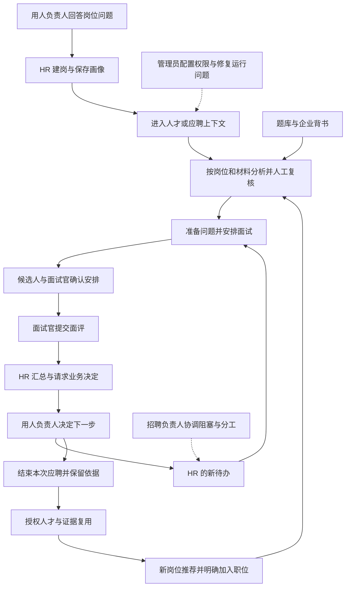

# 多角色招聘工作台：功能概览与设计总纲

日期：2026-10-03。状态：供评审与后续开发使用的设计稿，本次只交付 Markdown，不表示新增端、接口、数据库迁移或飞书集成已经完成。

本次需求：当前系统只有 HR 用户端，在已有功能和企业实际使用飞书招聘、招聘助手浏览器插件的基础上，设计各端功能、详细业务行为、相互交接和数据库关系。

## 1. 建议采用的结构

采用 **3 个后台工作视图＋2 个轻量协作入口**：招聘 HR、招聘负责人、系统管理员，以及面试官、用人负责人。共用账号、业务后端和数据库；“端”表示按职责看到的工作区，不代表建设五套独立系统。

HR 是主要使用者，其他角色围绕 HR 发起的具体招聘事项协作。一人可兼任，但每个操作分别检查职责和对象范围。切换视图只改变导航、默认队列与展示，不扩大权限。

| 工作视图／入口 | 主要使用者与目的 | 首页先看到什么 | 应交付给下游的结果 | 默认数据范围 |
|---|---|---|---|---|
| 招聘 HR 工作台 | 招聘专员、负责招聘的 HRBP；从定标准到推进人选 | 我的待办、等待他人、今日日程，再看统计 | 有依据的复核、面试安排、业务确认请求、下一步跟进 | 自己负责或被分配协作的职位，以及明确授权的人才材料 |
| 招聘负责人工作台 | 招聘主管、HR 部门负责人；看进展、调分工、发现阻塞 | 团队超期事项、未分配工作、招聘进展 | 明确的新责任人、协调记录、需要处理的问题 | 获授权的团队／部门；看汇总不自动获得简历、薪资和经办权 |
| 系统管理员工作台 | 承担账号与系统配置的人员；保证系统可用、权限准确 | 成员异常、连接状态、失败任务、配置入口 | 生效的授权、可核验的连接结果、技术故障处理记录 | 本组织配置与脱敏运行信息；默认无招聘材料读取权 |
| 面试官任务入口 | 被分配到某场面试的人；准备、面试、交面评 | 我的面试、待我反馈 | 本人提交的结构化面评与证据 | 本场必要材料和本人面评；不开放全人才库 |
| 用人负责人任务入口 | 岗位需求提出者、被指定的业务决定人 | 待我澄清、待我决定、本部门授权进度 | 岗位问题答复、针对本次人选的业务决定 | 被分配的事项及部门／职位授权；不默认看到其他部门 |

候选人仍是流程参与者：面试确认、拒绝、申请改期必须有真实受限入口；这不是第六套内部后台。完整候选人 App、HR 手机端按既有分期推进，不能因 App 尚未完成而把基础确认做成假按钮。服务账号只有被授权的接口能力，不作为人类决策角色。

## 2. 文档怎么读

| 文档 | 内容 | 用途 |
|---|---|---|
| 本文 | 各端定位、导航、25 项功能总览、功能关系、实施边界和分步顺序 | 先判断系统分工是否符合企业工作方式 |
| [01 各端功能详细设计](01_各端功能详细设计.md) | 每项功能的入口、条件、字段、动作、数据变化、交接、失败与验收 | 逐项设计页面、接口和业务测试 |
| [02 业务闭环与状态验收](02_业务闭环与状态验收.md) | 主流程、例外流程、跨系统分流、状态、任务和验收场景 | 检查“做完之后交给谁、失败怎么继续” |
| [03 数据库与权限设计](03_数据库与权限设计.md) | 实体现状、关系图、字段、约束、索引、授权、历史和迁移顺序 | 复用现有模型，按闭环补缺口 |

本套文档补充 [04 角色矩阵](../04_角色功能与范围矩阵.md)、[05 页面规格](../05_UI与功能颗粒度规格.md)、[06 数据字典](../06_数据库字典与实体关系.md)、[07 状态与验收](../07_接口状态与开发验收.md)，不重编号或宣布其后续功能全部进入首期。H／L／A／I／B 编号用于本次按角色组织功能；F 编号用于既有业务范围追踪。

业务含义以用户最新明确要求及 [AGENTS.md](../../../AGENTS.md) 为先。本次最重要的既定修正是：有职位操作权的 HR 可对画像直接“保存并使用”，无需用人负责人审批；04–07 中旧画像审批文字不能覆盖这一规则。画像细节继续以 [10 人才画像方案](../10_人才画像设计与闭环方案.md)、[11 飞书职位画像对照](../11_飞书职位画像对照与人才画像闭环设计.md) 为专题依据。

本次新增的权限字段、工作台布局和迁移切片是设计建议；企业尚未确认的审批、共享、保留期限和接口授权明确列为待定，不伪装成已有制度。后续实现出现等价命名时更新映射，不另造第二套数据。

## 3. 与现有 HR 系统的衔接

本次静态核对来源：[前端入口](../../../apps/admin/src/App.tsx)、[业务模型](../../../apps/api/recruitment/models.py)、[职位权限](../../../apps/api/recruitment/access.py)、[接口注册](../../../apps/api/config/urls.py)。工作区有其他任务持续开发的改动，以下是阅读时的源码线索，不代表已经部署或通过本次运行验收。

| 当前可见基础 | 本次如何使用 | 仍须补齐或验证 |
|---|---|---|
| HR 导航有招聘总览、职位管理、候选人库、人才画像、面试管理、AI 初面、面试题库、企业背书 | 保留已使用入口，通过上下文跳转连成流程；导航重组先作为建议 | 未见三类后台和两类协作入口全部独立完工的证据 |
| DepartmentRole 已有 HR、用人负责人、面试官、招聘主管及下载能力记录 | 复用组织、成员、部门和职位参与关系 | 有角色枚举不等于角色端已交付；下载应与人类职责分开表达 |
| Job、ProfileVersion、ProfileRequirement 及 AI 画像生成 | 职位页和人才画像页操作同一标准、同一生效版本 | 生效规则、版本影响、旧审批入口兼容以当前测试为准 |
| Candidate、Application、材料解析、人工复核和阶段事件 | 复用“一人多次应聘”和输入版本基础 | 人才独立可见范围、无应聘推荐、加入职位时材料绑定要按实际缺口补齐 |
| Interview、InterviewRevision、InterviewParticipant | 复用面试场次、排期修订与参与人 | 不能由已有表推定候选人确认、正式面评、业务确认已完成 |
| AIScreening、题库、企业档案与背书 | 继续支持 HR 分析、准备问题和企业介绍 | 当前 AI 初面是简历驱动的分析辅助，不等于候选人自主语音／视频面试 |
| 工作区 AIScreening 已出现 profile、resume_parse、source_context 和核实记录 | 将其作为已有版本关联线索继续检查 | 字段出现不证明迁移已执行，更不等于正式 Evaluation、面评或人才库推荐已完成 |
| 未见正式 Evaluation、Feedback、DecisionRequest、CapabilityEvidence 模型 | 沿 06、07、10 的设计，在对应闭环中落地 | 不用 AI 初面报告或页面“完成”按钮冒充这些事实 |

11 的早期源码缺口记录保留其历史时点；关于 AI 初面“尚无任何固定版本关系”的旧描述，不应用来否定本次观察到的新增字段。当前仍需核验的是完整性、权限、输入快照、调用路径和运行结果。

源码中的“全部在职／未关联企业”入口不是人事管理已经完成的证据。本次不扩大为员工花名册、薪资或人事系统建设。

## 4. 各端导航与页面概览

### 4.1 招聘 HR：保持主要工作集中

| 导航分组 | 页面／页签 | 主要操作 |
|---|---|---|
| 今天／招聘总览 | 我的待办、等待他人、今日日程、异常提示 | 打开事项、处理、看下一责任人；统计放在任务之后 |
| 职位 | 职位列表；进展、人选、JD 与画像、协作与来源 | 建岗、AI 起草、保存使用标准、管理职位成员、从库里找人 |
| 候选人 | 当前应聘、人才档案；抽屉和完整详情 | 导入核对、看依据、初面分析、正式复核、加入职位、复用 |
| 面试 | 日程、待安排、待确认、待反馈、待业务决定 | 排期改期、准备问题、催评、汇总并提交业务确认 |
| 常用工具 | 人才画像、AI 初面、面试题库、企业背书 | 允许快捷进入；进入后持续显示当前职位、人选、应聘与来源 |

这是目标分组，不要求本次立即删除现有八项入口。画像页是标准入口，职位详情的画像标签是同一标准的另一入口；AI 初面页和应聘详情中的分析必须引用同一记录，不能各存一份。

### 4.2 招聘负责人：协调与看质量

建议导航为“团队概览、分工与交接、共享内容、报表”。首页先看超期反馈、长期未跟进、无人负责、连接故障影响到的业务，再看数量趋势。汇总下钻仍按材料权限过滤；没有简历读取权时，只展示获准的进度字段。

分工必须同时解决对象权限和待办责任：只改页面姓名不能算交接完成。主管亲自处理某职位时，需具备该职位的 HR 经办资格和分配关系；主管身份本身不能代写面评或替指定业务负责人作决定。

### 4.3 系统管理员：配置与运行

建议导航为“成员与权限、业务配置、连接与模型、运行异常、审计与资料治理”。配置项按实际已接入能力出现，不预建完整流程引擎。

失败任务默认展示任务号、类型、时间、影响范围和脱敏错误。管理员可修复连接或重新调度有类型约束的任务；不能借重试任意替换候选人、图片文本、业务决定或外发收件人。

### 4.4 面试官：少找资料，明确提交结果

入口为“我的面试、待提交面评、我的已提交记录”。从飞书消息或系统任务直达同一场面试：先看时间、角色、岗位标准和本次核实重点，再看允许阅读的简历与提纲；结束后填写本人面评。

草稿、正式提交、提交后的修订分别呈现。本人提交前默认不展示他人的评价，避免互相影响；HR 催评不能变成冒名代交。被取消参与资格或改期后旧链接失效。

### 4.5 用人负责人：答问题与作决定

入口为“待我澄清、待我决定、招聘进度”。岗位澄清提供具体问题与必要上下文，回答后交 HR 整理标准，HR 可自行保存使用。人选确认展示本次岗位标准、HR 建议、已提交面评、分歧与缺失信息。

业务决定包括下一轮、补充核实、结束本次应聘，以及在后续范围具备时转入 Offer 流程。每个决定都产生明确的 HR 后续事项；“同意推进”不等于已经安排面试、已经发 Offer 或已经入职。

## 5. 25 项功能总表

具体字段、按钮、写入与验收见 [01 功能详细设计](01_各端功能详细设计.md)。下表中的输出都是目标行为，不是当前完成清单。

| 编号 | 功能 | 主要输入 → 结果 | 与其他端／功能的连接 | 既有范围 |
|---|---|---|---|---|
| H01 | 今天待办 | 有来源的任务与日程 → 处理入口、下一责任人 | 汇集 H02–H10、I03、B01/B02 的真实状态 | F02/F03/F20 |
| H02 | 职位、JD 与画像 | 招聘需求、JD、澄清 → HR 保存使用的岗位标准版本 | B01 答疑；H04/H05/H06 引用同一标准 | F04–F07；标签细化见 11 |
| H03 | 导入、人才主档与应聘 | 有来源的材料 → 核对后人才、材料、合法应聘或分析上下文 | 外部流程分流；H04/H05/H10 复用 | F09–F11/F13 |
| H04 | AI 初面与正式匹配 | 明确岗位、材料和版本 → 有依据的参考分析或正式评估，再人工复核 | H08/H09 提供受控内容；H06 接收核实重点 | F12/F13；不等同 X01 自主面试 |
| H05 | 人才库推荐 | 当前画像＋授权人才材料 → 推荐与待核实项 | HR 明确选择材料并加入职位后接 H03/H04 | F11/F12 补充设计；非完整 F33 |
| H06 | 面试准备、排期与跟进 | 通过复核的人选＋提纲＋时间 → 可确认的面试安排 | I01/I02 准备；候选人确认；I03 反馈 | F15–F17/F20 |
| H07 | 面评汇总与业务确认 | 已提交反馈＋证据＋HR 建议 → 指定业务确认及执行待办 | I03 → H07 → B02 → H01/H06 | F14/F18/F19 |
| H08 | 面试题库 | 问题、考察维度、适用范围 → 可复用版本与本场选题 | H04/H06/I02 选题；L03 治理共享内容 | F17 |
| H09 | 企业背书 | 企业资料、可用内容 → 招聘介绍与模型受控背景 | H04/H06 使用快照；L03 处理过期或争议内容 | F43 独立切片 |
| H10 | 人才复用 | 已结束应聘和获准证据 → 新岗位重新评估 | H02 新标准＋H05 推荐＋H03 新次应聘 | F11/F14；自动再触达 F37 后续 |
| L01 | 团队进度 | 授权范围内阶段、待办和时间 → 瓶颈及下钻 | H01/H06/H07；不能越权打开原文 | F21 |
| L02 | 分工与交接 | 原责任人、接收人、在途事项 → 可验收交接 | A01 校验资格；H01 更新任务；面试与决定单独重派 | F21/F22 |
| L03 | 共享内容治理 | 题库／背书问题与修订 → 明确适用范围和版本 | H08/H09；不覆盖历史 AI 与面试输入 | F17/F43；共享发布授权为本次建议 |
| L04 | 团队报表与质量 | 口径明确的本地／外部数据 → 范围内统计和改进事项 | L01/H04/H07；高级分析另按分期 | F21；F34/F35 后续 |
| A01 | 成员、角色与范围 | 组织成员＋已批准职责 → 有范围的有效授权 | 所有端；停用伴随撤权和在途任务移交 | F22 |
| A02 | 字典与模板 | 已确定业务规则 → 版本化表单、有限选项与模板 | H02/H06/I03/B02 复用；不任意改旧状态 | F24/F17 |
| A03 | 飞书、模型与渠道连接 | 已批准的连接权限 → 测试结果、范围、撤销能力 | H03/H04/H06；平台授权与插件安装分开 | F23；F08/F09/F19 的连接基础 |
| A04 | 运行异常与重试 | 解析／AI／外发失败 → 查询、重试或业务接手 | H01 显示影响；外部结果未知先核对 | F23/F20 |
| A05 | 审计、导出与资料治理 | 审计事件、导出或清理申请 → 实际执行记录 | 各端对象权限＋独立敏感动作授权 | F24/F42 |
| I01 | 我的面试资料 | 被分配面试 → 本场必要材料与排期状态 | H06；任务分配不授全人才库权限 | F15/F16 |
| I02 | 准备提纲 | 岗位标准、核实点、可用题库 → 本场提纲 | H08/H06 → I02 → I03 | F17 |
| I03 | 提交与修订面评 | 本人事实、证据、建议 → 已提交版本 | H07；可复用事实经核实进入人才证据 | F18/F14 |
| B01 | 岗位澄清 | HR 的具体问题 → 答复及来源 | H02 采用后由 HR 保存；不是画像审批 | F06 |
| B02 | 人选业务决定 | 指定确认事项与当前依据 → 决定、理由、下一事项 | H07 发起，HR 执行；F31 未具备不伪造 Offer | F19 |
| B03 | 本部门进度 | 获授权职位和事项 → 当前进展、待协作事项 | L01 同口径投影；不直接取得 HR 经办权 | F21 |

F08 渠道发布属于既有 P0 外部范围，挂在职位来源与 A03 连接下，当前未获授权的渠道不显示虚假发布成功。集中面试、群面、校招、笔试、猎头、内推奖励等飞书已有能力不因完成资料学习而自动变成本系统首版建设范围。

## 6. 让功能连起来的业务骨架

图中为本系统托管应聘的目标闭环。进入人才不必已经有应聘；推荐不会自动生成投递。每个待办关联真实对象，由业务动作完成，不靠手动勾掉待办推动招聘阶段。若进入下一轮，创建下一轮任务与排期；若结束，只结束本次应聘，人才档案仍可按权限复用。

## 7. 飞书招聘、插件与本系统各自承担什么

企业 HR 已经使用平台＋插件，资料基线见 [飞书招聘必读](../../飞书招聘/README.md)。飞书有职位画像、匹配与人才推荐，本系统的设计是在岗位标准、证据核实、问答和协同缺口上衔接现有工作方式，不能以“飞书没有”作为未经核实的前提。

| 路径 | 允许发生的事 | 不得混淆的事实 |
|---|---|---|
| 招聘网站 → 飞书招聘助手 → 飞书招聘 | HR 采集、核对重复、保存人才或加入职位，后续在飞书处理 | 插件没有因此直连本项目；安装插件不等于 API 授权 |
| 飞书在途应聘 → 授权材料分析 | 记录外部来源、时间及材料用途，给 HR 分析建议；HR 回飞书推进 | 不创建可独立推进的本地重复应聘；不显示“已同步” |
| 本系统原生应聘 | 在本系统内完成复核、排期、反馈、业务决定和复用 | 不因为来自某招聘网站或飞书导出的文件就自动认定流程归属 |
| 将来接通只读招聘数据接口 | 明确外部职位／人才／投递映射，显示最近成功读取及过期状态 | 外部应聘阶段仍由飞书决定，本地分析不改写阶段 |
| 将来获批可写接口或流程迁移 | 逐对象确定唯一管理系统、变更边界、幂等及回读验证 | 一条应聘不能同时由两套流程独立推进；接口超时不是成功 |

现有导入确认会建立应聘，不能直接拿它承接“只用于分析的飞书材料”。分析入口、来源关联与权限未补齐时，应标明能力未就绪；不能靠创建假应聘演示贯通。

## 8. 数据与权限的共同规则

1. **人、应聘、标准分开。** Candidate 是长期档案；Application 是某人针对某职位的某次应聘；ProfileVersion 是当时使用的标准。一人可多岗，一次结束后可再应聘；岗位分数不能放在人才全局字段。
2. **推荐、AI 报告、面评、决定分开。** 推荐不等于已投递；AI 初面不等于正式面试完成；已提交的本人反馈才是面评；业务决定由当前有权的指定人提交。
3. **共用一份事实。** HR、面试官、负责人和飞书任务入口引用同一条记录；Task 是事项入口，AuditEvent 是留痕，都不是第二套阶段表。
4. **权限同时满足能力和范围。** 用户是 A 部门 HR、B 部门主管，不代表可用 HR 能力操作 B 部门职位；配置管理员不默认读取简历或薪资。
5. **对象可见不等于可外发。** 阅读、原件下载、导出、薪资读取、把材料用于新团队分别校验；AI 输入、摘要、统计下钻和历史链接同样受限。
6. **历史不可悄悄覆盖。** 标准、材料、提纲、题库与背书的本次使用内容固定版本／快照；重算新增记录，人工修订留原因，不让新版本倒改旧结论。
7. **来源改变后重新判断。** 新画像、新材料、面评修订或授权撤回，应标识受影响结果；过期结果不能当当前依据，但不能凭空重演历史决定。
8. **事务与外部调用分开。** 本地决定、阶段、待办、审计在同一事务；外发在提交后执行并核验。重复点击、回调和重试不重复产生业务事实。

数据库设计的主要复用链为：`Organization → Membership／Department → Job → ProfileVersion`；`Candidate → Application → Interview → Feedback → DecisionRequest`，旁挂版本化材料、正式评估、能力证据、待办和审计。企业背书中的 Enterprise 是招聘展示内容主体，不是组织权限租户，不能用于绕过 Organization 边界。

## 9. 建议的开发顺序与验收出口

用户当前要求先出文档。以下是后续实施建议，不是本次自动启动这些开发任务；既有 P0/P1/P2/P3 和各专项任务继续有效。

| 切片 | 范围与顺序 | 能验收的实际结果 |
|---|---|---|
| S1 角色与范围基础 | A01 的最小配置、职责视图、对象与字段校验；保留 HR 当前入口 | 同一业务通过列表、详情、文件、AI 输入和统计访问时范围一致；配置账号不泄露招聘材料 |
| S2 HR 处理一名人选 | H02/H03/H04，接入现有 H08/H09，补正式评估与输入追溯缺口 | 已生效标准＋明确来源材料＋人工作出的复核结果；重新打开能追到依据与下一任务 |
| S3 协作完成一次面试与决定 | H06/H07、I01–I03、B01–B03、L01/L02，必要管理员异常入口 | 从 HR 排期、本人确认、面试反馈到业务决定和 HR 后续执行完整走通；异常可恢复 |
| S4 人才复用与内容治理 | H05/H10、L03、A05 对应能力；按 11 的推荐切片确认排期 | 无应聘可推荐，加入职位原子绑定材料；旧证据按授权复用且按新画像重评 |
| S5 完成获授权的外部连接 | A03/A04，以及 F08/F09/F19 等既有 P0 外部事项 | 授权、外部结果、去重、撤权和失败核对均有证据；未接通项目仍明确待联调 |
| 后续 | Offer／入职、高级报表、学习建议、语义搜索、再触达、复杂校招／多 BU | 分别沿 F25–F41 的既定阶段，按实际业务与授权进入开发 |

S1–S5 是依赖顺序，可以在互不冲突时并行；本地闭环通过不等于 P0 外部能力全部完成。L04 首期以可追到明细的基础报表为主，不预建自然语言数据分析平台。

## 10. 仍需业务决定的事项及当前默认

| 事项 | 设计阶段默认 | 什么时候必须明确 |
|---|---|---|
| 哪些应聘交由本系统管理 | 既有飞书在途流程继续由飞书管理；本地新流程标明来源 | 首次正式接入、写回或迁移前确认对象范围与唯一主系统 |
| 团队／部门范围与主管名单 | 最小部门范围；主管协调权与经办权分开 | 正式给成员开通工作台前 |
| 跨部门人才、简历与薪资共享 | 默认不跨范围共享，阅读不等于材料移交授权 | 首次跨团队复用或导出前 |
| 面后确认人、HC 与 Offer 审批 | 使用已确定的指定人规则；画像无需另人审批 | 需要多级或金额规则时；不得把建议参数当制度 |
| 题库／背书的共享维护与发布 | 保留现有可用范围；未来扩大范围需显式授权、版本和负责人 | 开启跨团队内容共享或统一发布前 |
| 面评修改窗口与背靠背规则 | 草稿本人可见；已提交修订保留历史并标记受影响判断 | 协作切片正式启用前确认企业具体规则 |
| 资料保留期限、导出和清理责任 | 不写死天数、不自动清理；另授动作并记录实际结果 | 正式设定保留策略或处理删除请求前 |
| 飞书 API、模型、渠道和通知能力 | 未获批、未测试的连接标“未接通”；提供人工业务路径 | 每项外部能力联调前逐项核验 |

待定项不阻塞本次设计，也不要求一次确定全部后续功能。开发切片要区分设计完成、代码完成、本地验证、外部联调和业务验收；本套文档目前只完成第一层。
